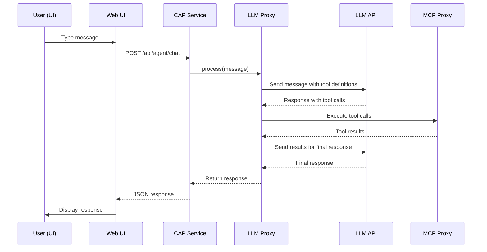

# LLM Proxy & UI Architecture Proposal

## 🎯 Overview

This document proposes the architecture for adding:
1. **LLM Proxy** - A minimal agent that works with MCP servers and various LLMs via API
2. **Simple UI** - A web interface for interacting with the agent

## 📋 Requirements

### LLM Proxy Requirements
- ✅ Work with MCP servers (use existing MCP proxy infrastructure)
- ✅ Support multiple LLM providers (OpenAI, Anthropic, etc.)
- ✅ Minimal implementation to start
- ✅ Extensible for future enhancements

### UI Requirements
- ✅ Simple and clean interface
- ✅ Chat-like interaction with the agent
- ✅ Display MCP tool results
- ✅ Show conversation history
- ✅ Easy to extend later

## 🏗️ Proposed Architecture

### Option 1: Separate Agent Repository (Recommended)

```
cloud-llm-hub/
├── submodules/
│   ├── mcp-abap-adt/          # Existing MCP server
│   └── llm-proxy/              # LLM Proxy documentation
│       ├── src/
│       │   ├── agent.ts        # Core agent logic
│       │   ├── llm-providers/  # LLM provider adapters
│       │   │   ├── openai.ts
│       │   │   ├── anthropic.ts
│       │   │   └── base.ts
│       │   ├── mcp-client.ts   # MCP client wrapper
│       │   └── orchestrator.ts  # Agent orchestration
│       ├── package.json
│       └── README.md
├── app/
│   └── router/
│       └── webapp/             # NEW: UI application
│           ├── index.html
│           ├── app.js
│           └── styles.css
└── srv/
    └── agent-service.ts        # NEW: CAP service for agent
```

**Advantages:**
- ✅ Agent can be reused in other projects
- ✅ Clear separation of concerns
- ✅ Independent versioning
- ✅ Easier to test and develop
- ✅ Can be published as separate npm package

**Disadvantages:**
- ⚠️ Requires managing another repository
- ⚠️ More complex build process

### Option 2: Agent in Main Repository

```
cloud-llm-hub/
├── srv/
│   ├── agent/                  # NEW: Agent implementation
│   │   ├── agent.ts
│   │   ├── llm-providers/
│   │   └── mcp-client.ts
│   └── agent-service.ts       # NEW: CAP service
├── app/
│   └── router/
│       └── webapp/             # NEW: UI
```

**Advantages:**
- ✅ Simpler structure
- ✅ Everything in one place
- ✅ Easier initial development

**Disadvantages:**
- ⚠️ Harder to reuse agent elsewhere
- ⚠️ Less modular

## 🎨 Recommended Approach: Option 1

**Rationale:** The agent is a significant component that may be useful in other contexts. Separating it allows for:
- Independent development and testing
- Reuse in other projects
- Clearer code organization
- Better maintainability

## 🔧 Technical Stack

### LLM Proxy (Submodule)

**Core Technologies:**
- **TypeScript** - Type safety and modern JavaScript
- **@modelcontextprotocol/sdk** - MCP client SDK (already in use)
- **axios** - HTTP client for LLM APIs (already in use)

**LLM Provider Support:**
- **OpenAI** - GPT-4, GPT-3.5
- **Anthropic** - Claude
- **Extensible** - Easy to add more providers

**Structure:**
```typescript
// Base LLM provider interface
interface LLMProvider {
  chat(messages: Message[]): Promise<Response>;
  streamChat(messages: Message[]): AsyncGenerator<Response>;
}

// Agent orchestrator
class Agent {
  constructor(
    private llmProvider: LLMProvider,
    private mcpClient: MCPClient
  ) {}
  
  async process(userMessage: string): Promise<AgentResponse> {
    // 1. Send to LLM
    // 2. Parse tool calls
    // 3. Execute MCP tools
    // 4. Return results
  }
}
```

### UI (In Main Project)

**Technology Options:**

#### Option A: Vanilla JavaScript (Recommended for MVP)
- ✅ No build step required
- ✅ Simple and fast to implement
- ✅ Easy to deploy
- ✅ Works with existing approuter

**Structure:**
```
app/router/webapp/
├── index.html          # Main UI
├── app.js              # Application logic
├── styles.css          # Styling
└── api-client.js       # API communication
```

#### Option B: Lightweight Framework (Future)
- React/Vue/Svelte
- Requires build step
- Better for complex UIs
- Can be added later

**Recommendation:** Start with Option A (Vanilla JS), migrate to framework if needed.

## 🔌 Integration Points

### 1. Agent Service (CAP Service)

```typescript
// srv/agent-service.cds
service AgentService {
  entity Conversations {
    key id: UUID;
    messages: Composition of Messages;
    createdAt: DateTime;
    updatedAt: DateTime;
  };
  
  entity Messages {
    key id: UUID;
    role: String; // 'user' | 'assistant' | 'system'
    content: String;
    toolCalls: String; // JSON array
    createdAt: DateTime;
  };
  
  function chat(message: String) returns String;
  function streamChat(message: String) returns stream of String;
}
```

```typescript
// srv/agent-service.ts
import { Agent } from '@mcp-abap-adt/llm-proxy';

export default class AgentService extends cds.Service {
  private agent: Agent;
  
  async init() {
    this.agent = new Agent(
      new OpenAIProvider(process.env.OPENAI_API_KEY),
      new MCPClient('http://localhost:4004/mcp/stream/http')
    );
  }
  
  async chat(message: string) {
    return await this.agent.process(message);
  }
}
```

### 2. UI Integration

**Route Configuration:**
```json
// app/router/xs-app.json
{
  "routes": [
    {
      "source": "^/webapp/(.*)$",
      "target": "/webapp/$1",
      "localDir": "webapp"
    },
    {
      "source": "^/api/agent/(.*)$",
      "target": "/srv/agent/$1",
      "destination": "srv-api"
    }
  ]
}
```

**API Endpoints:**
- `POST /api/agent/chat` - Send message to agent
- `GET /api/agent/stream` - Stream response (SSE)
- `GET /api/agent/conversations` - Get conversation history

## 📦 Implementation Phases

### Phase 1: Minimal Agent (MVP)
**Goal:** Basic agent that can call MCP tools via LLM

**Tasks:**
1. Create `llm-agent` repository
2. Implement base LLM provider interface
3. Implement OpenAI provider
4. Implement MCP client wrapper
5. Create simple orchestrator
6. Add to main project as submodule

**Deliverables:**
- ✅ Agent can process user messages
- ✅ Agent can call MCP tools
- ✅ Agent returns results

### Phase 2: Basic UI
**Goal:** Simple chat interface

**Tasks:**
1. Create `app/router/webapp/` directory
2. Implement HTML/CSS/JS UI
3. Add API client
4. Integrate with agent service
5. Add basic styling

**Deliverables:**
- ✅ Chat interface
- ✅ Message display
- ✅ Tool results display
- ✅ Basic error handling

### Phase 3: Enhancements
**Goal:** Improve UX and functionality

**Tasks:**
1. Add conversation history
2. Add streaming support
3. Add multiple LLM provider selection
4. Add tool selection UI
5. Improve styling

## 🗂️ File Structure Details

### LLM Proxy Submodule

```
node_modules/@mcp-abap-adt/llm-proxy/
├── src/
│   ├── index.ts                 # Main export
│   ├── agent.ts                 # Core agent class
│   ├── types.ts                 # TypeScript types
│   ├── llm-providers/
│   │   ├── base.ts              # Base provider interface
│   │   ├── openai.ts            # OpenAI implementation
│   │   ├── anthropic.ts         # Anthropic implementation
│   │   └── index.ts             # Provider exports
│   ├── mcp/
│   │   ├── client.ts            # MCP client wrapper
│   │   └── types.ts             # MCP types
│   └── utils/
│       ├── message-parser.ts    # Parse LLM responses
│       └── tool-executor.ts     # Execute MCP tools
├── package.json
├── tsconfig.json
├── README.md
└── .gitignore
```

### UI Application

```
app/router/webapp/
├── index.html                   # Main HTML
├── app.js                       # Application logic
├── api-client.js                # API communication
├── styles.css                   # Styling
├── components/                  # (Future) UI components
│   ├── chat-message.js
│   ├── tool-result.js
│   └── conversation-list.js
└── assets/                      # Static assets
    ├── icons/
    └── images/
```

## 🔐 Security Considerations

1. **API Keys:** Store LLM API keys in environment variables or BTP service bindings
2. **Authentication:** Use existing XSUAA authentication for UI
3. **Rate Limiting:** Implement rate limiting for agent endpoints
4. **Input Validation:** Validate all user inputs
5. **Output Sanitization:** Sanitize LLM responses before displaying

## 📊 Example Flow



## 🚀 Getting Started

### Step 1: Create Agent Repository
```bash
# Create new repository
git init llm-agent
cd llm-agent

# Initialize npm project
npm init -y

# Install dependencies
npm install @modelcontextprotocol/sdk axios
npm install -D typescript @types/node tsx
```

### Step 2: Install Package
```bash
cd cloud-llm-hub
npm install @mcp-abap-adt/llm-proxy
```

### Step 3: Create UI
```bash
mkdir -p app/router/webapp
# Create HTML/CSS/JS files
```

### Step 4: Integrate
```bash
# Add agent service to CAP
# Update xs-app.json
# Test integration
```

## 📝 Next Steps

1. **Review this proposal** - Get feedback
2. **Create agent repository** - Set up initial structure
3. **Implement MVP agent** - Basic functionality
4. **Create UI** - Simple chat interface
5. **Integrate** - Connect everything
6. **Test** - Verify functionality
7. **Document** - Update documentation

## ❓ Questions to Consider

1. **LLM Provider Priority:** Which LLM should we support first? (OpenAI recommended)
2. **UI Complexity:** How complex should the initial UI be?
3. **Conversation Storage:** Should we persist conversations? (Recommended: Yes)
4. **Streaming:** Do we need streaming responses? (Recommended: Yes, but can be Phase 2)
5. **Multi-tenancy:** Should conversations be user-specific? (Yes, via XSUAA)

## 🎯 Success Criteria

- ✅ Agent can process natural language queries
- ✅ Agent can call MCP tools correctly
- ✅ UI displays conversations clearly
- ✅ Integration works end-to-end
- ✅ Code is maintainable and extensible

---

**Status:** Proposal - Awaiting approval

**Author:** Architecture Team

**Date:** 2025-11-05
