# Cloud LLM Hub — Developer Architecture Guide

> **Version:** 1.3.2 | **Stack:** SAP CAP (Node.js) + TypeScript + SAP BTP  
> **Purpose:** This document gives a new developer everything needed to understand, navigate, and modify the codebase.

---

## Table of Contents

1. [High-Level Overview](#1-high-level-overview)
2. [Relationship with mcp-abap-adt](#2-relationship-with-mcp-abap-adt)
3. [Project Structure](#3-project-structure)
4. [Module Map & Responsibilities](#4-module-map--responsibilities)
5. [Module Dependency Graph](#5-module-dependency-graph)
6. [Request Lifecycle — MCP Proxy Flow](#6-request-lifecycle--mcp-proxy-flow)
7. [Request Lifecycle — Agent / LLM Flow](#7-request-lifecycle--agent--llm-flow)
8. [Authentication & Authorization Flow](#8-authentication--authorization-flow)
9. [Connection Strategy](#9-connection-strategy)
10. [SAP BTP Deployment Architecture](#10-sap-btp-deployment-architecture)
11. [CDS Service Model](#11-cds-service-model)
12. [Configuration & Environment](#12-configuration--environment)
13. [External Dependencies](#13-external-dependencies)
14. [Testing Strategy](#14-testing-strategy)
15. [Key Design Decisions](#15-key-design-decisions)

---

## 1. High-Level Overview

Cloud LLM Hub is an **enterprise MCP orchestrator and LLM-agent platform** built on SAP CAP. It connects AI assistants (Cline, Claude Desktop, n8n) and autonomous LLM agents with SAP ABAP systems, managing transport, authentication, destination resolution, and agent orchestration. It has two main runtime paths:

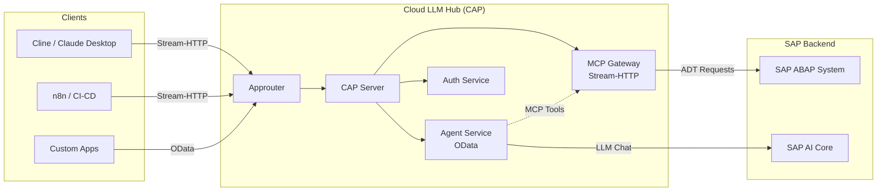

**Two runtime paths:**

| Path | Entry Point | Purpose |
|------|-------------|---------|
| **MCP Gateway** | `POST /mcp/stream/http` | Orchestrates MCP protocol requests: auth, destination resolution, connection creation, then delegates to embedded `mcp-abap-adt` server; used by AI assistants directly |
| **Agent Service** | `GET/POST /agent/*` (OData) | LLM-agent endpoint: receives natural language → calls SAP AI Core LLM → uses MCP tools via internal orchestration loop |

---

## 2. Relationship with mcp-abap-adt

**`mcp-abap-adt`** is a separate open-source project that implements the actual MCP server with ABAP/ADT tools. **Cloud LLM Hub does NOT implement MCP tools itself** — it uses `mcp-abap-adt` as an embedded component, orchestrating connections, authentication, and agent workflows around it.

### How the two projects relate

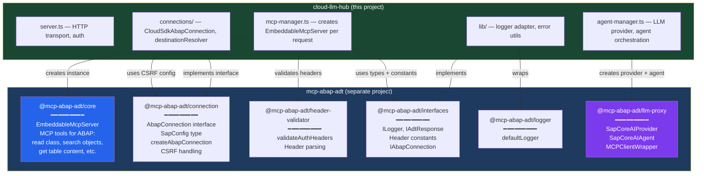

### What each `@mcp-abap-adt/*` package provides

| Package | What cloud-llm-hub uses from it | Where used |
|---------|--------------------------------|------------|
| **`@mcp-abap-adt/core`** | `EmbeddableMcpServer` — the MCP server with all ABAP tools (read class, search, table content, etc.) | `mcp-manager.ts` |
| **`@mcp-abap-adt/connection`** | `AbapConnection` interface, `SapConfig` type, `createAbapConnection()` factory, `CSRF_CONFIG`, `OnPremAbapConnection` base class | `connections/*`, `mcp-manager.ts` |
| **`@mcp-abap-adt/header-validator`** | `validateAuthHeaders()` — validates SAP auth headers for direct connections | `mcp-manager.ts` |
| **`@mcp-abap-adt/interfaces`** | `ILogger`, `IAdtResponse`, `IAbapConnection`, `ITokenRefresher`, `HEADER_*` constants | Throughout `srv/` |
| **`@mcp-abap-adt/logger`** | `defaultLogger` — base logging implementation | `lib/logger.ts` |
| **`@mcp-abap-adt/llm-proxy`** | `SapCoreAIProvider`, `SapCoreAIAgent`, `MCPClientWrapper`, `BaseAgent`, `Message` type | `agent-manager.ts`, `agent-service.ts` |

### Boundary of responsibility

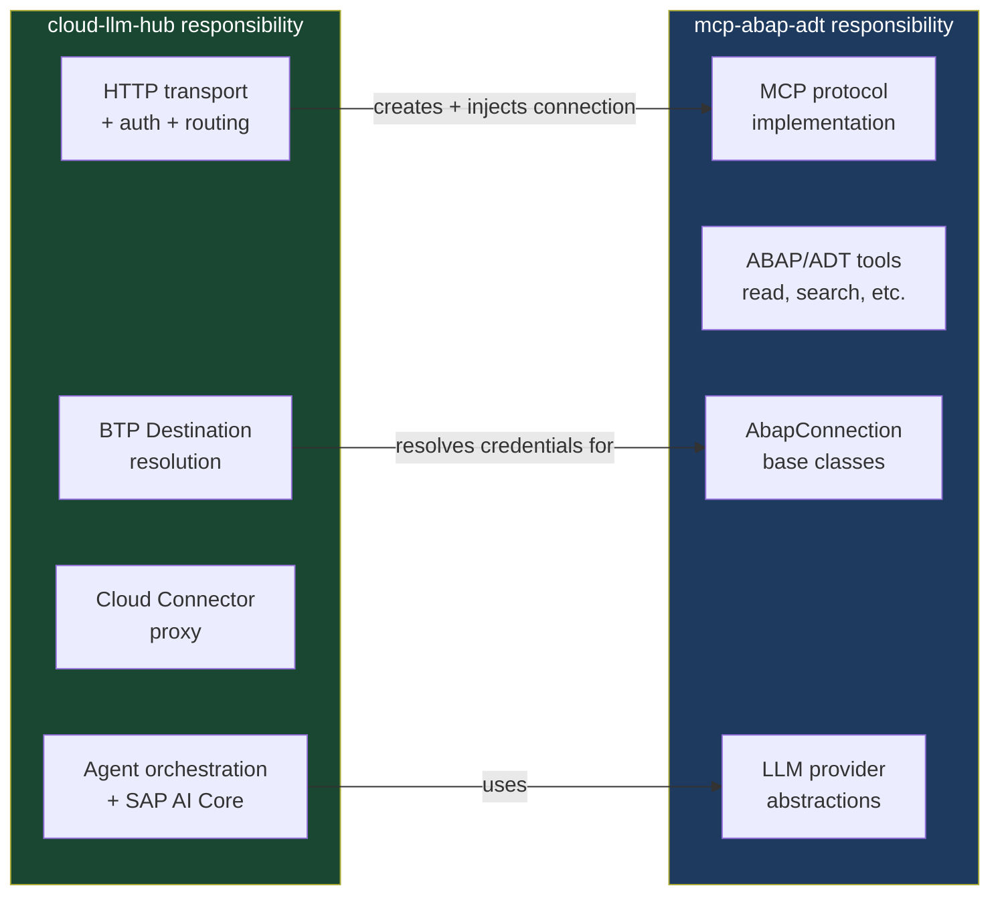

**Key principle:** Cloud LLM Hub is the orchestrator — it creates a connection (`AbapConnection`), injects it into `EmbeddableMcpServer`, and manages the full lifecycle (auth → destination → connection → MCP server → transport → cleanup). The MCP server uses that connection to talk to ABAP. Cloud LLM Hub never calls ABAP tools directly — all ABAP interaction goes through the embedded MCP server. The Agent Service adds an LLM-agent layer on top, where SAP AI Core LLM autonomously decides which MCP tools to call.

### Implications for developers

- **Adding/modifying MCP tools** (e.g., new ABAP read operation) → change `mcp-abap-adt`, NOT this project
- **Adding/modifying transport, auth, routing, BTP integration** → change this project (`srv/`)
- **Adding new connection type** (e.g., new auth method) → implement `AbapConnection` interface in `srv/connections/`, register in `connectionFactory.ts`
- **Changing LLM provider behavior** → if it's provider abstraction → `mcp-abap-adt/llm-proxy`; if it's SAP AI Core binding specifics → `agent-manager.ts` in this project
- **Updating `mcp-abap-adt` version** → update in `package.json`, test that `EmbeddableMcpServer` API hasn't changed, run integration tests

---

## 3. Project Structure

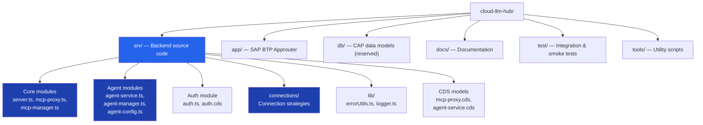

### File Layout

```
cloud-llm-hub/
├── srv/                          # ⭐ All backend logic
│   ├── server.ts                 # CAP bootstrap, Express middleware, Stream-HTTP endpoint
│   ├── mcp-proxy.ts              # CAP service handlers (Health, ProbeDestination, InvokeTool)
│   ├── mcp-proxy.cds             # CDS model for McpProxyService
│   ├── mcp-manager.ts            # Per-request MCP server creation factory
│   ├── agent-service.ts          # CAP service handlers for Agent (Chat, Health)
│   ├── agent-service.cds         # CDS model for AgentService
│   ├── agent-manager.ts          # LLM provider creation, agent caching, MCP client
│   ├── agent-config.ts           # Agent configuration from env vars / VCAP_SERVICES
│   ├── auth.ts                   # CAP AuthService handlers (CheckAuth, CheckRoles)
│   ├── auth.cds                  # CDS model for AuthService
│   ├── env-setup.ts              # Environment bootstrap (must be imported first)
│   ├── connections/              # Connection strategy implementations
│   │   ├── index.ts              # Barrel exports
│   │   ├── connectionFactory.ts  # Factory: picks CloudSdk vs Direct connection
│   │   ├── CloudSdkAbapConnection.ts  # BTP Destination-based connection
│   │   ├── destinationResolver.ts     # SAP Cloud SDK destination resolution
│   │   ├── connectivityProxy.ts       # On-premise Cloud Connector support
│   │   └── BtpOnPremDestinationConnection.ts  # On-prem connection via proxy
│   └── lib/                      # Shared utilities
│       ├── errorUtils.ts         # Centralized error handling
│       └── logger.ts             # Logger adapter wrapping @mcp-abap-adt/logger
├── app/
│   └── router/                   # SAP BTP Approuter (xs-app.json routes)
├── test/                         # Tests (YAML-driven integration, smoke, unit)
├── tools/                        # DevOps scripts (cline config sync, env setup, deploy)
├── mta.yaml                      # MTA deployment descriptor
├── xs-security.json              # XSUAA scopes, roles, role-collections
├── package.json                  # Dependencies & npm scripts
└── tsconfig.json                 # TypeScript configuration
```

---

## 4. Module Map & Responsibilities

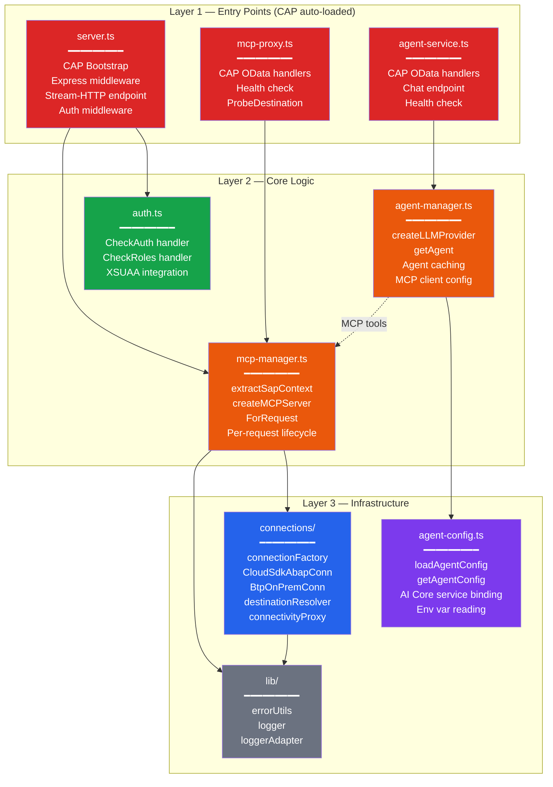

### Module Details

| Module | File | Responsibility |
|--------|------|---------------|
| **CAP Bootstrap** | `server.ts` | Registers Express middleware on `cds.on('bootstrap')`. Mounts `/mcp/stream/http` POST endpoint. Handles Content-Type normalization for Cline. Calls `requireAuth` → `AuthService.CheckAuth` before each request. |
| **MCP Proxy Service** | `mcp-proxy.ts` + `.cds` | CAP service at path `/mcp`. Exposes `Health()`, `ProbeDestination(destination)`, `InvokeTool()` (deprecated). Uses SAP Cloud SDK `executeHttpRequest` for destination probing. |
| **MCP Manager** | `mcp-manager.ts` | Core factory. `extractSapContext()` reads SAP config from HTTP headers (destination or direct). `createMCPServerForRequest()` creates fresh Connection → EmbeddableMcpServer → StreamableHTTPServerTransport per request. |
| **Agent Service** | `agent-service.ts` + `.cds` | CAP service at path `/agent`. Exposes `Chat(message)`, `GetHistory()`, `ClearHistory()`, `Health()`. Delegates to `agent-manager.ts`. |
| **Agent Manager** | `agent-manager.ts` | Creates `SapCoreAIProvider` with OAuth2 token from AI Core service binding. Builds MCP client config to loop back into own proxy. Caches agent instances (30 min TTL). |
| **Agent Config** | `agent-config.ts` | Reads `LLM_AGENT_MODEL`, `LLM_AGENT_TEMPERATURE`, `LLM_AGENT_MAX_TOKENS`, `LLM_AGENT_MCP_DESTINATION` from env vars. Reads AI Core service binding from `VCAP_SERVICES`. Singleton pattern. |
| **Auth Service** | `auth.ts` + `.cds` | CAP service at path `/auth`. `CheckAuth()` validates user identity. `CheckRoles(required)` checks specific roles. Used by `server.ts` middleware for `/mcp/*` routes. |
| **Connection Factory** | `connections/connectionFactory.ts` | Decision: `destinationName` → `CloudSdkAbapConnection`; no destination → `createAbapConnection` (direct). |
| **CloudSdk Connection** | `connections/CloudSdkAbapConnection.ts` | `AbapConnection` implementation using `executeHttpRequest` from SAP Cloud SDK. Auto destination resolution, auth, proxy, CSRF token management. |
| **Destination Resolver** | `connections/destinationResolver.ts` | Resolves BTP Destination to `SapConfig` via `getDestination()`. Handles `BasicAuthentication`, `OAuth2ClientCredentials`, `OAuth2SAMLBearerAssertion`. |
| **Connectivity Proxy** | `connections/connectivityProxy.ts` | On-premise support: loads Connectivity service credentials, obtains tokens, builds proxy config for Cloud Connector. |
| **BTP OnPrem Connection** | `connections/BtpOnPremDestinationConnection.ts` | Extends `OnPremAbapConnection` with BTP proxy headers (`Proxy-Authorization`, `SAP-Connectivity-SCC-Location_ID`). |
| **Error Utils** | `lib/errorUtils.ts` | `logErrorSafely()`, `formatErrorMessage()`, `createErrorResponse()`. Handles AxiosError, Cloud SDK errors, and standard errors safely. |
| **Logger** | `lib/logger.ts` | Wraps `@mcp-abap-adt/logger` with extended CSRF/TLS methods. Exports `logger` and `loggerAdapter` (ILogger interface). |
| **Env Setup** | `env-setup.ts` | **Must be imported first.** Sets `MCP_SKIP_AUTO_START`, `MCP_SKIP_ENV_LOAD`. Loads `.env` only in local dev. |

---

## 5. Module Dependency Graph

```mermaid
graph TB
    subgraph "Entry Points (CAP auto-loads)"
        server_ts["server.ts"]
        mcp_proxy_ts["mcp-proxy.ts"]
        agent_service_ts["agent-service.ts"]
        auth_ts["auth.ts"]
    end

    subgraph "Core Logic"
        mcp_manager["mcp-manager.ts"]
        agent_manager["agent-manager.ts"]
        agent_config["agent-config.ts"]
    end

    subgraph "connections/"
        conn_factory["connectionFactory.ts"]
        cloud_sdk_conn["CloudSdkAbapConnection.ts"]
        dest_resolver["destinationResolver.ts"]
        conn_proxy["connectivityProxy.ts"]
        btp_onprem["BtpOnPremDestinationConnection.ts"]
        conn_index["index.ts (barrel)"]
    end

    subgraph "lib/"
        error_utils["errorUtils.ts"]
        logger_mod["logger.ts"]
    end

    subgraph "External Packages"
        mcp_adt_core["@mcp-abap-adt/core"]
        mcp_adt_conn["@mcp-abap-adt/connection"]
        mcp_adt_hv["@mcp-abap-adt/header-validator"]
        mcp_adt_iface["@mcp-abap-adt/interfaces"]
        mcp_adt_logger["@mcp-abap-adt/logger"]
        mcp_adt_llm["@mcp-abap-adt/llm-proxy"]
        mcp_sdk["@modelcontextprotocol/sdk"]
        sap_cds["@sap/cds"]
        sap_cloud_sdk["@sap-cloud-sdk/*"]
        sap_xsenv["@sap/xsenv"]
    end

    env_setup["env-setup.ts"]

    %% server.ts dependencies
    server_ts --> env_setup
    server_ts --> mcp_manager
    server_ts --> error_utils
    server_ts --> sap_cds

    %% mcp-proxy.ts dependencies
    mcp_proxy_ts --> sap_cds
    mcp_proxy_ts --> sap_cloud_sdk
    mcp_proxy_ts --> error_utils

    %% mcp-manager.ts dependencies
    mcp_manager --> env_setup
    mcp_manager --> conn_factory
    mcp_manager --> conn_index
    mcp_manager --> dest_resolver
    mcp_manager --> error_utils
    mcp_manager --> logger_mod
    mcp_manager --> mcp_adt_core
    mcp_manager --> mcp_adt_conn
    mcp_manager --> mcp_adt_hv
    mcp_manager --> mcp_adt_iface
    mcp_manager --> mcp_sdk

    %% agent-service.ts dependencies
    agent_service_ts --> agent_config
    agent_service_ts --> agent_manager
    agent_service_ts --> mcp_adt_llm

    %% agent-manager.ts dependencies
    agent_manager --> agent_config
    agent_manager --> mcp_adt_llm

    %% agent-config.ts dependencies
    agent_config --> sap_cds

    %% auth.ts dependencies
    auth_ts --> sap_cds

    %% connectionFactory.ts dependencies
    conn_factory --> cloud_sdk_conn
    conn_factory --> mcp_adt_conn
    conn_factory --> logger_mod

    %% CloudSdkAbapConnection.ts dependencies
    cloud_sdk_conn --> env_setup
    cloud_sdk_conn --> mcp_adt_conn
    cloud_sdk_conn --> sap_cloud_sdk
    cloud_sdk_conn --> logger_mod
    cloud_sdk_conn --> error_utils

    %% destinationResolver.ts dependencies
    dest_resolver --> mcp_adt_conn
    dest_resolver --> sap_cloud_sdk
    dest_resolver --> sap_xsenv
    dest_resolver --> error_utils

    %% connectivityProxy.ts dependencies
    conn_proxy --> sap_xsenv
    conn_proxy --> btp_onprem
    conn_proxy --> mcp_adt_conn

    %% BtpOnPremDestinationConnection.ts dependencies
    btp_onprem --> mcp_adt_conn
    btp_onprem --> logger_mod

    %% logger.ts dependencies
    logger_mod --> mcp_adt_logger
    logger_mod --> mcp_adt_iface

    %% error_utils dependencies
    error_utils --> mcp_adt_conn

    style server_ts fill:#dc2626,color:#fff
    style mcp_manager fill:#ea580c,color:#fff
    style agent_manager fill:#ea580c,color:#fff
    style conn_factory fill:#2563eb,color:#fff
    style cloud_sdk_conn fill:#2563eb,color:#fff
    style dest_resolver fill:#2563eb,color:#fff
    style env_setup fill:#9333ea,color:#fff
```

---

## 6. Request Lifecycle — MCP Proxy Flow

This is the primary flow when an AI assistant (Cline, Claude Desktop) sends an MCP request.

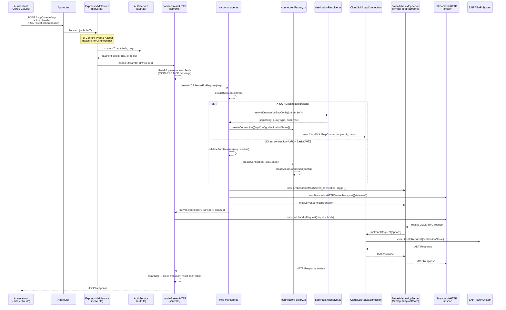

### Per-Request Architecture (Key Design)

Each HTTP request creates **three fresh objects** — no shared state between requests:

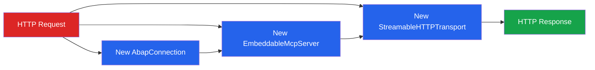

---

## 7. Request Lifecycle — Agent / LLM Flow

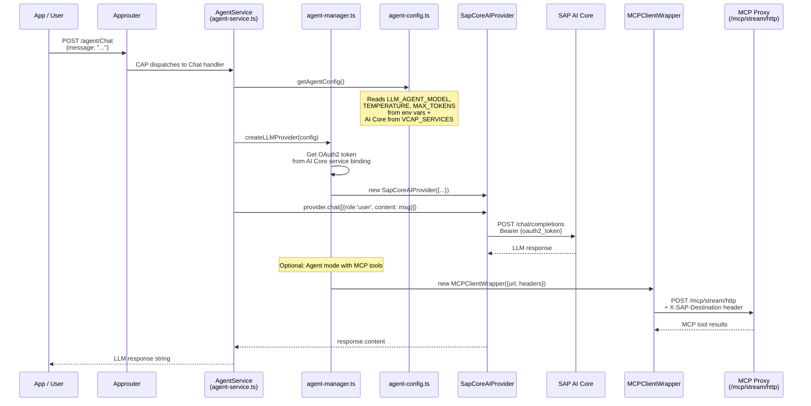

---

## 8. Authentication & Authorization Flow

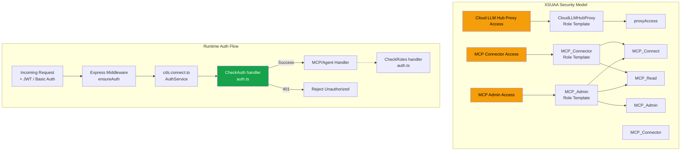

### Auth Modes

| Environment | Auth Kind | Details |
|------------|-----------|---------|
| **Development** (`cds watch`) | Mocked | Users `alice` (MCP_Connector + MCP_Admin) and `bob` (MCP_Connector) |
| **Production** (BTP) | XSUAA JWT | Token validated by CAP middleware, roles from JWT claims |

---

## 9. Connection Strategy

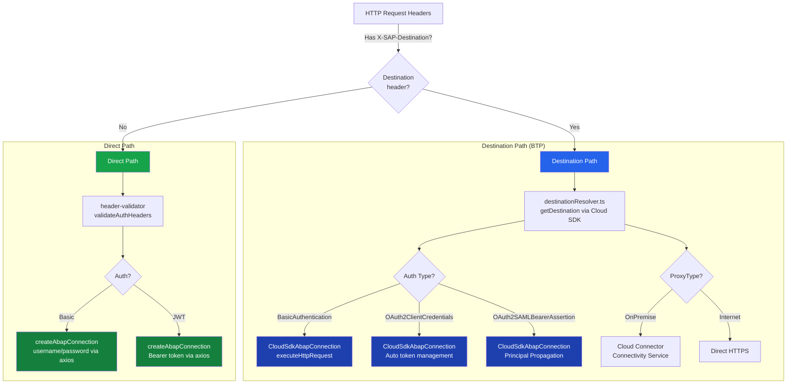

### Connection Classes

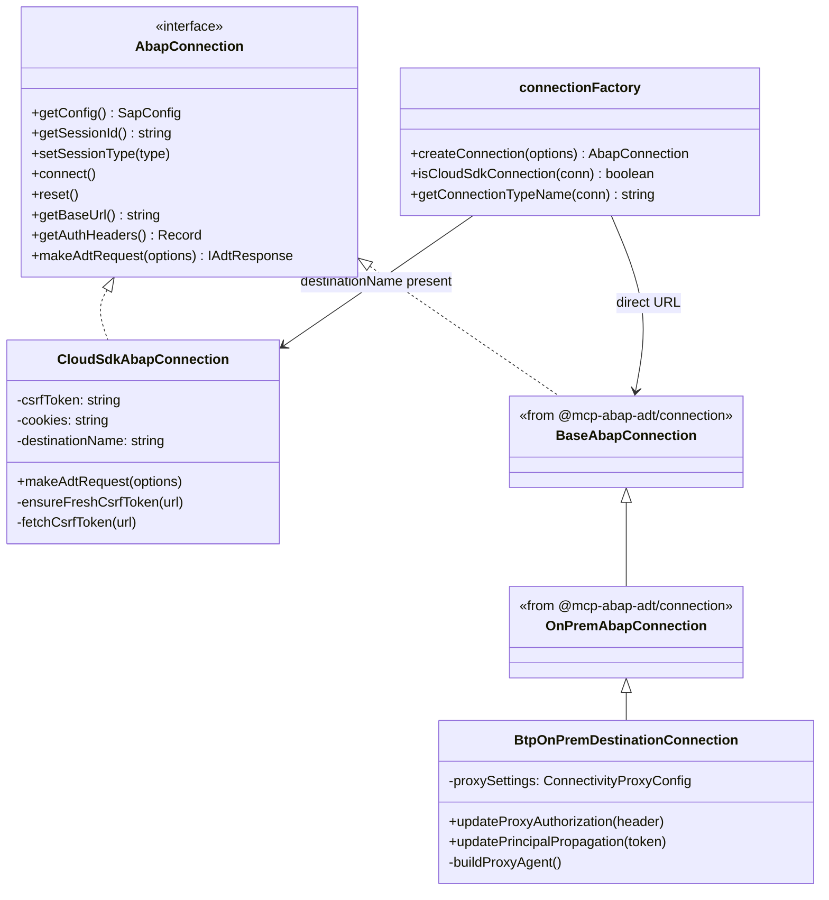

---

## 10. SAP BTP Deployment Architecture

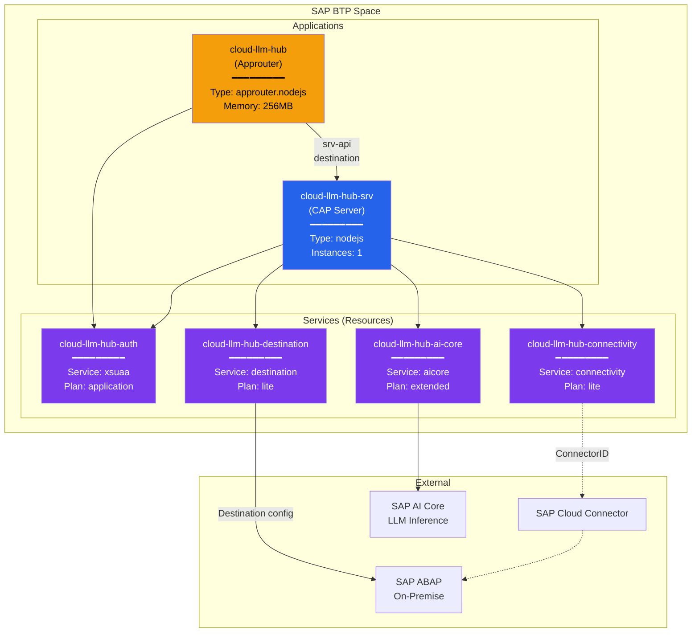

### MTA Build & Deploy

```
npm run build:mta    →  mbt build → gen/mta_archives/cloud-llm-hub.tar
npm run deploy       →  cf deploy gen/mta_archives/cloud-llm-hub.tar
```

The `mta.yaml` build step runs:
1. `npm ci` — install dependencies
2. `npx cds build --production` — compile CDS models to `gen/srv`
3. `npm ci --omit=dev` — reinstall without devDeps in gen/srv
4. Aggressive cleanup (~16MB final size)

---

## 11. CDS Service Model

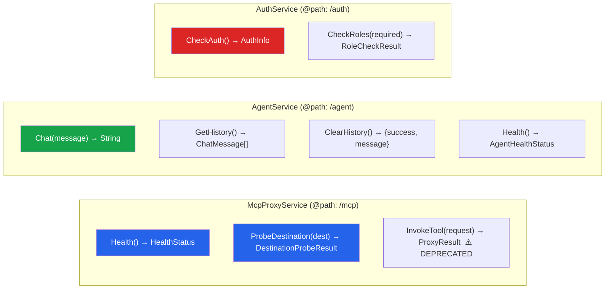

**Note:** The Stream-HTTP MCP endpoint (`POST /mcp/stream/http`) is **not** a CDS function — it is a custom Express route registered in `server.ts` during `cds.on('bootstrap')`.

---

## 12. Configuration & Environment

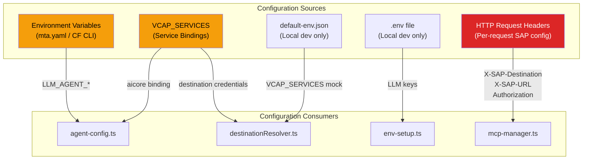

### Key Environment Variables

| Variable | Used By | Purpose |
|----------|---------|---------|
| `LLM_AGENT_MODEL` | `agent-config.ts` | LLM model name (e.g., `gpt-4o-mini`, `claude-3-5-sonnet`) |
| `LLM_AGENT_TEMPERATURE` | `agent-config.ts` | Temperature (0.0–2.0, default: 0.7) |
| `LLM_AGENT_MAX_TOKENS` | `agent-config.ts` | Max response tokens (default: 2000) |
| `LLM_AGENT_MCP_DESTINATION` | `agent-config.ts` | BTP Destination name for ABAP system |
| `LLM_AGENT_MCP_ENDPOINT` | `agent-config.ts` | MCP proxy URL (optional, auto-detected) |
| `VCAP_SERVICES` | `agent-config.ts`, `destinationResolver.ts` | Service bindings (AI Core, Destination, Connectivity) |
| `MCP_SKIP_AUTO_START` | `env-setup.ts` | Prevents mcp-abap-adt auto-start |
| `MCP_SKIP_ENV_LOAD` | `env-setup.ts` | Prevents mcp-abap-adt .env loading |

### Key HTTP Headers (Per-Request)

| Header | Purpose |
|--------|---------|
| `Authorization` | Bearer JWT or Basic auth for XSUAA |
| `X-SAP-Destination` | BTP Destination name → triggers CloudSdkAbapConnection |
| `X-SAP-URL` | Direct SAP system URL (no destination) |
| `X-SAP-Client` | SAP client number |
| `X-SAP-Login` / `X-SAP-Password` | Override destination auth with Basic |
| `X-SAP-Connectivity-Mode` | `onprem` to route through Cloud Connector |
| `X-SAP-Connectivity-Location-ID` | Cloud Connector location ID |

---

## 13. External Dependencies

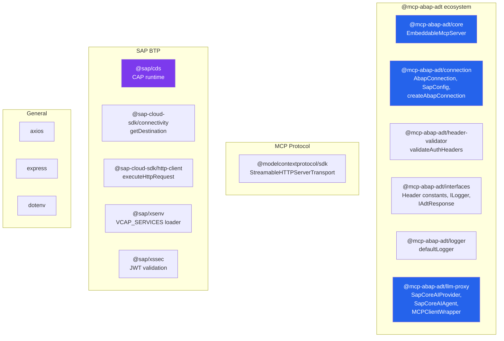

---

## 14. Testing Strategy

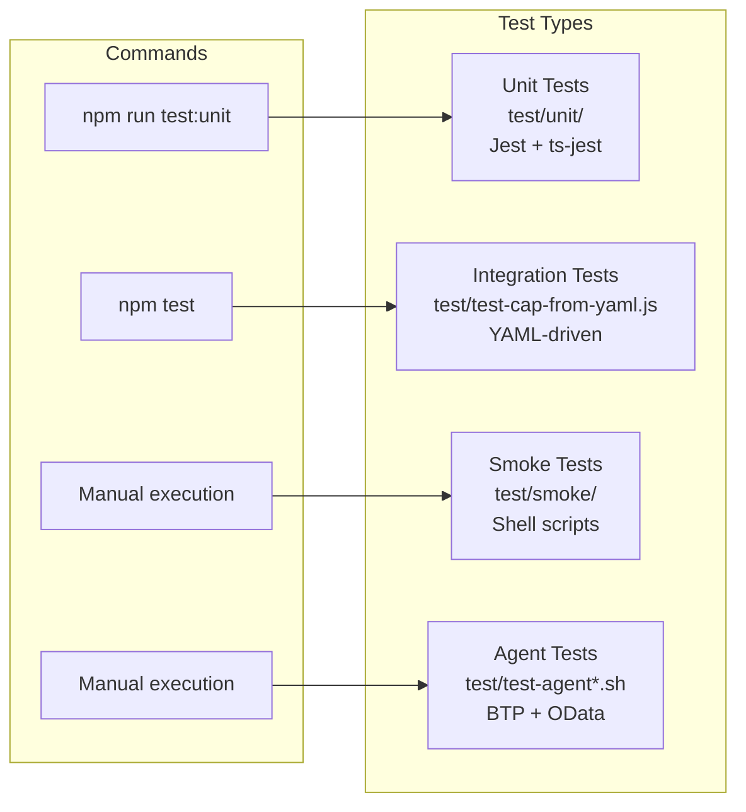

| Command | What it does |
|---------|-------------|
| `npm run test:unit` | Jest unit tests |
| `npm run test:unit:watch` | Jest in watch mode |
| `npm run test:unit:coverage` | Jest with coverage |
| `npm test` | YAML-driven integration tests (requires `test/integration.yaml`) |
| `npm run test:check` | TypeScript type-check (`tsc --noEmit`) |
| `npm run lint` | Biome linter (check + auto-fix) |
| `npm run format` | Biome formatter |

---

## 15. Key Design Decisions

### Per-Request Architecture (No Server Cache)

Every MCP request creates a **fresh** Connection + MCP Server + Transport. No session caching. This eliminates stale credential/state issues but means each request independently resolves destinations and creates CSRF tokens.

### Two Auth Layers

1. **XSUAA** (outer) — authenticates the user calling Cloud LLM Hub
2. **SAP system auth** (inner) — authenticates against the target ABAP system, configured per-request via headers or BTP Destination

### env-setup.ts Must Be First Import

The `@mcp-abap-adt` submodule has auto-start code that runs on import. `env-setup.ts` sets `MCP_SKIP_AUTO_START=true` and `MCP_SKIP_ENV_LOAD=true` **before** any submodule imports to prevent unintended behavior.

### SAP Cloud SDK for Destination Handling

All destination-based connections use `executeHttpRequest` from `@sap-cloud-sdk/http-client` instead of manual axios calls. This gives automatic:
- Destination resolution
- Auth token management (Basic, OAuth2, SAML Bearer)
- Cloud Connector proxy routing
- Token refresh

### Agent Self-Loop Pattern

The Agent Service connects its MCP client **back to its own MCP proxy endpoint** (`/mcp/stream/http`) with the destination header. This means the LLM agent uses the same MCP infrastructure that external AI assistants use.

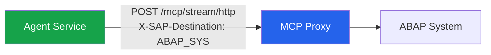

### Stateless by Default

- `MCP_ENABLE_SESSION_STORAGE=false` by default
- No in-memory session store between requests
- Agent instances cached for 30 min (performance optimization only)
- Fresh auth on every MCP proxy request

---

> **Last updated:** February 2026 | **Source:** Auto-generated from codebase analysis
