# Cloud LLM Hub — Developer Architecture Guide

> **Version:** 3.0.0 | **Stack:** SAP CAP (Node.js) + TypeScript + SAP BTP
> **Purpose:** This document gives a new developer everything needed to understand, navigate, and modify the codebase.

---

## Table of Contents

1. [High-Level Overview](#1-high-level-overview)
2. [Relationship with mcp-abap-adt](#2-relationship-with-mcp-abap-adt)
3. [Project Structure](#3-project-structure)
4. [Module Map & Responsibilities](#4-module-map--responsibilities)
5. [Module Dependency Graph](#5-module-dependency-graph)
6. [Request Lifecycle — MCP Proxy Flow](#6-request-lifecycle--mcp-proxy-flow)
7. [Request Lifecycle — Agent / LLM Flow](#7-request-lifecycle--agent--llm-flow)
8. [Authentication & Authorization Flow](#8-authentication--authorization-flow)
9. [Connection Strategy](#9-connection-strategy)
10. [SAP BTP Deployment Architecture](#10-sap-btp-deployment-architecture)
11. [CDS Service Model](#11-cds-service-model)
12. [Configuration & Environment](#12-configuration--environment)
13. [External Dependencies](#13-external-dependencies)
14. [Testing Strategy](#14-testing-strategy)
15. [Multi-Destination Architecture](#15-multi-destination-architecture-v220)
16. [Key Design Decisions](#16-key-design-decisions)

---

## 1. High-Level Overview

Cloud LLM Hub is an **enterprise MCP orchestrator and LLM-agent platform** built on SAP CAP. It connects AI assistants (Cline, Claude Desktop, n8n) and autonomous LLM agents with SAP ABAP systems, managing transport, authentication, destination resolution, and agent orchestration. It has two main runtime paths:

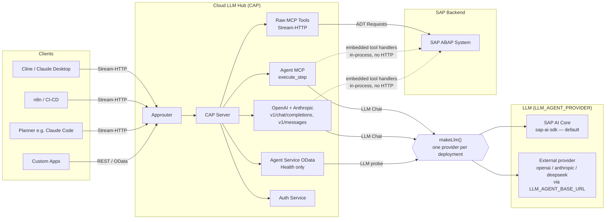

**Two runtime paths:**

| Path | Entry Point | Purpose |
|------|-------------|---------|
| **Raw MCP tools** | `POST /mcp/stream/http` | Orchestrates MCP protocol requests: auth, destination resolution, connection creation, then delegates to embedded `mcp-abap-adt` server; used by AI assistants directly. No agent involved. |
| **Agent / LLM surfaces** | `POST /mcp/agent/stream/http` (`execute_step`, `srv/agent-mcp.ts`), `POST /v1/chat/completions` (`srv/openai-handler.ts`), `POST /v1/messages` (`srv/anthropic-handler.ts`) | All three call `getSmartAgent` (`srv/agent-manager.ts`) → the DAG-coordinator controller (executor worker + reviewer, see §7). The OData `AgentService` (`/odata/v4/agent/*`) keeps `Health` (and the `GetHistory`/`ClearHistory` stubs); it starts no pipeline. |

---

## 2. Relationship with mcp-abap-adt

**`mcp-abap-adt`** is a separate open-source project that implements the actual MCP server with ABAP/ADT tools. **Cloud LLM Hub does NOT implement MCP tools itself** — it uses `mcp-abap-adt` as an embedded component, orchestrating connections, authentication, and agent workflows around it.

### How the two projects relate

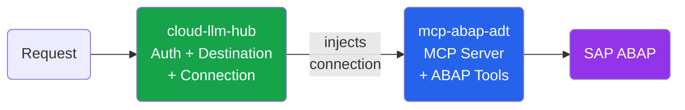

**Key point:** `mcp-abap-adt` is the **base implementation** of the ABAP tools. Cloud LLM Hub **delegates all ABAP tool execution** to it, over two paths that both come from `@mcp-abap-adt/lib`:

1. Cloud LLM Hub handles everything **before** the tools: auth, destination resolution, connection creation — then **injects** the connection.
2. **Raw MCP path** (`/mcp/stream/http`, `mcp-manager.ts`): Cloud LLM Hub creates an `EmbeddableMcpServer` and injects the connection; from that point `mcp-abap-adt` does **all** the MCP protocol handling and ABAP tool execution.
3. **Agent path** (`POST /v1/chat/completions`, `POST /v1/messages`, `/mcp/agent/stream/http`, `agent-manager.ts`): the SmartAgent executes the `HandlerExporter` tool corpus **in-process** against the injected connection (no MCP wire protocol) — see §7 and §16. (Other `/v1/*` routes — `/v1/models`, `/v1/usage`, `/v1/destinations/*`, `/v1/token` — are non-chat management routes; some touch `getSmartAgent()`/`refreshDestinations()` for metadata or warm-up, but none execute an agent request against SAP.)
4. On both paths Cloud LLM Hub never hand-codes ABAP tool logic — it provides the connection and lets `@mcp-abap-adt/lib` run the tools.

### What cloud-llm-hub uses from `@mcp-abap-adt/*`

| Package | Role | Where used |
|---------|------|------------|
| **`lib`** (`^10.0.1`) | ABAP tool surface: `EmbeddableMcpServer` (the MCP server exposing all ABAP tools on the raw `/mcp/stream/http` path) **and** `HandlerExporter` (the destination-free tool corpus the SmartAgent executes in-process). | `mcp-manager.ts` (`EmbeddableMcpServer`), `agent-manager.ts` (`HandlerExporter`) |
| **`connection`** | `AbapConnection` interface + base classes that cloud-llm-hub implements | `connections/*` |
| **`llm-agent`** (`^24.1.0`) | Public interface/contract surface the code programs against — `IRag`, `IMcpClient`, `ISubAgent`, `IFinalizer`, `McpToolResult`, `ToolCallRecord`, etc. (re-exports `interfaces` + `types`) | Throughout `srv/` (type imports) |
| **`llm-agent-libs`** (`^24.1.0`) | `SmartAgent`, `SmartAgentBuilder`, `DagPlanInterpreter`, `SmartAgentSubAgent` — the SmartAgent + RAG + DAG-coordinator **implementation** | `agent-manager.ts` |
| **`llm-agent-mcp`** (`^24.1.0`) | `McpClientAdapter` — wraps the embedded MCP client as an `IMcpClient` | `agent-manager.ts` |
| **`adt-clients`** (via `lib`, not declared here) | ADT HTTP clients underlying the ABAP tools | `mcp-abap-adt` (transitive) |
| **`header-validator`** | Validates SAP auth headers for direct connections | `mcp-manager.ts` |
| **`interfaces`** (`^11.3.0`) | Shared contracts: `ILogger`, `IAbapConnection`, `HEADER_*` constants | Throughout `srv/` |
| **`logger`** | Base logging implementation | `lib/logger.ts` |

### Implications for developers

- **Adding/modifying MCP tools** (e.g., new ABAP read operation) → change `mcp-abap-adt`, NOT this project
- **Adding/modifying transport, auth, routing, BTP integration** → change this project (`srv/`)
- **Adding new connection type** (e.g., new auth method) → implement `AbapConnection` interface in `srv/connections/`, register in `connectionFactory.ts`
- **Changing the LLM provider** → set `LLM_AGENT_PROVIDER` (`sap-ai-sdk` default / `openai` / `anthropic` / `deepseek`) plus `LLM_AGENT_API_KEY` / `LLM_AGENT_BASE_URL` (read in `agent-config.ts`); the provider client is built by `makeLlm` from `@mcp-abap-adt/llm-agent-libs`. SAP AI Core binding specifics live in `agent-manager.ts`.
- **Updating `mcp-abap-adt` version** → update in `package.json`, then verify both `@mcp-abap-adt/lib` consumers still match: the `EmbeddableMcpServer` API on the raw MCP path (`mcp-manager.ts`) **and** the `HandlerExporter` tool corpus on the agent path (`agent-manager.ts` — tool listing/exec and its config-dependent tool set), run integration tests

---

## 3. Project Structure

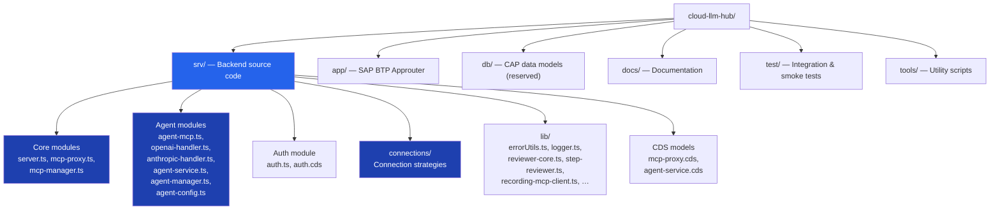

### File Layout

```
cloud-llm-hub/
├── srv/                          # ⭐ All backend logic
│   ├── server.ts                 # CAP bootstrap, Express middleware, Stream-HTTP + /v1/* + agent-MCP routes
│   ├── mcp-proxy.ts              # CAP service handlers (Health, ProbeDestination, ListDestinations, DiagnoseDestinations, ProbeActiveDestination, InvokeTool)
│   ├── mcp-proxy.cds             # CDS model for McpProxyService
│   ├── mcp-manager.ts            # Per-request MCP server creation factory (raw ABAP tools)
│   ├── agent-mcp.ts              # `/mcp/agent/stream/http` planner surface: `list_destinations` + `execute_step`
│   ├── openai-handler.ts         # `/v1/chat/completions`, `/v1/models`, `/v1/usage`, `/v1/destinations/*` handlers
│   ├── anthropic-handler.ts      # `/v1/messages` (Anthropic Messages API) handler
│   ├── agent-service.ts          # CAP OData service handlers for Agent (Health)
│   ├── agent-service.cds         # CDS model for AgentService
│   ├── agent-manager.ts          # getSmartAgent, LLM provider creation, per-destination state, DAG-coordinator wiring
│   ├── agent-config.ts           # Agent configuration from env vars / VCAP_SERVICES
│   ├── auth.ts                   # CAP AuthService handlers (CheckAuth, CheckRoles)
│   ├── auth.cds                  # CDS model for AuthService
│   ├── env-setup.ts              # Environment bootstrap (must be imported first)
│   ├── request-session.ts / session-id.ts   # Session id resolution for /v1/* requests
│   ├── rag-handler.ts / rag-tool-dispatcher.ts / rag-collections.ts / collection-ids.ts  # RAG collection management (`/v1/rag/*`)
│   ├── presets/                  # RAP context + skill presets (`rap-context/`, `rap-skills/`)
│   ├── skills/                   # Executor skill corpus (creating-*/reading-*/activating-* ABAP RAP skills)
│   ├── connections/              # Connection strategy implementations
│   │   ├── index.ts              # Barrel exports
│   │   ├── connectionFactory.ts  # Factory: picks CloudSdk vs Direct connection
│   │   ├── CloudSdkAbapConnection.ts  # BTP Destination-based connection
│   │   ├── destinationResolver.ts     # SAP Cloud SDK destination resolution
│   │   ├── connectivityProxy.ts       # On-premise Cloud Connector support
│   │   └── BtpOnPremDestinationConnection.ts  # On-prem connection via proxy
│   └── lib/                      # Shared utilities + honesty-controller support
│       ├── errorUtils.ts         # Centralized error handling
│       ├── logger.ts / log-mask.ts    # Logger adapter wrapping @mcp-abap-adt/logger + secret masking
│       ├── btp-oauth.ts          # Shared BTP OAuth2 token helper
│       ├── btp-destinations.ts   # BTP Destination Service client
│       ├── ai-core-models.ts     # AI Core model list (cached)
│       ├── recording-mcp-client.ts    # IMcpClient decorator capturing McpToolResult per traceId
│       ├── reviewer-core.ts / notice-finalizer.ts  # IFinalizer/NoticeFinalizer — compares claims vs captured results
│       ├── notify-policy.ts      # Notice wording policy
│       ├── step-reviewer.ts / reviewer-subagent.ts  # evaluateGated — deterministic check + gated LLM critic subagent
│       ├── step-gate.ts          # Tool-call-count gating for the LLM critic
│       ├── write-guardrail.ts    # Write-tool result envelope checks
│       ├── request-connection.ts   # establishRequestConnection + safeStop (release ADT lock on every exit path)
│       ├── principal.ts / request-system-context.ts   # principalHash, system scope, per-request responsible person + master system
│       ├── dump-buffer.ts / dump-parser.ts / get-dump-section.ts   # Dump section buffering/parsing for GetDumpSection
│       ├── composite-skill-manager.ts / skills-pool.ts   # Skill RAG exposure (skills are NOT role-gated)
│       ├── exposition.ts / tool-exposition-map.ts / tool-authorization.ts  # Role → tool-group levels, and the execution check
│       ├── cloud-local-tools.ts       # Merges this repo's own MCP tools into the shared tool corpus (dedup by name)
│       ├── fixed-executor-planner.ts  # `IPlanner` that skips planning — deterministic 1-node DAG bound to the executor
│       ├── probe-classifier.ts / active-probe.ts  # Destination-reachability probe classification (DiagnoseDestinations / ProbeActiveDestination)
│       ├── sap-ai-core-embedder.ts    # AI Core embedder client
│       ├── basic-to-bearer.ts    # Auth header conversion
│       └── semaphore.ts          # Bounded concurrency primitive (`execute_step` cap)
├── app/
│   ├── chat/webapp/              # Browser chat UI (vanilla HTML/JS)
│   │   └── index.html            # Terminal-style chat, file artifact cards, streaming parser
│   └── router/                   # SAP BTP Approuter (xs-app.json routes)
├── test/                         # Tests (YAML-driven integration, smoke, unit)
├── tools/                        # DevOps scripts (cline config sync, env setup, deploy)
├── mta.yaml                      # MTA deployment descriptor
├── xs-security.json              # XSUAA scopes, roles, role-collections
├── package.json                  # Dependencies & npm scripts
└── tsconfig.json                 # TypeScript configuration
```

---

## 4. Module Map & Responsibilities

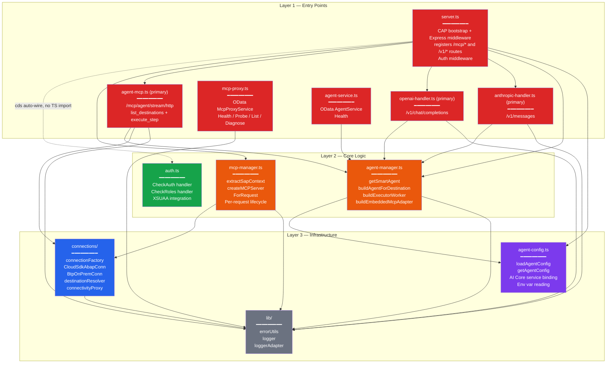

### Module Details

| Module | File | Responsibility |
|--------|------|---------------|
| **CAP Bootstrap** | `server.ts` | Registers Express middleware on `cds.on('bootstrap')`. Mounts `/mcp/stream/http`, `/mcp/agent/stream/http`, and all `/v1/*` routes. Handles Content-Type normalization for Cline. Guards `/mcp/*` and `/v1/*` with a manual Express middleware chain — `context` (CAP `cds.context`) → `wrappedAuth` (`createBasicToBearerMiddleware` over CAP's built-in auth) → `requireMcpRole` (local: 401 if `user.is('anonymous')`, 403 unless `user.is()` matches an `MCP_*` role) → `authJsonErrorHandler`. It does **not** call the `AuthService` OData handlers. |
| **MCP Proxy Service** | `mcp-proxy.ts` + `.cds` | CAP service annotated `@path: 'mcp-proxy'` (mounted at `/odata/v4/mcp-proxy/`). Exposes `Health()`, `ProbeDestination(destination)`, `ListDestinations()`, `DiagnoseDestinations()`, `ProbeActiveDestination()`, `InvokeTool()` (deprecated). Uses SAP Cloud SDK `executeHttpRequest` for destination probing. |
| **MCP Manager** | `mcp-manager.ts` | Core factory for the raw-tools path. `extractSapContext()` reads SAP config from HTTP headers (destination or direct). `createMCPServerForRequest()` creates fresh Connection → EmbeddableMcpServer → StreamableHTTPServerTransport per request. |
| **Agent MCP** | `agent-mcp.ts` | `POST /mcp/agent/stream/http` planner/controller surface — exposes `list_destinations` and `execute_step` (delegate ONE step to the SmartAgent executor via `getSmartAgent`). Connection built lazily per call from `x-sap-*` headers; counts against the gatekeeper's door when `LLM_GATEKEEPER_MAX_LIVE_SESSIONS` is set, and is otherwise capped at two by `Semaphore`. This is a **primary** agent entry point. |
| **OpenAI Handler** | `openai-handler.ts` | `POST /v1/chat/completions` (streaming + JSON), `GET /v1/models` (destination metadata), `GET /v1/usage`, `/v1/destinations/*`. Reads `X-SAP-Destination` header for per-request destination switching. **Primary** agent entry point. |
| **Anthropic Handler** | `anthropic-handler.ts` | `POST /v1/messages` — Anthropic Messages API, translated to the SmartAgent pipeline via `getSmartAgent`; enables Claude CLI via `ANTHROPIC_BASE_URL`. **Primary** agent entry point. |
| **Agent Service** | `agent-service.ts` + `.cds` | CAP service annotated `@path: 'agent'` (mounted at `/odata/v4/agent/`). Exposes `GetHistory()`, `ClearHistory()`, `Health()`. `Health` delegates to `agent-manager.ts` via `getSmartAgent` to probe the LLM; `GetHistory` returns `[]` and `ClearHistory` is a static-success stub. Starts no pipeline (see §1). |
| **Agent Manager** | `agent-manager.ts` | Creates SmartAgent with RAG pipeline via SmartAgentBuilder. Manages per-destination state (each destination's own `McpClientAdapter`). The **tool RAG is a single shared corpus vectorized once** (`sharedToolsRag`, from the destination-independent `HandlerExporter`) and reused by every destination; the embedder and facts/feedback/state RAG stores are likewise shared. Background + on-demand **initialization** for all destinations (no privileged primary; the tool corpus is vectorized once, not per destination); requests wait for a destination via `ensureDestinationInit`. LLM provider is configurable via `LLM_AGENT_PROVIDER` — supports `sap-ai-sdk` (default), `openai` (any OpenAI-compatible API via `baseURL`), `anthropic`, and `deepseek`. Wires the honesty-controller DAG coordinator: `buildAgentForDestination` + `buildExecutorWorker` (v6.28+). Consumed by `agent-mcp.ts`, `openai-handler.ts`, `anthropic-handler.ts`, and `agent-service.ts` (its `Health` probe only). |
| **Honesty Reviewer** | `lib/{recording-mcp-client,reviewer-core,notice-finalizer,notify-policy,step-reviewer,step-gate,write-guardrail}.ts` | Result-based honesty guard (v6.28+). `recording-mcp-client.ts` decorates `IMcpClient` to capture each tool's `McpToolResult` per `traceId`; `reviewer-core.ts` + `notice-finalizer.ts` implement `IFinalizer`/`NoticeFinalizer` comparing response claims against captured results; `notify-policy.ts` decides notice wording; `step-reviewer.ts` provides `evaluateGated`, which `NoticeFinalizer` invokes: a deterministic check (claims vs. tool RESULTS, plus a read claimed with zero calls) and, on every step, an LLM reviewer asking only whether the response delivered what the USER asked — it is forbidden to reason about tools, since every false notice came from doing so; `write-guardrail.ts` checks the write tool's result envelope. The controller wiring itself lives in `agent-manager.ts` (`buildAgentForDestination` → `builder.withDagCoordinator({ …, finalizer: new NoticeFinalizer(recMcp, …) })`). Kill-switch: `LLM_AGENT_STEP_REVIEW_ENABLED=false`. |
| **Agent Config** | `agent-config.ts` | Singleton that assembles runtime config from `LLM_AGENT_*` env vars: provider/auth (`LLM_AGENT_PROVIDER`, `LLM_AGENT_API_KEY`, `LLM_AGENT_BASE_URL`, `LLM_AGENT_RESOURCE_GROUP`), model params (`LLM_AGENT_MODEL`, `LLM_AGENT_TEMPERATURE`, `LLM_AGENT_MAX_TOKENS`), agent behaviour (`LLM_AGENT_MODE`, `LLM_AGENT_MAX_ITERATIONS`, `LLM_AGENT_RAG_TYPE`, `LLM_AGENT_RAG_QUERY_K`, `LLM_AGENT_HISTORY_RECENCY_WINDOW`), and MCP wiring (`LLM_AGENT_MCP_DESTINATION`, `LLM_AGENT_MCP_ENDPOINT`). Also reads the AI Core service binding from `VCAP_SERVICES`. See §12 for per-var semantics. |
| **Auth Service** | `auth.ts` + `.cds` | Standalone CAP OData service annotated `@path: 'auth'` (mounted at `/odata/v4/auth/`). `CheckAuth()` returns the caller's identity, `CheckRoles(required)` reports which roles they hold — a **diagnostic/introspection endpoint** clients can call directly. It is **not** in the `/mcp/*` or `/v1/*` request path — those are gated by `server.ts`'s `requireMcpRole` middleware (`user.is()`), not by this service. |
| **Connection Factory** | `connections/connectionFactory.ts` | Decision: `destinationName` → `CloudSdkAbapConnection`; no destination → `createAbapConnection` (direct). |
| **CloudSdk Connection** | `connections/CloudSdkAbapConnection.ts` | `AbapConnection` implementation using `executeHttpRequest` from SAP Cloud SDK. Auto destination resolution, auth, proxy, CSRF token management. |
| **Destination Resolver** | `connections/destinationResolver.ts` | Resolves BTP Destination to `SapConfig` via `getDestination()`. Handles `BasicAuthentication`, `OAuth2ClientCredentials`, `OAuth2SAMLBearerAssertion`. |
| **Connectivity Proxy** | `connections/connectivityProxy.ts` | On-premise support: loads Connectivity service credentials, obtains tokens, builds proxy config for Cloud Connector. |
| **BTP OnPrem Connection** | `connections/BtpOnPremDestinationConnection.ts` | Extends `OnPremAbapConnection` with BTP proxy headers (`Proxy-Authorization`, `SAP-Connectivity-SCC-Location_ID`). |
| **Error Utils** | `lib/errorUtils.ts` | `logErrorSafely()`, `formatErrorMessage()`, `createErrorResponse()`. Handles AxiosError, Cloud SDK errors, and standard errors safely. |
| **Logger** | `lib/logger.ts` | Wraps `@mcp-abap-adt/logger` with extended CSRF/TLS methods. Exports `logger` and `loggerAdapter` (ILogger interface). |
| **Env Setup** | `env-setup.ts` | **Must be imported first.** Sets `MCP_SKIP_AUTO_START`, `MCP_SKIP_ENV_LOAD`. Loads `.env` only in local dev. |

---

## 5. Module Dependency Graph

```mermaid
graph TB
    subgraph "Entry Points (CAP auto-loads server.ts; server.ts wires the rest as Express routes)"
        server_ts["server.ts"]
        agent_mcp_ts["agent-mcp.ts
        (execute_step, primary)"]
        openai_handler_ts["openai-handler.ts
        (/v1/chat/completions, primary)"]
        anthropic_handler_ts["anthropic-handler.ts
        (/v1/messages, primary)"]
        mcp_proxy_ts["mcp-proxy.ts"]
        agent_service_ts["agent-service.ts
        (/odata/v4/agent, Health only)"]
        auth_ts["auth.ts"]
    end

    subgraph "Core Logic"
        mcp_manager["mcp-manager.ts
        (raw /mcp/stream/http only)"]
        agent_manager["agent-manager.ts
        getSmartAgent
        buildAgentForDestination
        buildExecutorWorker
        buildEmbeddedMcpAdapter"]
        agent_config["agent-config.ts"]
        request_conn["lib/request-connection.ts
        establishRequestConnection"]
    end

    subgraph "Honesty controller (lib/)"
        fixed_planner["fixed-executor-planner.ts"]
        notice_finalizer["notice-finalizer.ts"]
        recording_mcp["recording-mcp-client.ts"]
        reviewer_core["reviewer-core.ts"]
        notify_policy["notify-policy.ts"]
        step_reviewer["step-reviewer.ts"]
        step_gate["step-gate.ts"]
        write_guardrail["write-guardrail.ts"]
    end

    subgraph "connections/"
        conn_factory["connectionFactory.ts"]
        cloud_sdk_conn["CloudSdkAbapConnection.ts"]
        dest_resolver["destinationResolver.ts"]
        conn_proxy["connectivityProxy.ts"]
        btp_onprem["BtpOnPremDestinationConnection.ts"]
        conn_index["index.ts (barrel)"]
    end

    subgraph "lib/"
        error_utils["errorUtils.ts"]
        logger_mod["logger.ts"]
        log_mask["log-mask.ts"]
        principal_ts["principal.ts"]
        request_system_ts["request-system-context.ts"]
        exposition_ts["exposition.ts"]
        semaphore_ts["semaphore.ts"]
        agent_mgr_libs["dump-buffer/dump-parser/get-dump-section,
        skills-pool/composite-skill-manager,
        sap-ai-core-embedder, btp-destinations,
        cloud-local-tools (lib/) + srv/rag-collections.ts
        (grouped agent-manager helpers)"]
    end

    subgraph "External Packages"
        mcp_adt_core["@mcp-abap-adt/lib
        EmbeddableMcpServer, HandlerExporter"]
        mcp_adt_conn["@mcp-abap-adt/connection"]
        mcp_adt_hv["@mcp-abap-adt/header-validator"]
        mcp_adt_iface["@mcp-abap-adt/interfaces"]
        mcp_adt_logger["@mcp-abap-adt/logger"]
        mcp_adt_llm_agent["@mcp-abap-adt/llm-agent
        ISubAgent, IFinalizer, IMcpClient (contracts/types)"]
        mcp_adt_llm_agent_mcp["@mcp-abap-adt/llm-agent-mcp
        McpClientAdapter"]
        mcp_adt_llm_agent_libs["@mcp-abap-adt/llm-agent-libs
        SmartAgent, SmartAgentBuilder, DagPlanInterpreter"]
        mcp_adt_openai_embedder["@mcp-abap-adt/openai-embedder
        OpenAiEmbedder"]
        mcp_sdk["@modelcontextprotocol/sdk"]
        sap_cds["@sap/cds"]
        sap_cloud_sdk["@sap-cloud-sdk/*"]
        sap_xsenv["@sap/xsenv"]
    end

    env_setup["env-setup.ts"]

    %% server.ts dependencies
    server_ts --> env_setup
    server_ts --> mcp_manager
    server_ts --> agent_mcp_ts
    server_ts --> openai_handler_ts
    server_ts --> anthropic_handler_ts
    server_ts --> agent_manager
    server_ts --> agent_config
    server_ts --> error_utils
    server_ts --> sap_cds

    %% mcp-proxy.ts dependencies (log-mask is a static import; errorUtils is a lazy
    %% dynamic import() used only on the probe error path)
    mcp_proxy_ts --> sap_cds
    mcp_proxy_ts --> sap_cloud_sdk
    mcp_proxy_ts --> log_mask
    mcp_proxy_ts --> error_utils

    %% mcp-manager.ts dependencies (raw /mcp/stream/http path — NOT the agent's tool path)
    mcp_manager --> env_setup
    mcp_manager --> conn_factory
    mcp_manager --> conn_index
    mcp_manager --> dest_resolver
    mcp_manager --> error_utils
    mcp_manager --> exposition_ts
    mcp_manager --> log_mask
    mcp_manager --> logger_mod
    mcp_manager --> mcp_adt_core
    mcp_manager --> mcp_adt_conn
    mcp_manager --> mcp_adt_hv
    mcp_manager --> mcp_adt_iface
    mcp_manager --> mcp_sdk
    mcp_manager --> sap_cds

    %% primary agent handlers: request-connection + getSmartAgent, converging on agent-manager.ts
    agent_mcp_ts --> request_conn
    agent_mcp_ts --> agent_manager
    agent_mcp_ts --> conn_factory
    agent_mcp_ts --> dest_resolver
    agent_mcp_ts --> exposition_ts
    agent_mcp_ts --> principal_ts
    agent_mcp_ts --> request_system_ts
    agent_mcp_ts --> semaphore_ts
    openai_handler_ts --> request_conn
    openai_handler_ts --> agent_manager
    openai_handler_ts --> exposition_ts
    openai_handler_ts --> request_system_ts
    anthropic_handler_ts --> request_conn
    anthropic_handler_ts --> agent_manager
    anthropic_handler_ts --> request_system_ts

    %% agent-service.ts dependencies (Health probe only, same agent-manager)
    agent_service_ts --> agent_config
    agent_service_ts --> agent_manager

    %% request-connection.ts dependencies
    request_conn --> mcp_adt_conn
    request_conn --> mcp_adt_iface
    request_conn --> conn_factory
    request_conn --> dest_resolver
    request_conn --> log_mask
    request_conn --> principal_ts
    request_conn --> request_system_ts

    %% agent-manager.ts dependencies — tools come from the EMBEDDED in-process
    %% adapter (HandlerExporter + McpClientAdapter), never from mcp-manager.ts
    agent_manager --> agent_config
    agent_manager --> mcp_adt_llm_agent
    agent_manager --> mcp_adt_llm_agent_mcp
    agent_manager --> mcp_adt_llm_agent_libs
    agent_manager --> mcp_adt_core
    agent_manager --> mcp_adt_openai_embedder
    agent_manager --> dest_resolver
    agent_manager --> logger_mod
    agent_manager --> agent_mgr_libs
    agent_manager --> fixed_planner
    agent_manager --> notice_finalizer
    agent_manager --> recording_mcp

    %% honesty controller lib dependencies
    fixed_planner --> mcp_adt_llm_agent
    notice_finalizer --> mcp_adt_llm_agent
    notice_finalizer --> notify_policy
    notice_finalizer --> recording_mcp
    notice_finalizer --> step_reviewer
    recording_mcp --> mcp_adt_llm_agent
    reviewer_core --> mcp_adt_llm_agent
    reviewer_core --> write_guardrail
    notify_policy --> reviewer_core
    step_reviewer --> mcp_adt_llm_agent
    step_reviewer --> reviewer_core
    step_reviewer --> step_gate

    %% principal.ts / request-system-context.ts dependencies
    request_system_ts --> mcp_adt_core

    %% agent-config.ts dependencies
    agent_config --> sap_cds

    %% auth.ts dependencies
    auth_ts --> sap_cds

    %% connectionFactory.ts dependencies
    conn_factory --> cloud_sdk_conn
    conn_factory --> mcp_adt_conn
    conn_factory --> logger_mod

    %% CloudSdkAbapConnection.ts dependencies
    cloud_sdk_conn --> env_setup
    cloud_sdk_conn --> mcp_adt_conn
    cloud_sdk_conn --> sap_cloud_sdk
    cloud_sdk_conn --> logger_mod
    cloud_sdk_conn --> error_utils

    %% destinationResolver.ts dependencies
    dest_resolver --> mcp_adt_conn
    dest_resolver --> sap_cloud_sdk
    dest_resolver --> sap_xsenv
    dest_resolver --> error_utils

    %% connectivityProxy.ts dependencies
    conn_proxy --> sap_xsenv
    conn_proxy --> btp_onprem
    conn_proxy --> mcp_adt_conn

    %% BtpOnPremDestinationConnection.ts dependencies
    btp_onprem --> mcp_adt_conn
    btp_onprem --> logger_mod

    %% logger.ts dependencies
    logger_mod --> mcp_adt_logger
    logger_mod --> mcp_adt_iface

    %% error_utils dependencies
    error_utils --> mcp_adt_conn

    style server_ts fill:#dc2626,color:#fff
    style agent_mcp_ts fill:#dc2626,color:#fff
    style openai_handler_ts fill:#dc2626,color:#fff
    style anthropic_handler_ts fill:#dc2626,color:#fff
    style mcp_manager fill:#ea580c,color:#fff
    style agent_manager fill:#ea580c,color:#fff
    style conn_factory fill:#2563eb,color:#fff
    style cloud_sdk_conn fill:#2563eb,color:#fff
    style dest_resolver fill:#2563eb,color:#fff
    style env_setup fill:#9333ea,color:#fff
```

---

## 6. Request Lifecycle — MCP Proxy Flow

This is the primary flow when an AI assistant (Cline, Claude Desktop) sends an MCP request.

#### Step 1 — Authentication

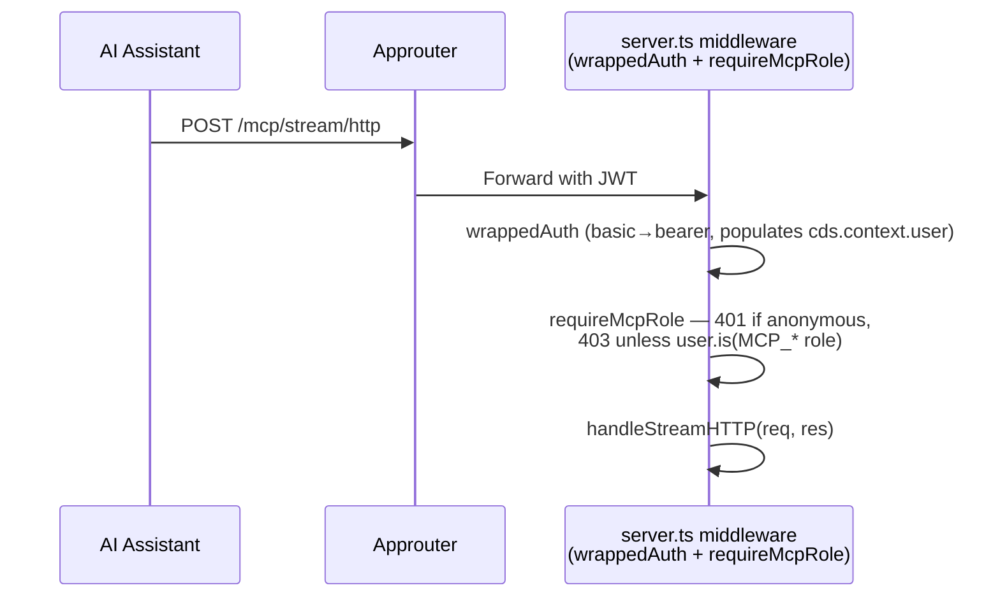

#### Step 2 — Create Connection + MCP Server

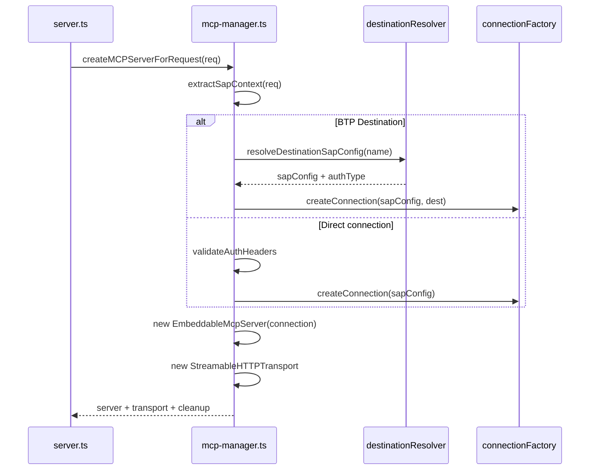

#### Step 3 — Execute MCP Request

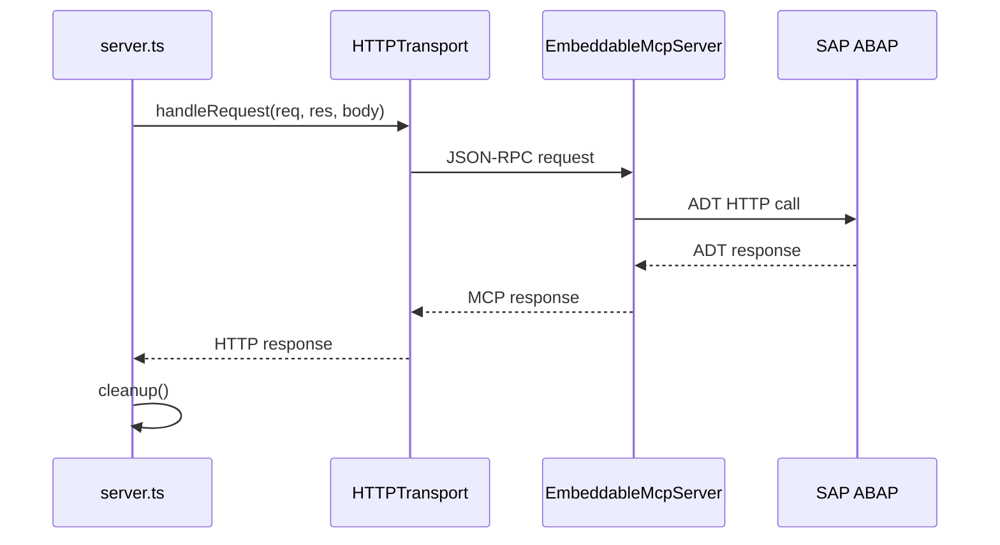

### Per-Request Architecture (Key Design)

Each HTTP request creates **three fresh objects** — no shared state between requests:

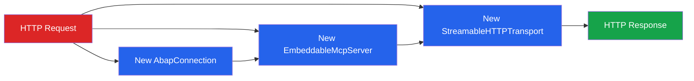

---

## 7. Request Lifecycle — Agent / LLM Flow

> This is the flow through the **primary** agent surfaces — `/mcp/agent/stream/http` (`execute_step`), `/v1/chat/completions`, `/v1/messages`. The two `/v1/*` handlers build their per-request connection via `establishRequestConnection` (`request-connection.ts`); `/mcp/agent/stream/http` builds its own via the local `buildConnectionForDestination` in `agent-mcp.ts`. All three then call `getSmartAgent` directly, enter the per-request ALS scope through `runWithRequestConnection` (exported from `agent-manager.ts`), and converge on the same DAG-coordinator controller shown in Step 4.

#### Step 1 — Connection + Agent Handle

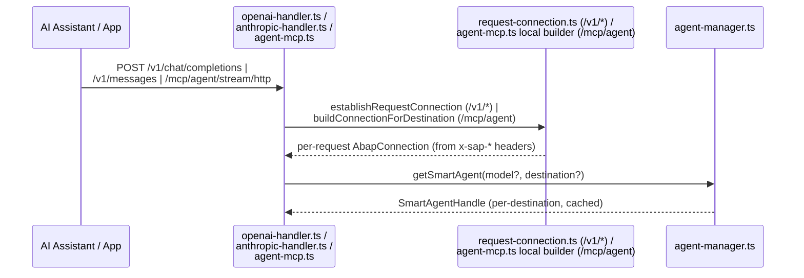

#### Step 2 — Run the Agent

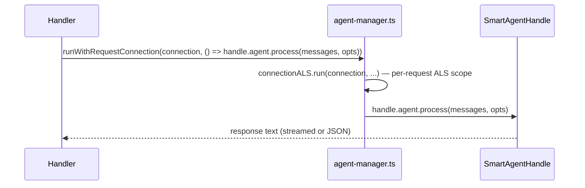

#### Step 3 — Inside `handle.agent.process` (tool-select + embedded MCP tools)

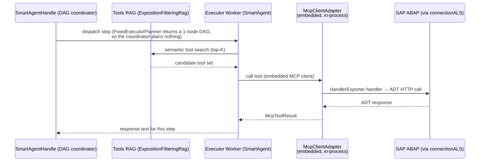

There is **no HTTP self-call** to `/mcp/stream/http` here: `buildEmbeddedMcpAdapter()` (`agent-manager.ts`) wires the executor's tools straight to the in-process `HandlerExporter` from `@mcp-abap-adt/lib`, wrapped by `McpClientAdapter` (`transport: 'embedded'`). See §16 "Agent Tool Access: Embedded, Not Self-Loop-HTTP" for the full picture.

#### Step 4 — Honesty Controller (DAG coordinator + reviewer) *(v6.28+)*

Every channel that reaches the destination agent — `execute_step`, `/v1/chat/completions`, and `/v1/messages` — now runs through an explicit **controller** built on the imported llm-agent **DAG-coordinator** interfaces, not the bare SmartAgent loop:

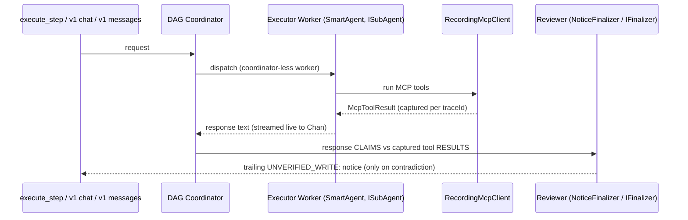

- The SmartAgent itself becomes a **coordinator-less executor worker** — it no longer owns the top-level loop.
- The reviewer compares what the response text **claims** to have written against the **actual tool results**, not tool names (`CreateDomain` self-activates via `activate:true`, so name-only matching false-positives).
- **NOTICE-ONLY**: the executor's content still streams live; the notice is appended as a trailing chunk. It is a soft warning ("verify against the system"), never a hard block — the consumer decides.
- Uniform across all three channels (previously this existed only on `execute_step`). Disabled entirely via `LLM_AGENT_STEP_REVIEW_ENABLED=false`. Not wired into the LLM-only path (no ABAP tools → nothing to verify).

---

## 8. Authentication & Authorization Flow

```mermaid
graph TB
    subgraph XSUAA["XSUAA Security Model (tiered, cumulative scopes)"]
        S1["MCP_Reader<br/>scope"]
        S2["MCP_Analyst<br/>scope"]
        S3["MCP_Developer<br/>scope"]
        S4["MCP_Full<br/>scope"]

        RT1["MCP_Reader<br/>Role Template"] --> S1
        RT2["MCP_Analyst<br/>Role Template"] --> S1
        RT2 --> S2
        RT3["MCP_Developer<br/>Role Template"] --> S1
        RT3 --> S2
        RT3 --> S3
        RT4["MCP_Full<br/>Role Template"] --> S1
        RT4 --> S2
        RT4 --> S3
        RT4 --> S4

        RC1["MCP Reader Access"] --> RT1
        RC2["MCP Analyst Access"] --> RT2
        RC3["MCP Developer Access"] --> RT3
        RC4["MCP Full Access"] --> RT4
    end

    subgraph AUTH_FLOW["Runtime Auth Flow (/mcp, /v1)"]
        REQ["Incoming Request
        + JWT / Basic Auth"]
        WA["wrappedAuth
        basic→bearer, populates
        cds.context.user"]
        RMR["requireMcpRole
        user.is() role check"]

        REQ --> WA
        WA -->|user.is('anonymous')| REJECT401["401 Unauthorized"]
        WA -->|authenticated| RMR
        RMR -->|no MCP_* role| REJECT403["403 Forbidden"]
        RMR -->|user.is(MCP_* role)| HANDLER["MCP / Agent / v1 Handler"]
    end

    style RC1 fill:#f59e0b,color:#000
    style RC2 fill:#f59e0b,color:#000
    style RC3 fill:#f59e0b,color:#000
    style RC4 fill:#f59e0b,color:#000
    style RMR fill:#16a34a,color:#fff
```

> The role check runs **before** the handler, inside the Express middleware chain (`requireMcpRole`, `user.is(...)`), not as a post-handler step. The `AuthService` OData handlers (`CheckAuth`/`CheckRoles`, `auth.ts`) are a separate introspection endpoint (`/odata/v4/auth/`), not part of this path.

> **Where the caller's roles reach the rest of the request.** `requireMcpRole` only
> admits or refuses. What the caller may see and run is carried by their
> *exposition* — the tool groups their roles grant — and it travels two ways:
> in the agent's request options, and in the request-scoped store
> (`connectionALS`). The RAG reads the options first and the store second; the
> execution check (`assertToolAllowed`) reads the store. Two sources rather than
> one because the options do not always survive: the pipeline selects tools twice
> per request and the second run rebuilds its own options. Losing the exposition
> there means the search silently falls back to Reader level and queries only the
> reader collection — the tool a Developer needs is never offered, and nothing
> reports an error. With neither source, Reader level stands: fail-closed.

### Auth Modes

| Environment | Auth Kind | Details |
|------------|-----------|---------|
| **Development** (`cds watch`) | Mocked | Tiered mock users (`package.json`): `alice` (`MCP_Full`+`MCP_Developer`+`MCP_Analyst`+`MCP_Reader`), `bob` (`MCP_Developer`+`MCP_Analyst`+`MCP_Reader`), `carol` (`MCP_Analyst`+`MCP_Reader`), `dave` (`MCP_Reader` only) |
| **Production** (BTP) | XSUAA JWT | Token validated by CAP middleware; roles from JWT claims — one of `MCP_Reader` / `MCP_Analyst` / `MCP_Developer` / `MCP_Full` (cumulative), enforced by `requireMcpRole` |

---

## 9. Connection Strategy

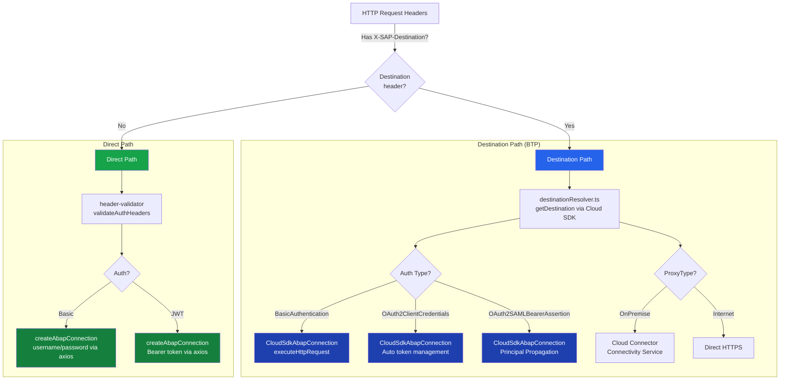

### Connection Classes

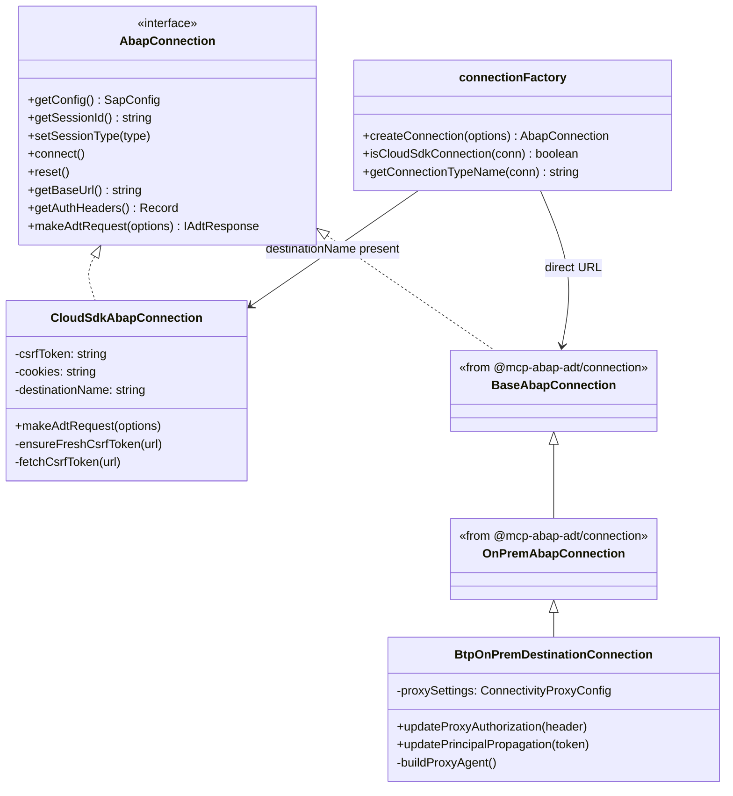

---

## 10. SAP BTP Deployment Architecture

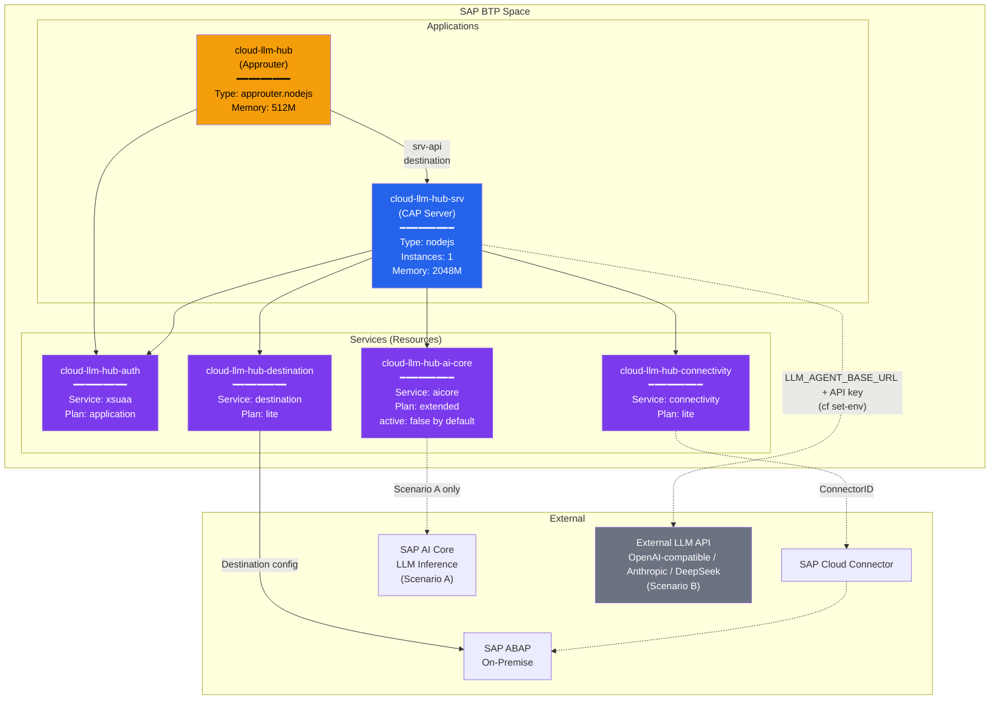

### MTA Build & Deploy

```
npm run build:mta    →  mbt build → gen/mta_archives/cloud-llm-hub.mtar
npm run deploy       →  cf deploy gen/mta_archives/cloud-llm-hub.mtar
```

The `mta.yaml` build runs, in `before-all`:
1. remove `node_modules`, then `npm ci` — a clean install
2. `npx cds build --production` — compile CDS models to `gen/srv`
3. copy `app/chat/webapp` into `gen/srv`

and then, in the srv module's own build step:

4. `npm ci --omit=dev --omit=optional` — reinstall in `gen/srv` without dev or optional dependencies
5. cleanup of files not needed at runtime

---

## 11. CDS Service Model

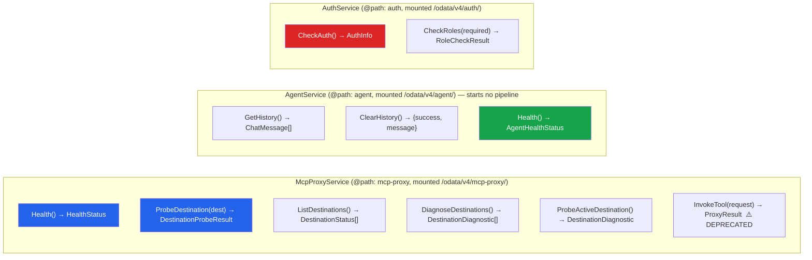

**Note:** the primary agent/LLM surfaces (`/mcp/agent/stream/http` `execute_step`, `/v1/chat/completions`, `/v1/messages`) are plain Express routes, not CDS services — they are not in this diagram. See §1 and §7.

**Note:** The Stream-HTTP MCP endpoint (`POST /mcp/stream/http`) is **not** a CDS function — it is a custom Express route registered in `server.ts` during `cds.on('bootstrap')`.

---

## 12. Configuration & Environment

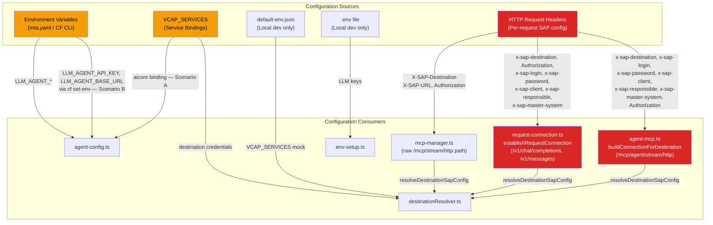

### Key Environment Variables

| Variable | Used By | Purpose |
|----------|---------|---------|
| `LLM_AGENT_MODEL` | `agent-config.ts` | LLM model name (e.g., `gpt-4o-mini`, `claude-3-5-sonnet`) |
| `LLM_AGENT_TEMPERATURE` | `agent-config.ts` | Temperature (0.0–2.0, default: 0.7) |
| `LLM_AGENT_MAX_TOKENS` | `agent-config.ts` | Max response tokens (default: 2000) |
| `LLM_AGENT_MCP_DESTINATION` | `agent-config.ts`, `agent-manager.ts` | BTP Destination with two roles: (1) a "warm this first" startup hint (NOT privileged; does not block startup), and (2) the **implicit default destination** `getSmartAgent()` uses when a request passes no destination (`requestedDestination \|\| config.mcp.destination`, `agent-manager.ts`). Unset → LLM-only mode at startup |
| `LLM_AGENT_DESTINATION_INIT_WAIT_MS` | `agent-manager.ts` | Max ms `getSmartAgent` waits for a destination to vectorize before erroring (default: 90000) |
| `LLM_AGENT_MCP_ENDPOINT` | `agent-config.ts` | **Inert.** Read into `config.mcp.endpoint` and logged at startup, but no runtime path consumes it — the agent calls embedded handlers, not an MCP URL. Setting it changes nothing |
| `LLM_AGENT_RESOURCE_GROUP` | `agent-config.ts`, `agent-manager.ts` | AI Core resource group; read into `llm.resourceGroup` (`agent-config.ts`) and passed to `makeLlm`, the embedder, and the tool-RAG store / embedding-bundle fingerprint (`agent-manager.ts`). Default: `default` |
| `LLM_AGENT_PROVIDER` | `agent-config.ts` | LLM provider (`sap-ai-sdk` \| `openai` \| `anthropic` \| `deepseek`, default: `sap-ai-sdk`) |
| `LLM_AGENT_API_KEY` | `agent-config.ts` | API key for non-SAP LLM providers (OpenAI, Anthropic, DeepSeek) |
| `LLM_AGENT_BASE_URL` | `agent-config.ts` | Base URL for LLM provider API (required for OpenAI-compatible endpoints) |
| `LLM_AGENT_HISTORY_RECENCY_WINDOW` | `agent-config.ts` | Max recent messages to LLM (older excluded, available via RAG) |
| `LLM_AGENT_MODE` | `agent-config.ts` | SmartAgent mode (`smart` \| `pass` \| `hard`, default: `smart`) |
| `LLM_AGENT_MAX_ITERATIONS` | `agent-config.ts` | Max tool-loop iterations (default: `10`) |
| `LLM_AGENT_RAG_TYPE` | `agent-config.ts`, `agent-manager.ts` | Selects the tool-intent RAG mode. `in-memory` (the default) is keyword-only and builds **no** embedder (`agent-manager.ts`: `if (ragType === 'in-memory') return null`). **Any other value** — every deployment template sets `vector` — takes the vector path, with the embedder chosen by `LLM_AGENT_PROVIDER`. There is no separate Ollama backend, despite the `RagType` union in `agent-config.ts` still naming `ollama` |
| `LLM_AGENT_RAG_QUERY_K` | `agent-config.ts` | Number of tools selected per query by the tool-intent RAG. Code fallback is `5`, but `mta.yaml` sets `15` — that is what a BTP deployment runs with. Too-low K makes outcome-phrased requests miss tools |
| `LLM_AGENT_INCLUDE_COMPACT` | `agent-manager.ts` (`getHandlerExporterConfig`) | Opt-in (`true`; default OFF): add the generic compact/low-level handlers (`HandlerCreate`, `HandlerActivate`, …) to the shared tool corpus alongside the high-level named tools. Changes both the RAG tool list and the callable embedded adapter |
| `LLM_AGENT_INCLUDE_LOW_LEVEL` | `agent-manager.ts` (`getHandlerExporterConfig`) | Opt-in (`true`; default OFF): add the low handler group to the shared tool corpus. Same dual effect (RAG list + embedded adapter) as `LLM_AGENT_INCLUDE_COMPACT` |
| `DESTINATION_MAPPING` | `agent-manager.ts` | Comma-separated `system=destination` map (e.g. `DEV.100=S4HANA_DEV,QAS.600=S4HANA_QAS`); parsed at startup, resolves a SAP system code to a BTP destination name via `resolveSystemDestination()` (backs `GET /v1/destinations/resolve`) |
| `VCAP_SERVICES` | `agent-config.ts`, `destinationResolver.ts` | Service bindings (AI Core, Destination, Connectivity) |
| `MCP_SKIP_AUTO_START` | `env-setup.ts` | Prevents mcp-abap-adt auto-start |
| `MCP_SKIP_ENV_LOAD` | `env-setup.ts` | Prevents mcp-abap-adt .env loading |
| `LLM_AGENT_STEP_REVIEW_ENABLED` | `agent-manager.ts` | Honesty guard kill-switch (default: on/`true`); `false` disables the reviewer (`NoticeFinalizer`) entirely — no `UNVERIFIED_WRITE:` notices on any channel |
| `LLM_AGENT_STEP_REVIEW_TIMEOUT_MS` | `lib/step-gate.ts` | Hard timeout (ms) for the reviewer's LLM critic call (default: `8000`; empty/invalid/`<=0` → `8000`) |

### Key HTTP Headers (Per-Request)

| Header | Purpose |
|--------|---------|
| `Authorization` | Bearer JWT or Basic auth for XSUAA |
| `X-SAP-Destination` | BTP Destination name → triggers CloudSdkAbapConnection |
| `X-SAP-URL` | Direct SAP system URL (no destination) |
| `X-SAP-Client` | SAP client number |
| `X-SAP-Login` / `X-SAP-Password` | Override destination auth with Basic |
| `X-SAP-Connectivity-Mode` | `onprem` to route through Cloud Connector |
| `X-SAP-Connectivity-Location-ID` | Cloud Connector location ID |
| `X-Rag-Collections` | Comma-separated RAG collection names to include in agent context |

---

## 13. External Dependencies

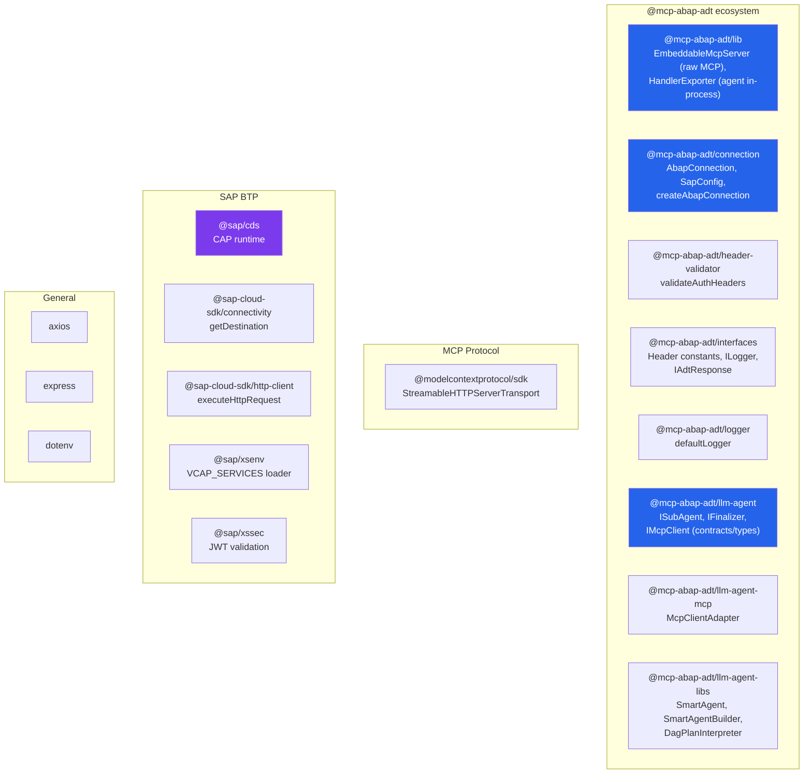

---

## 14. Testing Strategy

```mermaid
graph LR
    subgraph "Test Types"
        UT["Unit Tests<br/>test/unit/<br/>Jest + ts-jest"]
        IT["Integration Tests<br/>test/test-cap-from-yaml.js<br/>YAML-driven"]
        ST["Smoke Tests<br/>test/smoke/<br/>Shell scripts"]
        AT["Agent Tests<br/>test/test-agent*.sh<br/>BTP + OData"]
    end

    subgraph "Commands"
        C1["npm run test:unit"]
        C2["npm test"]
        C3["Manual execution"]
        C4["Manual execution"]
    end

    C1 --> UT
    C2 --> IT
    C3 --> ST
    C4 --> AT
```

| Command | What it does |
|---------|-------------|
| `npm run test:unit` | Jest unit tests |
| `npm run test:unit:watch` | Jest in watch mode |
| `npm run test:unit:coverage` | Jest with coverage |
| `npm test` | YAML-driven integration tests (requires `test/integration.yaml`) |
| `npm run test:check` | TypeScript type-check (`tsc --noEmit`) |
| `npm run lint` | Biome linter (check + auto-fix) |
| `npm run format` | Biome formatter |

---

## 15. Multi-Destination Architecture (v2.2.0)

Cloud LLM Hub automatically discovers SAP ABAP destinations from BTP Destination Service and manages per-destination state.

### Destination Discovery & Filtering

```mermaid
graph LR
    BTP_API["BTP Destination Service<br/>GET /destination-configuration/v1/subaccountDestinations"] --> FILTER["Filter Heuristic"]
    FILTER -->|"OnPremise + BasicAuth<br/>Exclude OData, /srvd_a2x/<br/>Exclude cloud-connector"| SAP_DESTS["SAP ABAP Destinations"]
```

**Heuristic:** `isSapAbapDestination()` selects OnPremise + BasicAuthentication destinations, excluding OData service endpoints and technical destinations (`cloud-connector`, `cloud_connector`, `connectivity`).

### Per-Destination State

```mermaid
graph TB
    subgraph "Shared Components"
        EMB["Embedder<br/>(text-embedding model)"]
        FACTS["Facts RAG Store"]
        FB["Feedback RAG Store"]
        STATE["State RAG Store"]
        TOOLS["Tools RAG Store<br/>(shared corpus,<br/>vectorized once)"]
    end

    subgraph "Per-Destination State Map"
        D1["S4HANA_DEV<br/>status: ready<br/>toolCount: 259"]
        D2["S4HANA_TST<br/>status: vectorizing<br/>toolCount: 0"]
        D3["S4HANA_QAS<br/>status: pending<br/>toolCount: 0"]
    end

    D1 --> MCP1["McpClientAdapter"]
    D2 --> MCP2["McpClientAdapter"]
    D3 --> MCP3["McpClientAdapter"]

    D1 -->|toolsRag| TOOLS
    D2 -->|toolsRag| TOOLS
    D3 -->|toolsRag| TOOLS

    EMB --> TOOLS

    style D1 fill:#16a34a,color:#fff
    style D2 fill:#f59e0b,color:#000
    style D3 fill:#6b7280,color:#fff
```

Each destination has its own cached `McpClientAdapter`, but that adapter is **not** an ABAP connection: it wraps the embedded handlers and is built over a *placeholder* connection (`agent-manager.ts`: "Handler context with a placeholder connection"). The real connection is created per request and reaches each tool call through `connectionALS` — see the Embedded and Stateless sections below. The `Tools RAG Store`, meanwhile, is a **single shared corpus** — tools come from `HandlerExporter` and, for a given include-config, are identical for every SAP system, so it is vectorized **once** (`sharedToolsRag` / `ensureSharedToolsVectorized`, `agent-manager.ts`) and each destination's `toolsRag` points at it. (The corpus contents are config-dependent, not fixed: `getHandlerExporterConfig()` — driven by `LLM_AGENT_INCLUDE_COMPACT` / `LLM_AGENT_INCLUDE_LOW_LEVEL` — is the single source of truth shared by the RAG tool list and the callable embedded adapter, so they never diverge; the sharing is across destinations, for whatever config is active.) The embedder and facts/feedback/state RAG stores are likewise shared. See §"Shared tool corpus" in CLAUDE.md.

**Note:** The tools RAG store uses a `NamespaceIgnoringRag` wrapper that strips `ragFilter` before querying. This is because tools have no namespace — unlike domain RAG stores which use `ragFilter.namespace` to separate collections.

### Startup & Background Vectorization

1. **No blocking primary.** Startup is ready immediately (shared LLMs init lazily) — readiness does NOT depend on any destination vectorizing. There is no privileged destination.
2. `initBackgroundDestinations()` fires (non-blocking) and warms **all** destinations equally:
   - Fetches all BTP destinations via Destination Service API
   - Registers ALL as `pending` immediately (visible in UI)
   - Initializes each destination sequentially in background (the `LLM_AGENT_MCP_DESTINATION` hint, if set, goes first). The **tool corpus is vectorized only once** into the shared `sharedToolsRag` — `initDestination()` reuses it with **no per-destination re-vectorization** (`agent-manager.ts`); per-destination init only wires the `McpClientAdapter` + the **generic** executor skills pool (`buildSkillsPool()`, identical for every destination; the DAG-controller build skips it via `skipSkills`)
3. A request to a not-yet-ready destination **waits** (bounded by `LLM_AGENT_DESTINATION_INIT_WAIT_MS`, default 90s) in `getSmartAgent` and is served once ready — instead of erroring `agent not initialized`. Concurrent inits are deduped via `ensureDestinationInit`.
4. UI polls `GET /v1/models` every 15s to update destination status

### Destination Switching

- Client sends `X-SAP-Destination: <name>` header on `POST /v1/chat/completions`
- `getSmartAgent(model?, destination?)` checks pre-built `DestinationState` map
- If destination is `ready`, uses pre-built adapter + tools RAG — no rebuild needed
- Old agent stays ready during any rebuild (no 503 errors)

---

## 16. Key Design Decisions

### Per-Request Architecture (No Server Cache)

Every MCP request creates a **fresh** Connection + MCP Server + Transport. No session caching. This eliminates stale credential/state issues but means each request independently resolves destinations and creates CSRF tokens.

### Two Auth Layers

1. **XSUAA** (outer) — authenticates the user calling Cloud LLM Hub
2. **SAP system auth** (inner) — authenticates against the target ABAP system, configured per-request via headers or BTP Destination

### env-setup.ts Must Be First Import

The `@mcp-abap-adt` submodule has auto-start code that runs on import. `env-setup.ts` sets `MCP_SKIP_AUTO_START=true` and `MCP_SKIP_ENV_LOAD=true` **before** any submodule imports to prevent unintended behavior.

### SAP Cloud SDK for Destination Handling

All destination-based connections use `executeHttpRequest` from `@sap-cloud-sdk/http-client` instead of manual axios calls. This gives automatic:
- Destination resolution
- Auth token management (Basic, OAuth2, SAML Bearer)
- Cloud Connector proxy routing
- Token refresh

### Agent Tool Access: Embedded, Not Self-Loop-HTTP

The agent does **not** call its own `/mcp/stream/http` over HTTP. `buildEmbeddedMcpAdapter()` (`agent-manager.ts`) builds an **in-process** MCP client: `HandlerExporter` (`@mcp-abap-adt/lib`) yields tool handlers directly, which are wrapped in `MCPClientWrapper` with `transport: 'embedded'` and adapted to `IMcpClient` via `McpClientAdapter`. The per-request ABAP connection is injected into the handler context (via `connectionALS`), not resolved through an HTTP round-trip. This means the LLM agent uses the same tool handlers that `mcp-abap-adt` exposes over `/mcp/stream/http`, without an actual network hop.

```mermaid
graph LR
    AGENT[SmartAgent / Executor] -->|in-process call| ADAPTER[McpClientAdapter<br/>MCPClientWrapper transport=embedded]
    ADAPTER --> HANDLERS[HandlerExporter tool handlers]
    HANDLERS --> ABAP[ABAP System]

    style AGENT fill:#16a34a,color:#fff
    style ADAPTER fill:#2563eb,color:#fff
```

### Stateless by Default

- **Raw MCP protocol** (`/mcp/stream/http`) is stateless per request: `MCP_ENABLE_SESSION_STORAGE=false` by default, no cross-request MCP session store
- **Exception — `/v1/chat/completions` server-managed sessions:** the OpenAI handler keeps a process-local `sessionStore` of chat history keyed by session+user (`openai-handler.ts`), expired after 30 min of inactivity by a periodic cleanup (`SESSION_TTL_MS`). This is conversation history, not connection or agent state
- **Agent handles** (`SmartAgentHandle`) are cached **per destination for the process lifetime** — reused across requests, cleared only on shutdown cleanup (no TTL). The 30-min TTL above applies to OpenAI chat history, not to agent instances
- Fresh auth on every **SAP-touching** request — the raw MCP path and the agent/tool-execution endpoints (`/mcp/stream/http`, `/mcp/agent/stream/http`, `POST /v1/chat/completions`, `POST /v1/messages`) build a per-request SAP connection from the caller's credentials, never a cached connection. The non-SAP-connection routes (`/v1/models`, `/v1/usage`, `/v1/destinations/*`, `/v1/token`) create no per-request SAP connection — some touch `getSmartAgent()`/`refreshDestinations()` for metadata or destination warm-up, but none open a caller-credentialed ABAP connection

### Upstream throttling is a 5xx to our caller, never a 429

When SAP AI Core throttles us, `@mcp-abap-adt/llm-agent` establishes the facts —
this is a 429, the server named this interval, the quota is shut until then —
and leaves the decision to its consumer. We are that consumer. The decisions are
ours, and they are these.

**The caller gets a 5xx with `Retry-After`, not `429`.** A `429` says *this
caller* sent too many requests, which is wrong twice over. The caller does not
set the rate: it arrives with one question. And the traffic is not one-to-one —
a single chat request fans out into as many LLM calls as the tool loop needs, so
a consumer's request count says nothing about how much upstream quota it spends.
A client acting on a `429` would throttle itself for a limit it never reached.
What actually happened is that we are temporarily unable to answer and know when
we will be able to.

The exact status follows the dialect of the channel. `/v1/messages` speaks
Anthropic's, where `overloaded_error` is paired with `529` — sending their error
type under a different status would be a pairing their clients have never seen.
`Retry-After` applies to it as it would to a `503`.

**Every channel says when to come back**, in the shape that channel speaks: the
message as response content on `/v1/chat/completions`, an Anthropic
`overloaded_error` envelope with `529` on `/v1/messages` (as an SSE `error`
event when streaming, where the type travels without a status), and the step's
error text for `execute_step`. The number is the
server's own, carried on the error rather than guessed at. The formatters live
in `srv/lib/throttle-surfacing.ts` so a test exercises what the handlers run;
a test that rebuilds an envelope beside a handler stays green when the handler
stops sending it.

**We do not retry a rate limit ourselves.** A second request into a quota the
server has just closed earns another penalty and lengthens the very window it
was waiting out. The handler used to do this — twice, with a fixed one- and
two-second wait — and could not see a `Retry-After`, the header being long gone
by the time an error reached it.

**Detection reads a fact, not a substring.** `findThrottled` walks the error's
cause chain for the marker the provider attached. The fallback, for an error
that lost it on the way up, takes a structured status first and then the status
on a *word boundary* — the old matcher called anything containing `429` a rate
limit, so a question about object `4290` was answered with an apology about an
overloaded AI service.

**Where the waiting decision sits.** Ours, not the library's, because only we
know our callers give up around a minute. Since llm-agent 24.0.0 that decision
is a strategy rather than a number, and ours is `WaitIfShortEnough`
(`srv/lib/throttle-strategy.ts`): wait while the **total** stays short enough to
be worth waiting, report anything longer with the number attached. The total,
not the interval in hand — five twenty-second intervals are a hundred seconds
and a cut connection. A caller told to try
again in ninety seconds has something to act on; a caller whose connection was
cut at sixty has nothing. The ceiling is `LLM_AGENT_THROTTLE_MAX_WAIT_MS`,
20 seconds by default.

Deliberately **not** an `AbortSignal` on the call, though the library accepts
one. A signal bounds the whole agent run, and a tool loop legitimately takes
minutes — the deadline we want applies to waiting for a quota, not to doing the
work.

With a door configured the strategy is `WaitAsTold` instead: admission already
decided the caller is carried to the end, so a ceiling behind the door would
only kill work in flight.

The reasoning for the library refusing to choose any of this for us is in
llm-agent's `docs/ARCHITECTURE.md`, under Server-governed throttling.

### Gatekeeper

Memory is the binding resource, spent two ways: pipelines in flight, and
sessions at rest. `srv/lib/door.ts` bounds the first, `srv/lib/session-retention.ts`
the second; `srv/lib/gatekeeper.ts` joins them to the real stores.

- **One session, one pipeline.** The door keys by the authenticated user and
  the issued `clh_session`. A second request for a running session waits.
- **One queue.** Bounded by `LLM_GATEKEEPER_QUEUE_LENGTH`; the oldest waiter that
  can be served goes next. Admission takes a slot and a retention place
  together, or neither.
- **Carried to the end.** Only shutdown aborts an admitted session. A client
  disconnect detaches the output sink (`srv/lib/detached-sink.ts`) and nothing
  more.
- **Teardown order.** Wait for every model and tool call the session started
  (they register themselves through `srv/lib/admission-scope.ts`), then
  `safeStop`, then release the slot.
- **Leases.** Every operation on a session's state holds one. Eviction and the
  TTL sweep skip leased sessions. Every deletion closes the session to new
  leases, cancels RAG operations, waits for the rest, then removes history,
  collections and their directories through one primitive
  (`srv/lib/session-state.ts`).
- **Eviction order.** Idle sessions nobody ever presented go before idle ones a
  caller came back to; least recently used within each group.
- **Admitted before it changes anything.** A request changes a session's
  history, collections or destination, the shared agent's RAG stores, and the
  responsible person only once admitted; a queued caller that leaves is never
  admitted later.
- **Responsible person and master system.** Resolved per request once admitted
  and visible to that run alone (`srv/lib/request-system-context.ts`, a
  workaround for fr0ster/mcp-abap-adt#202): the caller's headers on-premise,
  the headers then the system's own information on cloud.
- **Closed destinations.** Every channel refuses a closed destination before
  attempting a connection to it.
- **Startup.** The `LLM_GATEKEEPER_*` variables are validated in `bootstrap`; a
  malformed one stops `cds serve` before it listens.
- **Observability.** `Health()` returns door, retention, per-destination and
  throttling scopes separately (`srv/lib/gatekeeper-metrics.ts`).

### Honesty controller (executor + reviewer)

The controller is explicit, in the agent layer — not baked into the `execute_step` tool. Key decisions:

- **Explicit controller, not an implicit tool wrapper.** Every channel (`execute_step`, `/v1/chat/completions`, `/v1/messages`) is dispatched through a DAG coordinator built on the imported llm-agent interfaces; the SmartAgent runs underneath it as a coordinator-less executor worker (`ISubAgent`). This replaced the interim `execute_step`-only honesty wrapper.
- **Ground truth = tool RESULTS, not tool names.** `RecordingMcpClient` (`srv/lib/recording-mcp-client.ts`) is a thin `IMcpClient` decorator that captures each executed ABAP tool's `McpToolResult`, scoped per `traceId` and freed after the request. The reviewer parses the write tool's result envelope (`{success, status, error}`) — matching by name alone false-positives, since e.g. `CreateDomain` self-activates via `activate:true`.
- **Reaction = notify + safe-stop, not a hard block.** On a contradiction the reviewer appends a trailing `UNVERIFIED_WRITE:` notice; it never renders a verdict itself. ADT edit-locks are released (`connection.closeSession()`) on every exit path regardless. This is interim behavior until the llm-agent planner/controller lands upstream.

---

> **Last updated:** 2026-07-22 | **Source:** Auto-generated from codebase analysis
