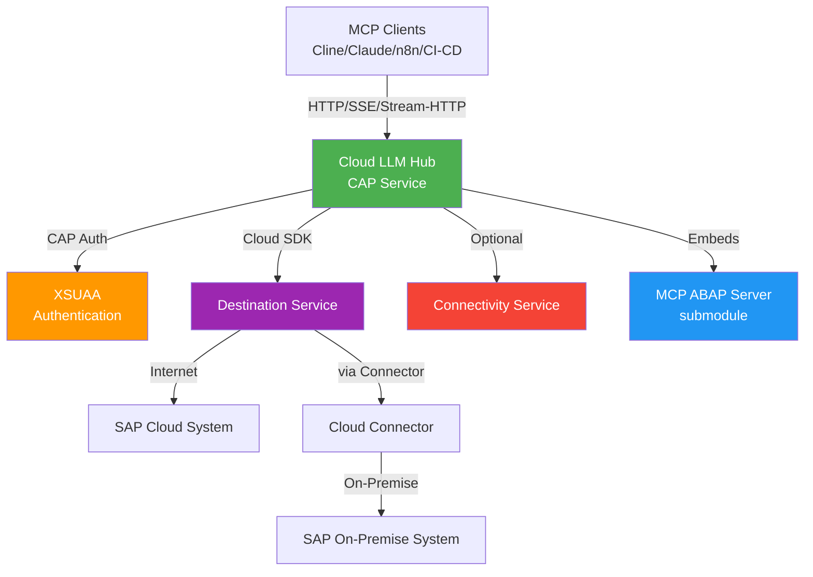
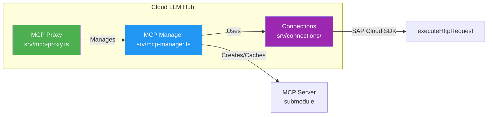
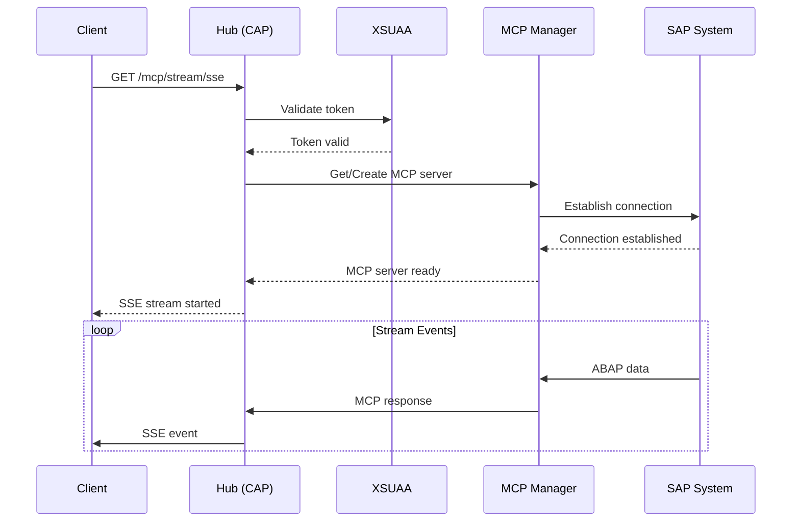
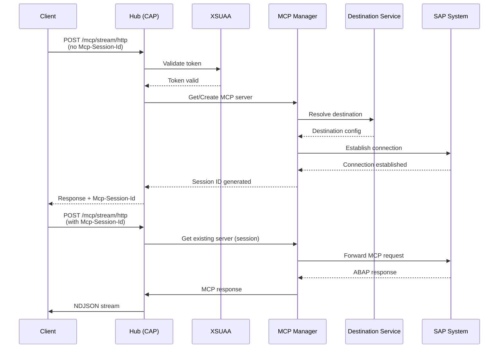
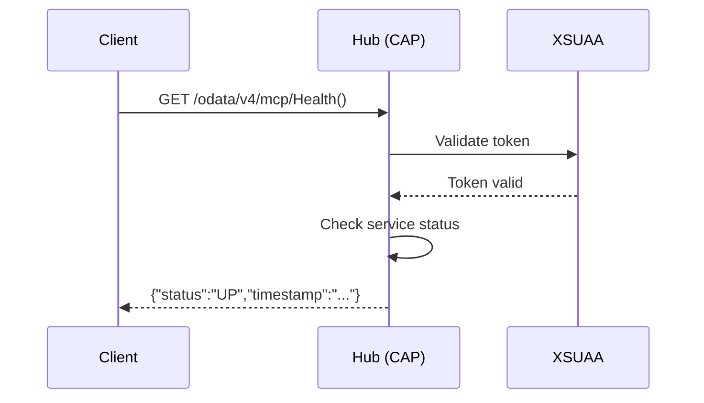
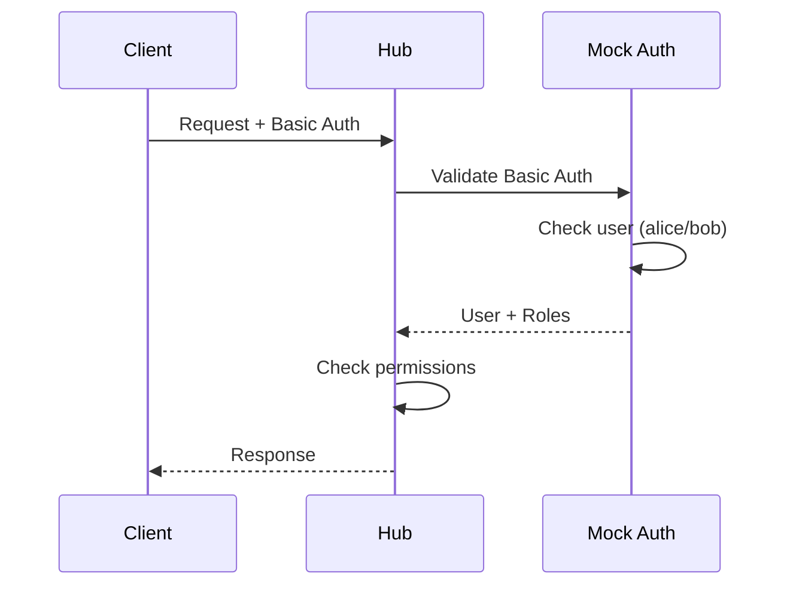
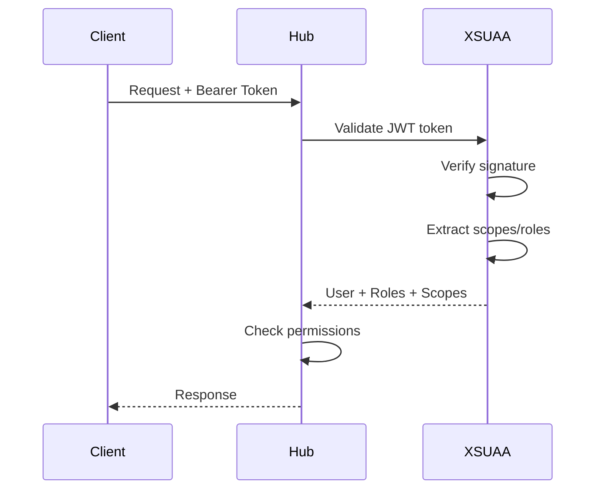

# Architecture Overview

High-level architecture and design decisions for Cloud LLM Hub.

## 🏗️ System Architecture



### Component Architecture



## 📁 Project Structure

```
cloud-llm-hub/
├── srv/                          # Service Layer
│   ├── server.ts                 # CAP server setup & Express routes
│   ├── mcp-proxy.ts              # CAP OData endpoints (Health, Probe)
│   ├── mcp-proxy.cds             # CAP service definitions
│   ├── mcp-manager.ts            # MCP server lifecycle & caching
│   ├── auth.ts                   # Authentication helpers
│   ├── auth.cds                  # CAP auth definitions
│   └── connections/               # Connection handlers
│       ├── destinationResolver.ts    # Destination resolution
│       ├── CloudSdkAbapConnection.ts # Cloud SDK connection
│       ├── BtpOnPremDestinationConnection.ts # On-premise handling
│       └── connectivityProxy.ts      # Cloud Connector proxy
├── tools/                        # Utility Scripts
│   ├── update-cline-connection.js   # Cline config updater
│   ├── copy-mcp-submodule.js        # Build helper
│   └── update-default-env.js        # Env sync
├── test/                         # Tests
│   ├── test-cap-from-yaml.js        # Integration test runner
│   └── smoke/                      # Manual smoke tests
├── submodules/                   # Git Submodules
│   └── mcp-abap-adt/             # ABAP MCP server implementation
├── app/                          # Approuter (BTP)
│   └── router/
├── db/                           # CAP Data Models (reserved)
└── mta.yaml                      # MTA Deployment Descriptor
```

## 🔄 Request Flow

### 1. MCP Request (SSE)



**Detailed flow:**

1. Client sends GET request to `/mcp/stream/sse`
2. CAP authentication middleware validates XSUAA token
3. Express route handler (`server.ts`) processes request
4. MCP Manager creates/retrieves MCP server instance
5. MCP server establishes connection to SAP
6. Server-Sent Events stream responses back to client

### 2. MCP Request (Stream-HTTP)



### 3. Health Check (CAP OData)



**Flow:**

1. Client sends GET request to `/odata/v4/mcp/Health()`
2. CAP authentication middleware validates token
3. CAP handler in `mcp-proxy.ts` processes request
4. Returns health status

## 🔑 Key Components

### MCP Proxy (`srv/mcp-proxy.ts`)

**Responsibilities:**

- CAP OData endpoint handlers
- Health check endpoint
- Destination probe endpoint
- Authentication enforcement

**Key Functions:**

- `Health()` - Health check
- `ProbeDestination()` - Test destination connectivity

### MCP Manager (`srv/mcp-manager.ts`)

**Responsibilities:**

- MCP server lifecycle management
- Server instance caching (30 min TTL)
- Session management for Stream-HTTP
- Connection pooling

**Key Functions:**

- `getMCPServer()` - Get or create MCP server
- `cleanup()` - Clean expired servers

**Caching Strategy:**

- Cache key: SAP system URL
- TTL: 30 minutes
- Cleanup: On-demand and periodic

### Connection Handlers (`srv/connections/`)

**Destination Resolver** (`destinationResolver.ts`):

- Resolves SAP BTP Destination service entries
- Handles authentication types (Basic, OAuth2, SAML)
- Returns connection configuration

**Cloud SDK Connection** (`CloudSdkAbapConnection.ts`):

- Uses SAP Cloud SDK's `executeHttpRequest`
- Handles internet destinations
- Automatic token refresh

**On-Premise Connection** (`BtpOnPremDestinationConnection.ts`):

- Handles on-premise destinations
- Cloud Connector integration
- Location ID management

**Connectivity Proxy** (`connectivityProxy.ts`):

- Manages Cloud Connector proxy
- Handles proxy configuration
- Connection pooling for on-premise

### Server Setup (`srv/server.ts`)

**Responsibilities:**

- CAP server initialization
- Express routes for streaming endpoints
- Middleware configuration
- Error handling

**Express Routes:**

- `GET /mcp/stream/sse` - Server-Sent Events
- `POST /mcp/stream/http` - Streamable HTTP

## 🔐 Authentication Flow

### Development Mode



### Production Mode



**XSUAA Scopes:**

- `MCP_Connect` - Connect to streaming endpoints
- `MCP_Read` - Read MCP data
- `MCP_Admin` - Administrative operations

**Role Collections:**

- `MCP_Connector` - Basic access (Connect + Read)
- `MCP_Admin` - Full access

## 🔌 SAP Connection Modes

### 1. Direct Mode

**Configuration:**

- Direct SAP URL
- JWT token or Basic auth
- No Destination service needed

**Use Cases:**

- Development
- Testing
- Simple integrations

### 2. Destination Mode (Internet)

**Configuration:**

- Destination name in BTP
- Automatic authentication
- Cloud SDK handles tokens

**Use Cases:**

- Production
- Cloud SAP systems
- Enterprise deployments

### 3. Destination Mode (On-Premise)

**Configuration:**

- Destination with `ProxyType=OnPremise`
- Cloud Connector location ID
- Automatic proxy routing

**Use Cases:**

- On-premise SAP systems
- Enterprise networks
- Secure connections

## 📦 MCP Server Integration

### Submodule Structure

```
submodules/mcp-abap-adt/
├── src/
│   ├── index.ts              # MCP server entry point
│   ├── handlers/             # Tool handlers
│   └── lib/                   # Utilities
├── dist/                      # Compiled output
└── package.json
```

### Integration Points

1. **Import:** `@fr0ster/mcp-abap-adt` (from submodule)
2. **Initialization:** Create server instance with SAP connection
3. **Tool Access:** Call tools via MCP protocol
4. **Build:** Submodule compiled during MTA build

### Build Process

1. Build submodule: `npm run build --prefix submodules/mcp-abap-adt`
2. Copy to `gen/srv`: `node tools/copy-mcp-submodule.js`
3. Package in MTAR: MTA build includes `gen/srv`

## 🧪 Testing Architecture

### Integration Tests

- **YAML-driven:** `test/test-cap-from-yaml.js`
- **Configuration:** `test/integration.yaml`
- **Endpoints tested:** Health, SSE, Stream-HTTP, Probe

### Smoke Tests

- **Location:** `test/smoke/`
- **Manual scripts:** For quick verification
- **Coverage:** All endpoints

## 🚀 Deployment Architecture

### MTA Structure

```
cloud-llm-hub/
├── srv (Node.js module)
│   ├── CAP service
│   ├── Express routes
│   └── MCP server (from submodule)
├── app (Approuter)
│   └── Routes configuration
└── Services
    ├── XSUAA
    ├── Destination
    └── Connectivity
```

### Build Process

1. **Submodule build:** Compile `mcp-abap-adt`
2. **CAP build:** `cds build --production`
3. **Copy submodule:** `tools/copy-mcp-submodule.js`
4. **MTA build:** `mbt build`
5. **Deploy:** `cf deploy mta_archives/cloud-llm-hub_1.0.0.mtar`

## 📚 Design Decisions

### Why CAP?

- **Enterprise-ready:** SAP BTP integration
- **Authentication:** Built-in XSUAA support
- **Service layer:** Clean separation of concerns
- **OData:** Standard API protocol

### Why Express Routes for Streaming?

- **Flexibility:** Full control over streaming
- **SSE Support:** Native Server-Sent Events
- **Session Management:** Custom session handling
- **Performance:** Direct stream handling

### Why MCP Server Caching?

- **Performance:** Avoid re-initialization
- **State Management:** Preserve session state
- **Resource Efficiency:** Reuse connections

### Why SAP Cloud SDK?

- **Standard:** SAP-recommended approach
- **Automatic:** Token refresh, proxy handling
- **Reliable:** Production-tested
- **Maintained:** Regular updates

## 🔄 Future Considerations

### Potential Enhancements

- **Rate Limiting:** Per-user request limits
- **Metrics:** Prometheus integration
- **Tracing:** Distributed tracing support
- **Caching:** Response caching for tools
- **Multi-tenant:** Enhanced tenant isolation

## 📚 Related Documentation

- [SAP CAP Documentation](https://cap.cloud.sap/docs/)
- [SAP Cloud SDK](https://sap.github.io/cloud-sdk/)
- [MCP Protocol](https://modelcontextprotocol.io/)
- [Architecture Decision Records](adrs/)

---

**Questions?** Check ADRs or ask in discussions!
