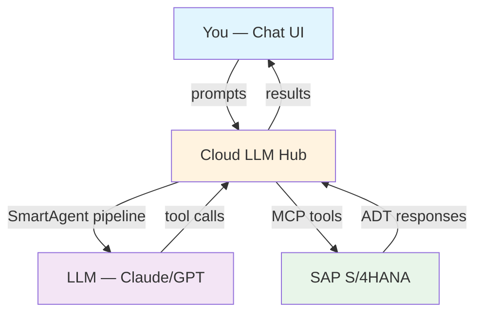
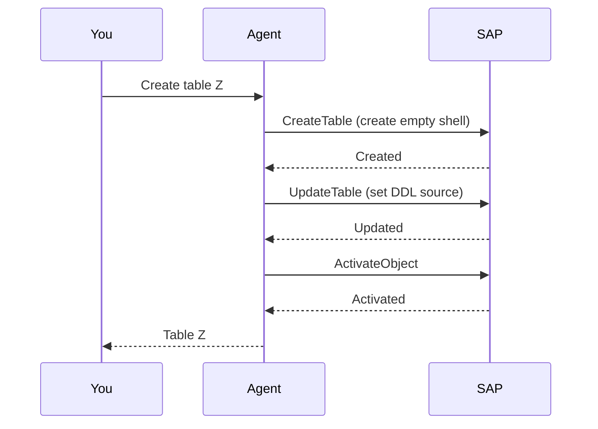
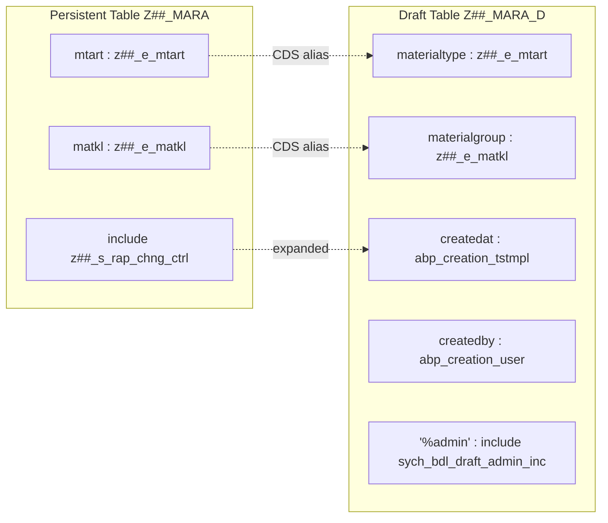
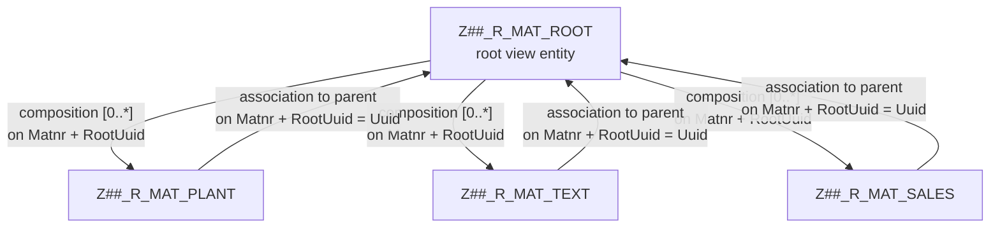
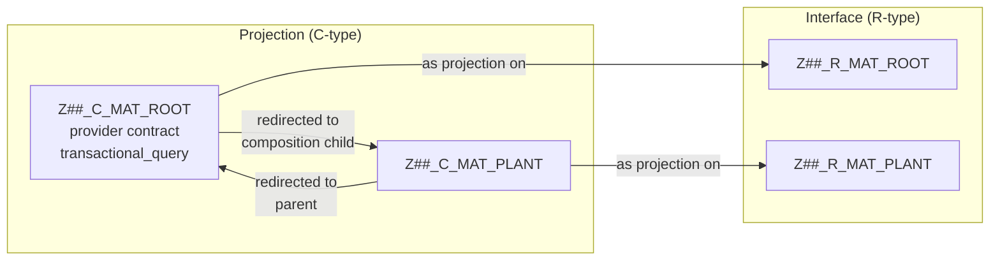
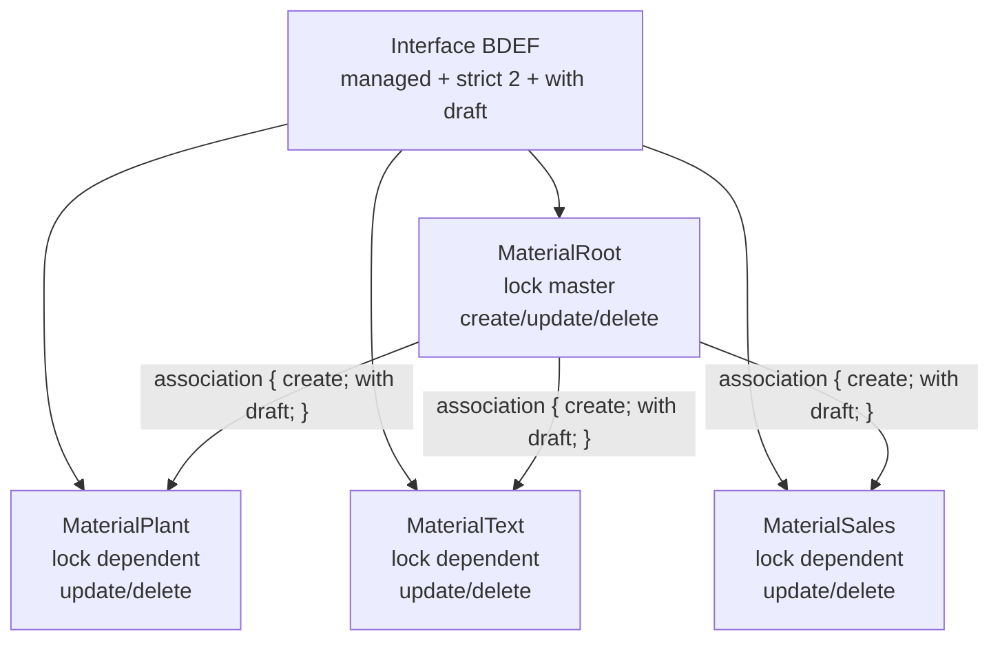
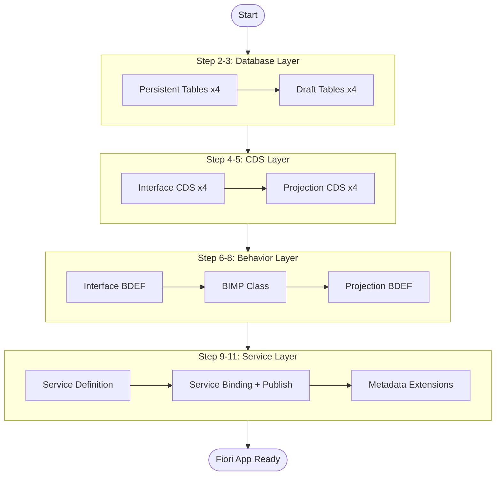

# Tutorial: Creating a RAP Business Object with Cloud LLM Hub

This tutorial walks through creating a complete RAP (RESTful Application Programming) Business Object on a live SAP S/4HANA system using cloud-llm-hub's chat UI. The AI agent connects to the SAP system via MCP tools and executes all ABAP development tasks on your behalf.

**What you will build:** A Material Master RAP BO with root entity (MARA) and child entities (MARC, MAKT, MVKE), including tables, CDS views, behavior definition, service definition, and Fiori UI.

**System:** SAP S/4HANA (DEV)
**Time:** ~30-60 minutes
**Prerequisites:** Access to cloud-llm-hub chat UI with MCP connection to an SAP system

---

## Naming Convention

ABAP object names have length limits (30 characters for most, 26 for service binding). To avoid conflicts between participants and fit within limits, we use a personal prefix convention.

**Your prefix: `Z<II><N>_`**

- `<II>` — your initials, 2 characters (e.g., `OK` for Oleksii Kyslytsia)
- `<N>` — version number, start with `1`

**Examples:**

| Developer | Prefix | Package | Root Table |
|-----------|--------|---------|------------|
| Oleksii Kyslytsia | `ZDEMO1_` | `ZDEMO1_MAT` | `ZDEMO1_MARA` |
| Roman Semenov | `ZDEMO1_` | `ZDEMO1_MAT` | `ZDEMO1_MARA` |
| Roman Semenov (2nd attempt) | `ZDEMO2_` | `ZDEMO2_MAT` | `ZDEMO2_MARA` |

If someone shares your initials — take the next number (`ZDEMO2_`, `ZDEMO3_`, ...).

**Full naming table:**

| Object | Max | Placeholder | Example (ZDEMO1_) |
|--------|-----|-------------|-----------------|
| Package | 30 | `Z##_MAT` | `ZDEMO1_MAT` |
| Persistent table (root) | 30 | `Z##_MARA` | `ZDEMO1_MARA` |
| Persistent table (child) | 30 | `Z##_MARC`, `Z##_MAKT`, `Z##_MVKE` | `ZDEMO1_MARC` |
| Draft table | 30 | `Z##_MARA_D`, `Z##_MARC_D`, ... | `ZDEMO1_MARA_D` |
| Interface CDS (root) | 30 | `Z##_R_MAT_ROOT` | `ZDEMO1_R_MAT_ROOT` |
| Interface CDS (child) | 30 | `Z##_R_MAT_PLANT`, ... | `ZDEMO1_R_MAT_PLANT` |
| Projection CDS (root) | 30 | `Z##_C_MAT_ROOT` | `ZDEMO1_C_MAT_ROOT` |
| Projection CDS (child) | 30 | `Z##_C_MAT_PLANT`, ... | `ZDEMO1_C_MAT_PLANT` |
| BIMP class | 30 | `ZBP_##_R_MAT_ROOT` | `ZBP_DEMO1_R_MAT_ROOT` |
| Service Definition | 30 | `ZUI_##_MAT_O4` | `ZUI_DEMO1_MAT_O4` |
| Service Binding | 26 | `ZUI_##_MAT_O4` | `ZUI_DEMO1_MAT_O4` |
| Data Element | 30 | `Z##_E_MATNR`, ... | `ZDEMO1_E_MATNR` |
| Structure include | 30 | `Z##_S_RAP_CHNG_CTRL` | `ZDEMO1_S_RAP_CHNG_CTRL` |

> **Before you start:**
> 1. Decide your prefix (e.g., `ZDEMO1_`)
> 2. Ask the agent: *"Search for objects starting with ZDEMO1_*"*
> 3. If objects found — increment: `ZDEMO2_`, `ZDEMO3_`, ...
> 4. When objects are clean — you're ready

**In all steps below, `Z##_` is a placeholder.** Mentally replace `##` with your chosen prefix (e.g., `OK1`). When typing prompts to the agent, use your actual prefix.

---

## Architecture Overview



## RAP BO Structure

The Business Object we are creating follows the standard RAP managed scenario with draft support:


## Entity Model

```mermaid
erDiagram
    Z##_MARA ||--o{ Z##_MARC : "has plants"
    Z##_MARA ||--o{ Z##_MAKT : "has texts"
    Z##_MARA ||--o{ Z##_MVKE : "has sales data"

    Z##_MARA {
        sysuuid_x16 uuid PK
        z##_e_matnr matnr PK
        z##_e_mtart mtart
        z##_e_matkl matkl
        z##_e_lvorm lvorm
        z##_e_meins meins
    }

    Z##_MARC {
        sysuuid_x16 uuid PK
        z##_e_matnr matnr PK
        z##_e_werks werks PK
        sysuuid_x16 root_uuid FK
    }

    Z##_MAKT {
        sysuuid_x16 uuid PK
        z##_e_matnr matnr PK
        spras spras PK
        sysuuid_x16 root_uuid FK
        z##_e_maktx maktx
    }

    Z##_MVKE {
        sysuuid_x16 uuid PK
        z##_e_matnr matnr PK
        z##_e_vkorg vkorg PK
        z##_e_vtweg vtweg PK
        sysuuid_x16 root_uuid FK
    }
```

## Creation Order

RAP objects must be created and activated in a specific order due to dependencies:

```mermaid
flowchart LR
    A[1. Tables<br/>persistent + draft] --> B[2. Interface CDS<br/>R-type views]
    B --> C[3. Projection CDS<br/>C-type views]
    C --> D[4. Interface BDEF]
    D --> E[5. BIMP Class]
    E --> F[6. Projection BDEF]
    F --> G[7. Service Definition]
    G --> H[8. Service Binding<br/>+ Publish]
    H --> I[9. Metadata Extensions<br/>UI annotations]

    style A fill:#e8f5e9
    style B fill:#e8f5e9
    style C fill:#e1f5fe
    style D fill:#fff3e0
    style E fill:#fff3e0
    style F fill:#f3e5f5
    style G fill:#fce4ec
    style H fill:#fce4ec
    style I fill:#f5f5f5
```



---

## Step 1: Verify System Connection

Before starting, verify that the agent can connect to your SAP system.

**You type in chat:**

> Check if you can connect to the SAP system. List available objects in package Z##_MAT.

**What happens:** The agent uses `SearchObject` MCP tool to query the SAP system. You should see the package contents (or an empty package if it's new).

**Expected result:** The agent confirms connection and shows the package contents.

---

## Step 2: Create Persistent Tables

The foundation of any RAP BO is the database tables. We need 4 persistent tables.

### 2.1 Root Table — Z##_MARA

**You type in chat:**

> Create table Z##_MARA in package Z##_MAT with transport $TMP.
> Label: 'General Material Data'
> Fields:
> - key client : abap.clnt not null
> - key uuid : sysuuid_x16 not null
> - key matnr : z##_e_matnr not null
> - mtart : z##_e_mtart
> - matkl : z##_e_matkl
> - lvorm : z##_e_lvorm
> - meins : z##_e_meins
> - include z##_s_rap_chng_ctrl

**What happens:**



> **Key concept:** Creating an ABAP object is always a two-step process:
> 1. `Create*` — creates an empty shell with metadata
> 2. `Update*` — sets the actual source code
>
> The agent handles both steps automatically.

### 2.2 Child Tables — Z##_MARC, Z##_MAKT, Z##_MVKE

**You type in chat:**

> Now create the child tables in the same package and transport:
>
> 1. Z##_MARC — 'Plant Data for Material'
>    - key client, key uuid, key matnr (z##_e_matnr), key werks (z##_e_werks)
>    - root_uuid : sysuuid_x16
>    - include z##_s_rap_chng_ctrl
>
> 2. Z##_MAKT — 'Material Descriptions'
>    - key client, key uuid, key matnr (z##_e_matnr), key spras : spras
>    - root_uuid : sysuuid_x16
>    - maktx : z##_e_maktx
>    - include z##_s_rap_chng_ctrl
>
> 3. Z##_MVKE — 'Sales Data for Material'
>    - key client, key uuid, key matnr (z##_e_matnr), key vkorg (z##_e_vkorg), key vtweg (z##_e_vtweg)
>    - root_uuid : sysuuid_x16
>    - include z##_s_rap_chng_ctrl

**Expected result:** All 3 child tables created and activated. Each has `root_uuid` field linking back to the root.

> **Important:** Child tables always have `root_uuid : sysuuid_x16` to link to the parent via UUID. The root table does NOT have `root_uuid`.

---

## Step 3: Create Draft Tables

Draft tables enable the "Edit" mode in Fiori UI — changes are saved as drafts before the user presses "Save".

**You type in chat:**

> Create draft tables for all 4 persistent tables. Draft table naming: add _D suffix (e.g., Z##_MARA_D).
> Rules for draft tables:
> - key mandt : mandt not null (not abap.clnt!)
> - key uuid : sysuuid_x16 not null
> - All non-key fields use CDS-like PascalCase names (MaterialType instead of mtart)
> - No include for audit fields — spell them out individually
> - Add "%admin" : include sych_bdl_draft_admin_inc at the end
> - Non-key business keys (matnr, werks, etc.) are NOT key fields in draft table

**What happens:** The agent creates 4 draft tables. The naming convention difference between persistent and draft tables is critical:



> **Common mistake:** Using persistent table field names (mtart) instead of CDS aliases (materialtype) in draft tables. This causes BDEF mapping errors.

---

## Step 4: Create Interface CDS Views (R-type)

Interface CDS views define the BO's data model. The root view has compositions to children.

### 4.1 Root CDS — Z##_R_MAT_ROOT

**You type in chat:**

> Create interface CDS view entity Z##_R_MAT_ROOT in package Z##_MAT, transport $TMP.
> Source table: zmd_mara
> This is the root view with compositions to children: _Plant (Z##_R_MAT_PLANT), _Text (Z##_R_MAT_TEXT), _Sales (Z##_R_MAT_SALES).
> Map all fields from table to PascalCase aliases (matnr as Matnr, mtart as MaterialType, etc.)
> Include audit fields (created_at as CreatedAt, etc.)
> Expose compositions in the field list.

**What happens:** The agent creates a `define root view entity` with compositions:



> **Key concept:** Composition on-conditions must include ALL keys: both the business key (Matnr) and the technical key (RootUuid = parent Uuid).

### 4.2 Child CDS Views

**You type in chat:**

> Create child interface CDS views:
> 1. Z##_R_MAT_PLANT — select from zmd_marc, association to parent Z##_R_MAT_ROOT
> 2. Z##_R_MAT_TEXT — select from zmd_makt, association to parent Z##_R_MAT_ROOT
> 3. Z##_R_MAT_SALES — select from zmd_mvke, association to parent Z##_R_MAT_ROOT
>
> Each child must have: root_uuid as RootUuid field, association to parent through Matnr + RootUuid = Uuid

**Expected result:** All 4 CDS views created. Activate them together (group activation).

> **Tip:** After creating all interface CDS views, ask the agent to activate them all at once. CDS views with cross-references must be activated together.

---

## Step 5: Create Projection CDS Views (C-type)

Projections define what the service consumer sees. They reference the interface CDS views.

**You type in chat:**

> Create projection CDS views for all 4 entities:
> 1. Z##_C_MAT_ROOT — root projection on Z##_R_MAT_ROOT, provider contract transactional_query
>    - Redirect compositions: _Plant to Z##_C_MAT_PLANT, _Text to Z##_C_MAT_TEXT, _Sales to Z##_C_MAT_SALES
> 2. Z##_C_MAT_PLANT — projection on Z##_R_MAT_PLANT, redirect _Root to parent Z##_C_MAT_ROOT
> 3. Z##_C_MAT_TEXT — projection on Z##_R_MAT_TEXT, redirect _Root to parent Z##_C_MAT_ROOT
> 4. Z##_C_MAT_SALES — projection on Z##_R_MAT_SALES, redirect _Root to parent Z##_C_MAT_ROOT
>
> Add @Search.searchable and @Search.defaultSearchElement on Matnr in root projection.
> Add @Metadata.allowExtensions: true on all projections.

**What happens:**



> **Important:** The `provider contract transactional_query` is required on the root projection for RAP managed BO with draft.

---

## Step 6: Create Interface Behavior Definition (BDEF)

The BDEF defines the transactional behavior — CRUD operations, draft support, field control, and mappings.

**You type in chat:**

> Create interface behavior definition for Z##_R_MAT_ROOT.
> Settings:
> - managed implementation in class ZBP_##_R_MAT_ROOT unique
> - strict ( 2 ), with draft
>
> Root entity (alias MaterialRoot):
> - persistent table zmd_mara, draft table zmd_mara_d
> - lock master total etag LocalLastChangedAt
> - create, update, delete
> - field ( numbering : managed, readonly ) Uuid
> - field ( readonly ) CreatedAt, CreatedBy, LastChangedAt, LastChangedBy
> - field ( mandatory ) Matnr, MaterialType
> - mapping for persistent table and draft table
> - associations to _Plant, _Text, _Sales with { create; with draft; }
>
> Child entities (alias MaterialPlant, MaterialText, MaterialSales):
> - lock dependent by _Root, authorization dependent by _Root
> - update, delete (no create — created via association from root)
> - field ( readonly ) Matnr, RootUuid + audit fields
> - mapping for persistent + draft tables
> - association _Root { with draft; }

**What happens:**



> **Common mistake:** Forgetting `mapping for <draft_table> corresponding;` — this is required for draft to work correctly.

---

## Step 7: Create Behavior Implementation (BIMP)

**You type in chat:**

> Create the behavior implementation class ZBP_##_R_MAT_ROOT for behavior of Z##_R_MAT_ROOT.
> The class should be PUBLIC ABSTRACT FINAL.
> For now, create a minimal implementation — just the class shell. The managed scenario handles most operations automatically.

**Expected result:** A minimal BIMP class with authorization handler.

---

## Step 8: Create Projection Behavior Definition

**You type in chat:**

> Create projection behavior definition for Z##_C_MAT_ROOT.
> Settings: projection, strict ( 2 ), use draft
>
> For each entity:
> - use etag
> - use create/update/delete (root) or use update/delete (children)
> - use associations with draft

---

## Step 9: Create Service Definition

**You type in chat:**

> Create service definition ZUI_##_MAT_O4 in package Z##_MAT.
> Label: 'Service for Material'
> Expose:
> - Z##_C_MAT_ROOT as Material
> - Z##_C_MAT_PLANT as MaterialPlant
> - Z##_C_MAT_TEXT as MaterialText
> - Z##_C_MAT_SALES as MaterialSales

---

## Step 10: Create Service Binding and Publish

**You type in chat:**

> Create OData V4 UI service binding ZUI_##_MAT_O4 for service definition ZUI_##_MAT_O4.
> After creation, publish it.

> **Note:** Service Binding publishing may not be available via MCP tools. If so, the agent will tell you — publish manually in ADT (Eclipse) or Fiori Launchpad.

---

## Step 11: Create Metadata Extensions (Optional)

Metadata extensions add UI annotations for the Fiori Elements app.

**You type in chat:**

> Create metadata extension for Z##_C_MAT_ROOT with:
> - headerInfo: typeName 'Material', title field Matnr
> - facets: General Data (identification), Plant Data (lineitem for _Plant), Texts (lineitem for _Text), Sales (lineitem for _Sales)
> - Hide Uuid field
> - Show Matnr, MaterialType, MaterialGroup in list and detail with selection fields
>
> Also create metadata extension for Z##_C_MAT_PLANT:
> - headerInfo: typeName 'Plant Data', title field Plant
> - Hide Uuid and RootUuid
> - Show Plant, Quantity in list and detail

---

## Verification

After all steps, verify the BO works:

**You type in chat:**

> Check the current state of all objects in package Z##_MAT. List any inactive objects.

The agent will use `GetInactiveObjects` to find anything that needs activation.

---

## Troubleshooting

### "Association/composition target not found"
The child CDS is not yet created or activated. Create and activate all interface CDS views together.

### "Field not found in draft table"
Draft tables use CDS alias names (MaterialType), not table field names (mtart). Check your draft table DDL.

### "Persistent table not found"
Activate tables before creating CDS views. Objects must be activated in dependency order.

### "Draft table missing admin fields"
Add `"%admin" : include sych_bdl_draft_admin_inc;` to the draft table.

### Agent creates but doesn't activate
After each creation step, you can ask: "Activate all inactive objects" or "Activate Z##_R_MAT_ROOT".

---

## Summary



**Total objects created:** ~20 (4 persistent tables + 4 draft tables + 4 interface CDS + 4 projection CDS + 2 BDEFs + 1 BIMP + 1 Service Definition + 1 Service Binding + metadata extensions)

**Key takeaways:**
1. Always create objects in dependency order (tables → CDS → BDEF → service)
2. Activate related objects together (all CDS at once, etc.)
3. Draft tables use CDS alias names, not table field names
4. Compositions need ALL keys in on-conditions (business key + UUID)
5. The agent handles Create + Update two-step process automatically
6. When in doubt, ask the agent to check inactive objects or read existing ones
