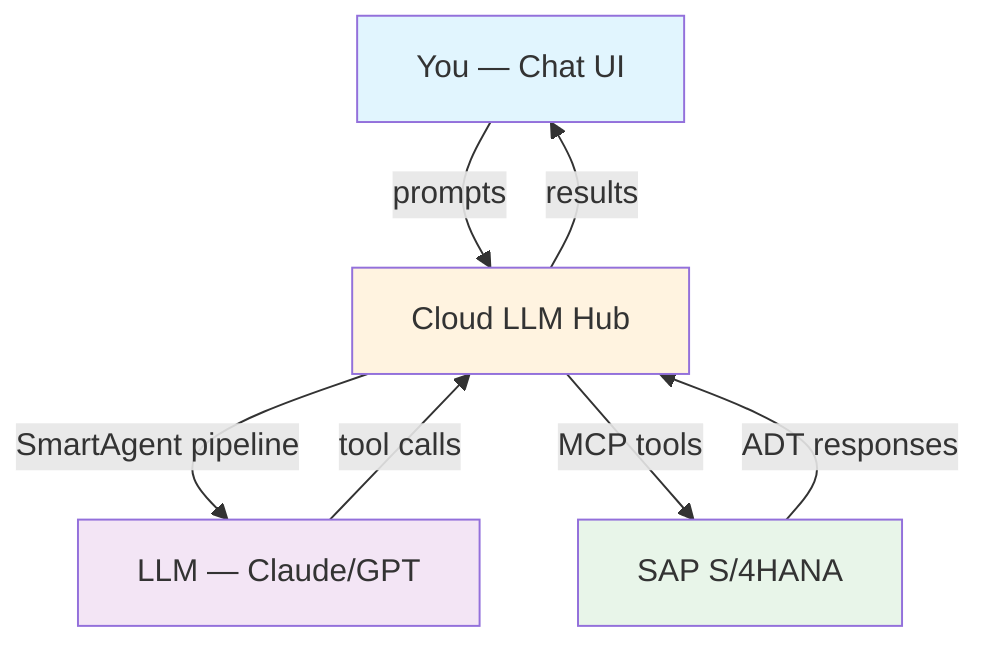
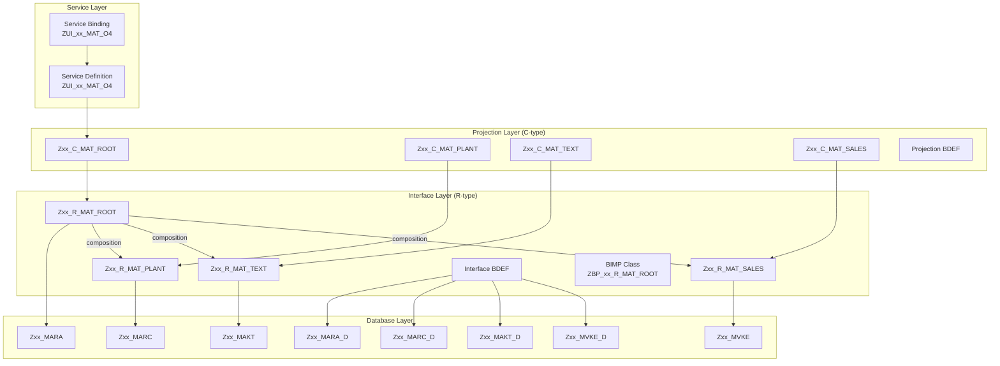
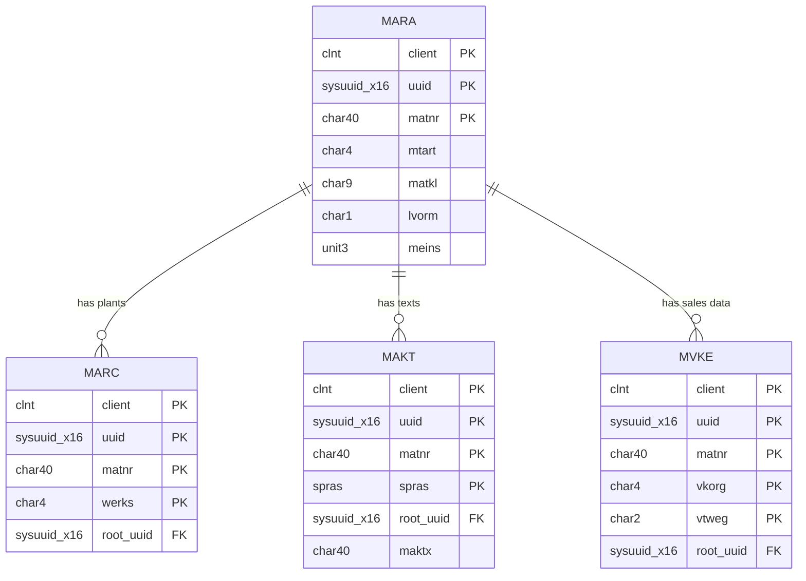
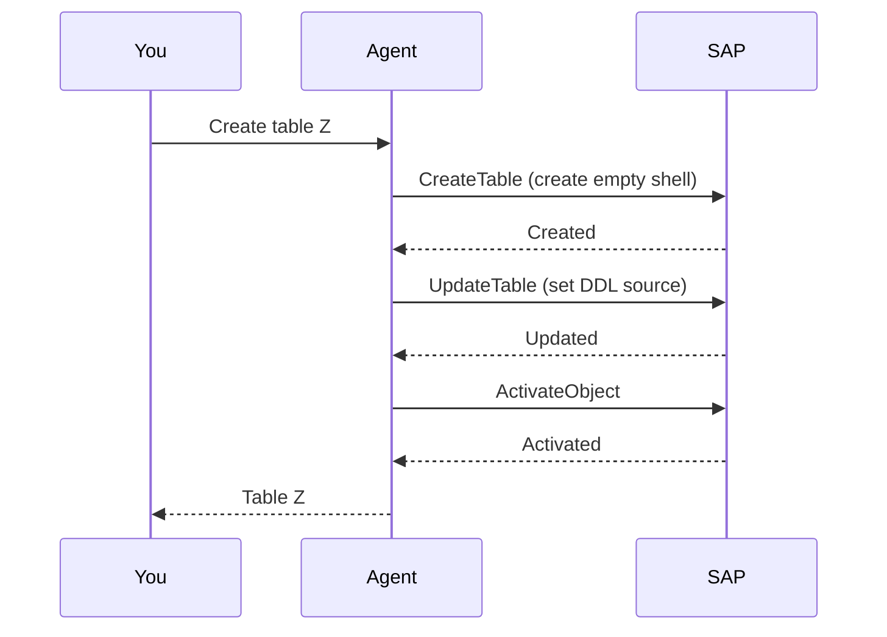
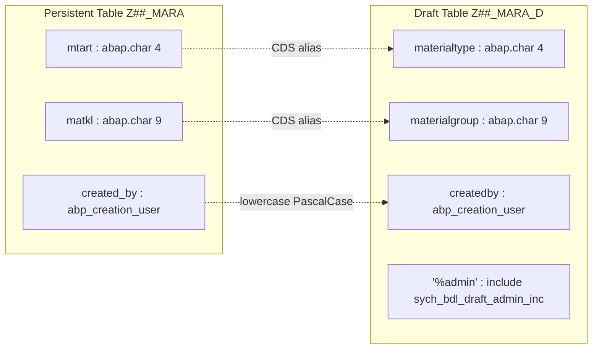
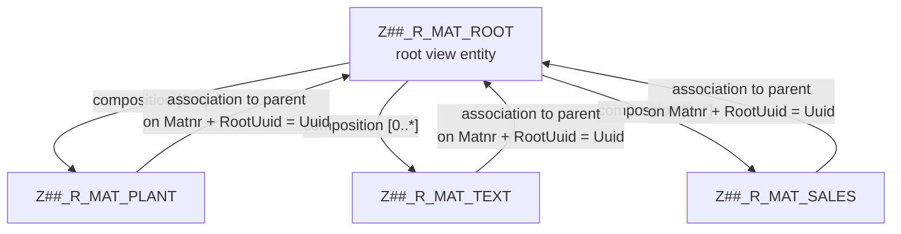
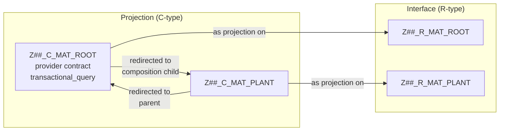
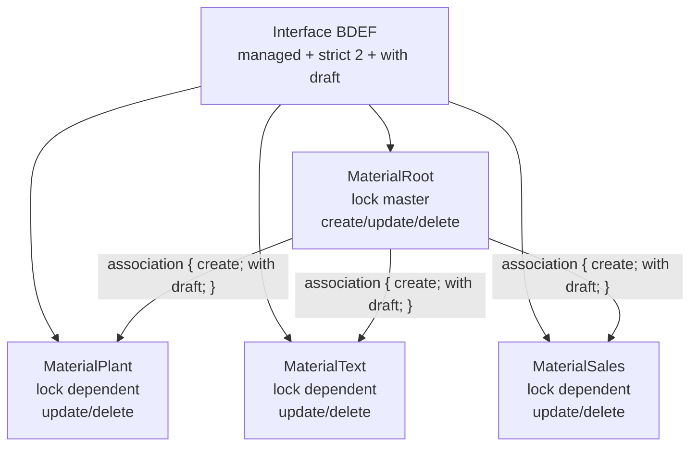
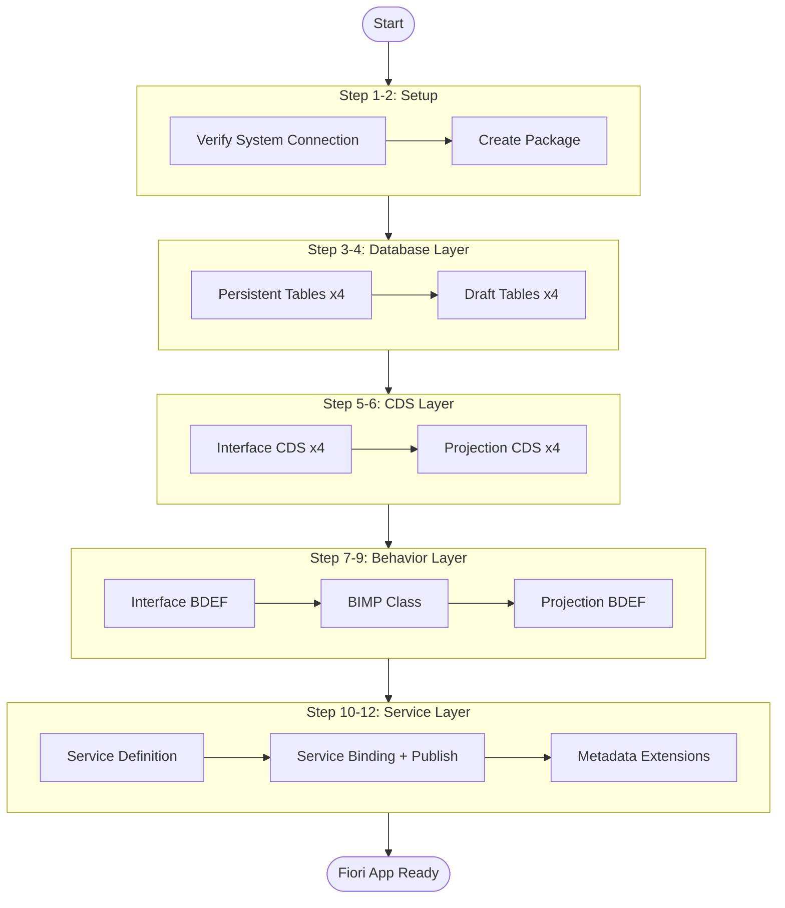

# Tutorial: Creating a RAP Business Object with Cloud LLM Hub

This tutorial walks through creating a complete RAP (RESTful Application Programming) Business Object on a live SAP S/4HANA system using cloud-llm-hub's chat UI. The AI agent connects to the SAP system via MCP tools and executes all ABAP development tasks on your behalf.

**What you will build:** A Material Master RAP BO with root entity (MARA) and child entities (MARC, MAKT, MVKE), including tables, CDS views, behavior definition, service definition, and Fiori UI.

**System:** SAP S/4HANA (DEV)
**Time:** ~30-60 minutes
**Prerequisites:** Access to cloud-llm-hub chat UI with MCP connection to an SAP system

---

## Naming Convention

ABAP object names have length limits (30 characters for most, 26 for service binding). To avoid conflicts between participants and fit within limits, we use a personal prefix convention.

**Your prefix: `Z<II><NN>_`**

- `<II>` — your initials, 2 characters (e.g., `OK` for Oleksii Kyslytsia)
- `<NN>` — version number, 2 digits, start with `01`

**Examples:**

| Developer | Prefix | Package | Root Table |
|-----------|--------|---------|------------|
| Oleksii Kyslytsia | `ZDEMO01_` | `TEST_DEMO1_MAT` | `ZDEMO01_MARA` |
| Roman Semenov | `ZDEMO01_` | `TEST_RS01_MAT` | `ZDEMO01_MARA` |
| Roman Semenov (2nd attempt) | `ZDEMO02_` | `TEST_RS02_MAT` | `ZDEMO02_MARA` |

If someone shares your initials — take the next number (`ZDEMO02_`, `ZDEMO03_`, ...).

**Full naming table:**

| Object | Max | Placeholder | Example (ZDEMO01_) |
|--------|-----|-------------|------------------|
| Package | 30 | `TEST_##_MAT` | `TEST_DEMO1_MAT` |
| Domain | 30 | `Z##_D_MATNR`, ... | `ZDEMO01_D_MATNR` |
| Data Element | 30 | `Z##_E_MATNR`, ... | `ZDEMO01_E_MATNR` |
| Persistent table (root) | 30 | `Z##_MARA` | `ZDEMO01_MARA` |
| Persistent table (child) | 30 | `Z##_MARC`, `Z##_MAKT`, `Z##_MVKE` | `ZDEMO01_MARC` |
| Draft table | 30 | `Z##_MARA_D`, `Z##_MARC_D`, ... | `ZDEMO01_MARA_D` |
| Interface CDS (root) | 30 | `Z##_R_MAT_ROOT` | `ZDEMO01_R_MAT_ROOT` |
| Interface CDS (child) | 30 | `Z##_R_MAT_PLANT`, ... | `ZDEMO01_R_MAT_PLANT` |
| Projection CDS (root) | 30 | `Z##_C_MAT_ROOT` | `ZDEMO01_C_MAT_ROOT` |
| Projection CDS (child) | 30 | `Z##_C_MAT_PLANT`, ... | `ZDEMO01_C_MAT_PLANT` |
| BIMP class | 30 | `ZBP_##_R_MAT_ROOT` | `ZBP_DEMO1_R_MAT_ROOT` |
| Service Definition | 30 | `ZUI_##_MAT_O4` | `ZUI_DEMO1_MAT_O4` |
| Service Binding | 26 | `ZUI_##_MAT_O4` | `ZUI_DEMO1_MAT_O4` |
| Metadata Extension | 30 | `Z##_C_MAT_ROOT` | `ZDEMO01_C_MAT_ROOT` |

> **Before you start:**
> 1. Decide your prefix (e.g., `ZDEMO01_`)
> 2. Ask the agent: *"Search for objects starting with ZDEMO01_"*
> 3. If objects found — increment: `ZDEMO02_`, `ZDEMO03_`, ...
> 4. When objects are clean — you're ready

**In all steps below, `Z##_` is a placeholder.** Replace `##` with your chosen prefix (e.g., `OK01`). When typing prompts to the agent, use your actual prefix.

> **Can I use different names?** Yes — the naming above is a convention, not a hard rule. You can rename tables, CDS views, classes, and services as you wish. However, RAP BO is a complex multi-layered system where objects reference each other: CDS views depend on table names, BDEFs reference CDS views and draft tables, projections redirect to interface views, and service definitions expose projections. If you change one name, you must update all objects that reference it. For this tutorial, we recommend following the convention exactly — you can always rename later when you understand the full dependency chain.

---

## Architecture Overview



## RAP BO Structure

The Business Object we are creating follows the standard RAP managed scenario with draft support:



## Entity Model



## Creation Order

RAP objects must be created and activated in a specific order due to dependencies:

```mermaid
flowchart LR
    P[1. Package] --> A[2. Tables<br/>persistent + draft]
    A --> B[3. Interface CDS<br/>R-type views]
    B --> C[4. Projection CDS<br/>C-type views]
    C --> D[5. Interface BDEF]
    D --> E[6. BIMP Class]
    E --> F[7. Projection BDEF]
    F --> G[8. Service Definition]
    G --> H[9. Service Binding<br/>+ Publish]
    H --> I[10. Metadata Extensions<br/>UI annotations]

    style P fill:#f5f5f5
    style A fill:#e8f5e9
    style B fill:#e8f5e9
    style C fill:#e1f5fe
    style D fill:#fff3e0
    style E fill:#fff3e0
    style F fill:#f3e5f5
    style G fill:#fce4ec
    style H fill:#fce4ec
    style I fill:#f5f5f5
```



---

## Step 1: Verify System Connection

Before starting, verify that the agent can connect to your SAP system and that your prefix is available.

**You type in chat:**

> Check if you can connect to the SAP system. Search for objects starting with Z##_ to verify my prefix is available.

**What happens:** The agent uses `SearchObject` MCP tool to query the SAP system.

**Expected result:** The agent confirms connection. If objects with your prefix already exist — increment the version number (`Z##2_`, `Z##3_`).

---

## Step 2: Create Package

All objects need a development package. On most on-premise systems, local packages must start with `TEST_` or `$` to use the `LOCAL` software component.

**You type in chat:**

> Create package TEST_##_MAT as a local $TMP package with software component LOCAL and description 'Material Master RAP BO'.

**Expected result:** Package TEST_##_MAT created under $TMP with software component LOCAL.

> **Tip:** The agent may need two attempts — the first may fail if it omits the software component. If so, repeat the prompt and explicitly mention `software component LOCAL`.

> **Note:** If the agent cannot create the package via MCP, create it manually in ADT (Eclipse) via `File → New → ABAP Package` (select "Local Object" when prompted for transport). Then tell the agent: "Use package TEST_##_MAT for all objects."
>
> **Known LLM mistakes in package creation:**
>
> 1. **Package name must start with `TEST_` or `$` on on-premise.** Z-prefixed packages cannot use LOCAL software component. Error: "Package names starting with Z cannot be assigned to software component LOCAL". **Fix:** Use `TEST_` prefix for package name.
>
> 2. **Software component omitted.** The LLM may not pass `software_component: LOCAL` — the system rejects the package. **Fix:** Explicitly state "software component LOCAL" in the prompt.

---

## Step 3: Create Domains and Data Elements

Before creating tables, we define custom domains and data elements. This provides proper semantics, labels, and F4 help for Fiori UI fields.

### 3.1 Domains

**You type in chat:**

> Create the following domains in package TEST_##_MAT. Activate each after creation.
>
> 1. Z##_D_MATNR — 'Material Number', type abap.char(40)
> 2. Z##_D_MTART — 'Material Type', type abap.char(4)
> 3. Z##_D_MATKL — 'Material Group', type abap.char(9)
> 4. Z##_D_MEINS — 'Base Unit of Measure', type abap.unit(3)
> 5. Z##_D_WERKS — 'Plant', type abap.char(4)
> 6. Z##_D_MAKTX — 'Material Description', type abap.char(40)
> 7. Z##_D_VKORG — 'Sales Organization', type abap.char(4)
> 8. Z##_D_VTWEG — 'Distribution Channel', type abap.char(2)

**Expected result:** 8 domains created and activated.

> **If domains are not activated:** The agent may create domains without activating them (they will have status "new"). If this happens, type:
> "Activate all inactive domains starting with Z##_D_"
>
> **Never say "Activate all inactive objects"** — on a shared system other users may have their own inactive objects. Always activate only your own objects by prefix: "Activate all inactive objects starting with Z##_".

**Checkpoint:** Ask the agent: "Read domain Z##_D_MATNR" — verify it shows the correct type (CHAR, length 40) and is active.

### 3.2 Data Elements

> **Important:** All domains must be active before creating data elements. If data element creation fails with "domain not active", activate the domains first (see note above).

**You type in chat:**

> Create the following data elements in package TEST_##_MAT. Each references the corresponding domain. Activate each after creation.
>
> 1. Z##_E_MATNR — 'Material Number', domain Z##_D_MATNR
> 2. Z##_E_MTART — 'Material Type', domain Z##_D_MTART
> 3. Z##_E_MATKL — 'Material Group', domain Z##_D_MATKL
> 4. Z##_E_MEINS — 'Base Unit of Measure', domain Z##_D_MEINS
> 5. Z##_E_WERKS — 'Plant', domain Z##_D_WERKS
> 6. Z##_E_MAKTX — 'Material Description', domain Z##_D_MAKTX
> 7. Z##_E_VKORG — 'Sales Organization', domain Z##_D_VKORG
> 8. Z##_E_VTWEG — 'Distribution Channel', domain Z##_D_VTWEG
> 9. Z##_E_LVORM — 'Marked for Deletion', type CHAR length 1 (no domain needed)

**Expected result:** 9 data elements created and activated.

> **Why domains and data elements?** Domains define value ranges and formatting. Data elements add labels and F4 help. Without them, Fiori UI shows raw field names instead of proper labels, and there's no input validation or search help.

> **If data elements are not activated:** Type: "Activate all inactive data elements starting with Z##_E_".
>
> **Known LLM mistakes in data element generation:**
>
> 1. **`abap_boolean` type not handled correctly.** The LLM may create Z##_E_LVORM with `type abap_boolean` but the MCP handler produces a data element without a data type definition. Error: "No domain or data type was defined". **Fix:** Use `type CHAR length 1` instead of `abap_boolean`.
>
> 2. **Data elements created but not activated.** Domains must be active before data elements can be created. If data element creation fails with "domain not active" — first activate domains: "Activate all inactive domains starting with Z##_D_".

**Checkpoint:** Ask the agent: "List all objects in package TEST_##_MAT" — you should see 8 domains + 9 data elements, all active.

---

## Step 4: Create Persistent Tables

The foundation of any RAP BO is the database tables. We need 4 persistent tables. Tables reference the data elements created in Step 3.

### 4.1 Root Table — Z##_MARA

**You type in chat:**

> Create table Z##_MARA in package TEST_##_MAT.
> Label: 'General Material Data'
> Fields:
> - key client : abap.clnt not null
> - key uuid : sysuuid_x16 not null
> - key matnr : z##_e_matnr not null
> - mtart : z##_e_mtart
> - matkl : z##_e_matkl
> - lvorm : z##_e_lvorm
> - meins : z##_e_meins
> - created_by : abp_creation_user
> - created_at : abp_creation_tstmpl
> - last_changed_by : abp_locinst_lastchange_user
> - last_changed_at : abp_locinst_lastchange_tstmpl
> - local_last_changed_at : abp_lastchange_tstmpl
>
> Activate after creation.

**What happens:**



> **Key concept:** Creating an ABAP object is always a two-step process:
> 1. `Create*` — creates an empty shell with metadata
> 2. `Update*` — sets the actual source code
>
> The agent handles both steps automatically.

**Expected result:** Table Z##_MARA created and activated with 12 fields.

### 4.2 Child Tables — Z##_MARC, Z##_MAKT, Z##_MVKE

**You type in chat:**

> Now create the 3 child tables in package TEST_##_MAT. Use the data elements from Step 3. Include the same audit fields as the root table. Activate all after creation.
>
> 1. Z##_MARC — 'Plant Data for Material'
>    - key client : abap.clnt not null
>    - key uuid : sysuuid_x16 not null
>    - key matnr : z##_e_matnr not null
>    - key werks : z##_e_werks not null
>    - root_uuid : sysuuid_x16
>    - audit fields (created_by, created_at, last_changed_by, last_changed_at, local_last_changed_at)
>
> 2. Z##_MAKT — 'Material Descriptions'
>    - key client : abap.clnt not null
>    - key uuid : sysuuid_x16 not null
>    - key matnr : z##_e_matnr not null
>    - key spras : spras not null
>    - root_uuid : sysuuid_x16
>    - maktx : z##_e_maktx
>    - audit fields
>
> 3. Z##_MVKE — 'Sales Data for Material'
>    - key client : abap.clnt not null
>    - key uuid : sysuuid_x16 not null
>    - key matnr : z##_e_matnr not null
>    - key vkorg : z##_e_vkorg not null
>    - key vtweg : z##_e_vtweg not null
>    - root_uuid : sysuuid_x16
>    - audit fields

**Expected result:** All 3 child tables created and activated. Each has `root_uuid` field linking back to the root.

> **Important:** Child tables always have `root_uuid : sysuuid_x16` to link to the parent via UUID. The root table does NOT have `root_uuid`.

---

## Step 5: Create Draft Tables

Draft tables enable the "Edit" mode in Fiori UI — changes are saved as drafts before the user presses "Save".

**You type in chat:**

> Create draft tables for all 4 persistent tables in package TEST_##_MAT. Draft table naming: add _D suffix.
>
> Rules for draft tables:
> - key mandt : mandt not null (not abap.clnt!)
> - key uuid : sysuuid_x16 not null
> - **Key fields from persistent table must also be key in draft table** — but use CDS alias names
> - Non-key fields use CDS-like PascalCase names (materialtype instead of mtart)
> - Spell out audit fields individually using lowercase names: createdby, createdat, lastchangedby, lastchangedat, locallastchangedat
> - Add "%admin" : include sych_bdl_draft_admin_inc at the end
>
> Draft tables:
> 1. Z##_MARA_D — root draft: key mandt, key uuid, **key matnr**, materialtype, materialgroup, markedfordeletion, baseunitofmeasure + audit + admin
> 2. Z##_MARC_D — plant draft: key mandt, key uuid, **key matnr**, **key plant**(werks), rootuuid + audit + admin
> 3. Z##_MAKT_D — text draft: key mandt, key uuid, **key matnr**, **key language**(spras), materialdescription, rootuuid + audit + admin
> 4. Z##_MVKE_D — sales draft: key mandt, key uuid, **key matnr**, **key salesorganization**(vkorg), **key distributionchannel**(vtweg), rootuuid + audit + admin
>
> Activate all after creation.

**What happens:** The agent creates 4 draft tables. The naming convention difference between persistent and draft tables is critical:



**Expected result:** All 4 draft tables created and activated. Key fields match persistent tables (mandt + uuid + business keys), non-key fields use PascalCase CDS alias names, and the `%admin` include is present.

> **Critical rule:** Draft table key fields must match persistent table key fields. If persistent table has `key matnr`, draft table must also have `key matnr`. The field names in draft table must use CDS alias names (PascalCase for non-key fields), but key fields keep their original names.
>
> **Known LLM mistake:** The LLM often generates draft tables with only `mandt` + `uuid` as keys, omitting business keys like `matnr`, `werks`, `spras`. This causes BDEF activation error: "Field MATNR is required but not a key". **Fix:** Ensure all key fields from the persistent table are also key fields in the draft table.
>
> **Common mistake:** Using persistent table field names (mtart) instead of CDS aliases (materialtype) for non-key fields in draft tables. This causes BDEF mapping errors.

---

## Step 6: Create Interface CDS Views (R-type)

Interface CDS views define the BO's data model. The root view has compositions to children.

> **Important — activation strategy:** Root and child CDS views reference each other (root has compositions to children, children have association to parent). This creates a circular dependency. The agent needs to:
> 1. Create all 4 views first (they will have syntax errors — this is expected)
> 2. Activate all 4 together in one activation call
>
> If the agent struggles with circular dependencies, tell it explicitly: "Create all views without activating, then activate all 4 together."

### 6.1 Root CDS — Z##_R_MAT_ROOT

**You type in chat:**

> Create interface CDS view entity Z##_R_MAT_ROOT in package TEST_##_MAT.
> Source table: z##_mara
> This is the root view with compositions to children:
> - composition [0..*] of Z##_R_MAT_PLANT as _Plant
> - composition [0..*] of Z##_R_MAT_TEXT as _Text
> - composition [0..*] of Z##_R_MAT_SALES as _Sales
>
> Map fields to PascalCase aliases:
> - uuid as Uuid, matnr as Matnr, mtart as MaterialType, matkl as MaterialGroup
> - lvorm as MarkedForDeletion, meins as BaseUnitOfMeasure
> - created_by as CreatedBy, created_at as CreatedAt
> - last_changed_by as LastChangedBy, last_changed_at as LastChangedAt
> - local_last_changed_at as LocalLastChangedAt
>
> Expose compositions _Plant, _Text, _Sales in the field list.
> Do NOT activate yet — we need to create child views first.

**What happens:** The agent creates a `define root view entity` with compositions. Syntax errors are expected at this point because child views don't exist yet.



> **Key concept:** Composition on-conditions must include ALL keys: both the business key (Matnr) and the technical key (RootUuid = parent Uuid).

### 6.2 Child CDS Views + Activate All

**You type in chat:**

> Create 3 child interface CDS view entities in the same package:
>
> 1. Z##_R_MAT_PLANT — select from z##_marc
>    - association to parent Z##_R_MAT_ROOT as _Root on $projection.Matnr = _Root.Matnr and $projection.RootUuid = _Root.Uuid
>    - Fields: uuid as Uuid, matnr as Matnr, werks as Plant, root_uuid as RootUuid + audit fields in PascalCase
>    - Expose _Root
>
> 2. Z##_R_MAT_TEXT — select from z##_makt
>    - association to parent Z##_R_MAT_ROOT as _Root on $projection.Matnr = _Root.Matnr and $projection.RootUuid = _Root.Uuid
>    - Fields: uuid as Uuid, matnr as Matnr, spras as Language, maktx as MaterialDescription, root_uuid as RootUuid + audit fields
>    - Expose _Root
>
> 3. Z##_R_MAT_SALES — select from z##_mvke
>    - association to parent Z##_R_MAT_ROOT as _Root on $projection.Matnr = _Root.Matnr and $projection.RootUuid = _Root.Uuid
>    - Fields: uuid as Uuid, matnr as Matnr, vkorg as SalesOrganization, vtweg as DistributionChannel, root_uuid as RootUuid + audit fields
>    - Expose _Root
>
> After creating all 3, activate ALL 4 interface CDS views together (Z##_R_MAT_ROOT + 3 children).

**Expected result:** All 4 CDS views created and activated. The agent confirms all views are active.

**Checkpoint:** Ask the agent to verify: "List all objects starting with Z##_ and confirm all interface CDS views are active."

> **Tip:** If activation fails with "association target not found", it means not all views were activated together. Ask the agent: "Activate Z##_R_MAT_ROOT, Z##_R_MAT_PLANT, Z##_R_MAT_TEXT, Z##_R_MAT_SALES together in one activation call."
>
> **Known LLM mistakes in CDS view generation:**
>
> 1. **DDL source not uploaded.** The LLM may create the view object shell but fail to upload the DDL source (circular dependency blocks syntax check). Error on activation: "DDIC source code does not contain a valid definition". **Fix:** Provide the exact DDL source code in the prompt. Ask the agent to update each view with the DDL, then activate all together.
>
> 2. **Views created then deleted during retries.** The LLM may delete and recreate views multiple times trying to resolve circular dependencies, accidentally deleting previously working views. **Fix:** After this step, always verify with a checkpoint that all 4 views exist and are active before proceeding.
>
> **Important — run syntax check after activation:** CDS views are created without syntax check and activated as a group. After activation, verify each view has no errors:
> "Check CDS view Z##_R_MAT_ROOT for syntax errors" (repeat for each view).
> The check may show warnings about key definition mismatches and missing access control — these are non-blocking for the tutorial but should be addressed in production.

---

## Step 7: Create Projection CDS Views (C-type)

Projections define what the service consumer sees. They reference the interface CDS views.

> **Same activation strategy as Step 5:** Projections have the same circular dependency pattern (root redirects to child projections, children redirect to parent). Create all 4, then activate together.

**You type in chat:**

> Create projection CDS views for all 4 entities in package TEST_##_MAT:
>
> 1. Z##_C_MAT_ROOT — root projection on Z##_R_MAT_ROOT
>    - provider contract transactional_query
>    - All fields from interface view
>    - Redirect compositions: _Plant : redirected to Z##_C_MAT_PLANT, _Text : redirected to Z##_C_MAT_TEXT, _Sales : redirected to Z##_C_MAT_SALES
>    - @Search.searchable: true on view, @Search.defaultSearchElement on Matnr
>    - @Metadata.allowExtensions: true
>
> 2. Z##_C_MAT_PLANT — projection on Z##_R_MAT_PLANT
>    - All fields, redirect _Root : redirected to Z##_C_MAT_ROOT
>    - @Metadata.allowExtensions: true
>
> 3. Z##_C_MAT_TEXT — projection on Z##_R_MAT_TEXT
>    - All fields, redirect _Root : redirected to Z##_C_MAT_ROOT
>    - @Metadata.allowExtensions: true
>
> 4. Z##_C_MAT_SALES — projection on Z##_R_MAT_SALES
>    - All fields, redirect _Root : redirected to Z##_C_MAT_ROOT
>    - @Metadata.allowExtensions: true
>
> Create all 4 without activating, then activate all 4 together.

**What happens:**



**Expected result:** All 4 projection CDS views created and activated.

> **Important:** The `provider contract transactional_query` is required on the root projection for RAP managed BO with draft.

**Checkpoint:** Ask the agent: "List all CDS views starting with Z##_ and confirm they are all active."

---

## Step 8: Create Metadata Extensions

Metadata extensions add UI annotations for the Fiori Elements app. They depend on projection views (`@Metadata.allowExtensions: true` from Step 7).

**You type in chat:**

> Create metadata extension for Z##_C_MAT_ROOT in package TEST_##_MAT with this source:
>
> ```
> @Metadata.layer: #CUSTOMER
> annotate entity Z##_C_MAT_ROOT with
> {
>   @UI.facet: [
>     { id: 'General', purpose: #STANDARD, type: #IDENTIFICATION_REFERENCE, label: 'General Data', position: 10 },
>     { id: 'Plant', purpose: #STANDARD, type: #LINEITEM_REFERENCE, label: 'Plant Data', position: 20, targetElement: '_Plant' },
>     { id: 'Text', purpose: #STANDARD, type: #LINEITEM_REFERENCE, label: 'Texts', position: 30, targetElement: '_Text' },
>     { id: 'Sales', purpose: #STANDARD, type: #LINEITEM_REFERENCE, label: 'Sales Data', position: 40, targetElement: '_Sales' }
>   ]
>   @UI.hidden: true
>   Uuid;
>   @UI: { lineItem: [{ position: 10 }], identification: [{ position: 10 }], selectionField: [{ position: 10 }] }
>   Matnr;
>   @UI: { lineItem: [{ position: 20 }], identification: [{ position: 20 }], selectionField: [{ position: 20 }] }
>   MaterialType;
>   @UI: { lineItem: [{ position: 30 }], identification: [{ position: 30 }], selectionField: [{ position: 30 }] }
>   MaterialGroup;
>   @UI: { lineItem: [{ position: 40 }], identification: [{ position: 40 }] }
>   BaseUnitOfMeasure;
> }
> ```
>
> Activate.

**Expected result:** Metadata extension created and activated. The Fiori preview will show proper list/detail pages with field labels and facets.

---

## Step 9: Create Interface Behavior Definition (BDEF)

The BDEF defines the transactional behavior — CRUD operations, draft support, field control, and mappings.

**You type in chat:**

> Create interface behavior definition for Z##_R_MAT_ROOT in package TEST_##_MAT. Use this exact BDEF source:
>
> ```
> managed implementation in class ZBP_##_R_MAT_ROOT unique;
> strict ( 2 );
> with draft;
>
> define behavior for Z##_R_MAT_ROOT alias MaterialRoot
> persistent table z##_mara
> draft table z##_mara_d
> lock master total etag LocalLastChangedAt
> authorization master ( instance )
> {
>   create;
>   update;
>   delete;
>
>   draft action Edit;
>   draft action Resume;
>   draft action Activate optimized;
>   draft action Discard;
>   draft determine action Prepare;
>
>   field ( numbering : managed, readonly ) Uuid;
>   field ( readonly ) CreatedAt, CreatedBy, LastChangedAt, LastChangedBy, LocalLastChangedAt;
>   field ( mandatory ) Matnr, MaterialType;
>
>   mapping for z##_mara
>   {
>     Uuid = uuid;
>     Matnr = matnr;
>     MaterialType = mtart;
>     MaterialGroup = matkl;
>     MarkedForDeletion = lvorm;
>     BaseUnitOfMeasure = meins;
>     CreatedBy = created_by;
>     CreatedAt = created_at;
>     LastChangedBy = last_changed_by;
>     LastChangedAt = last_changed_at;
>     LocalLastChangedAt = local_last_changed_at;
>   }
>
>   association _Plant { create; with draft; }
>   association _Text { create; with draft; }
>   association _Sales { create; with draft; }
> }
>
> define behavior for Z##_R_MAT_PLANT alias MaterialPlant
> persistent table z##_marc
> draft table z##_marc_d
> lock dependent by _Root
> authorization dependent by _Root
> {
>   update;
>   delete;
>
>   field ( numbering : managed, readonly ) Uuid;
>   field ( readonly ) Matnr, RootUuid, CreatedAt, CreatedBy, LastChangedAt, LastChangedBy, LocalLastChangedAt;
>
>   mapping for z##_marc
>   {
>     Uuid = uuid;
>     Matnr = matnr;
>     Plant = werks;
>     RootUuid = root_uuid;
>     CreatedBy = created_by;
>     CreatedAt = created_at;
>     LastChangedBy = last_changed_by;
>     LastChangedAt = last_changed_at;
>     LocalLastChangedAt = local_last_changed_at;
>   }
>
>   association _Root { with draft; }
> }
>
> define behavior for Z##_R_MAT_TEXT alias MaterialText
> persistent table z##_makt
> draft table z##_makt_d
> lock dependent by _Root
> authorization dependent by _Root
> {
>   update;
>   delete;
>
>   field ( numbering : managed, readonly ) Uuid;
>   field ( readonly ) Matnr, RootUuid, CreatedAt, CreatedBy, LastChangedAt, LastChangedBy, LocalLastChangedAt;
>
>   mapping for z##_makt
>   {
>     Uuid = uuid;
>     Matnr = matnr;
>     Language = spras;
>     MaterialDescription = maktx;
>     RootUuid = root_uuid;
>     CreatedBy = created_by;
>     CreatedAt = created_at;
>     LastChangedBy = last_changed_by;
>     LastChangedAt = last_changed_at;
>     LocalLastChangedAt = local_last_changed_at;
>   }
>
>   association _Root { with draft; }
> }
>
> define behavior for Z##_R_MAT_SALES alias MaterialSales
> persistent table z##_mvke
> draft table z##_mvke_d
> lock dependent by _Root
> authorization dependent by _Root
> {
>   update;
>   delete;
>
>   field ( numbering : managed, readonly ) Uuid;
>   field ( readonly ) Matnr, RootUuid, CreatedAt, CreatedBy, LastChangedAt, LastChangedBy, LocalLastChangedAt;
>
>   mapping for z##_mvke
>   {
>     Uuid = uuid;
>     Matnr = matnr;
>     SalesOrganization = vkorg;
>     DistributionChannel = vtweg;
>     RootUuid = root_uuid;
>     CreatedBy = created_by;
>     CreatedAt = created_at;
>     LastChangedBy = last_changed_by;
>     LastChangedAt = last_changed_at;
>     LocalLastChangedAt = local_last_changed_at;
>   }
>
>   association _Root { with draft; }
> }
> ```
>
> Do NOT activate yet — BIMP class must be created first.

**What happens:**



**Expected result:** BDEF created (inactive until BIMP class exists). Do NOT activate yet — proceed to Step 10.

> **Run check before activation:** After creating the BDEF, verify it has no errors:
> "Check behavior definition Z##_R_MAT_ROOT for syntax errors"
> This catches mapping errors, missing draft actions, and authorization issues before attempting activation — saving time on expensive retry loops.

> **Known LLM mistakes in BDEF generation:**
>
> 1. **Draft table mapping added incorrectly.** The LLM may generate `mapping for z##_mara_d corresponding;` for draft tables. This is wrong — `mapping for` is only for persistent tables. Draft table is specified in the entity header (`draft table z##_mara_d`) and does NOT need a mapping line. If you see this error: remove the draft mapping lines.
>
> 2. **Missing `authorization master ( instance )` on root entity.** `strict ( 2 )` requires every entity to declare authorization. Root must have `authorization master ( instance )`. If you see error "every entity must be flagged as authorization master or dependent" — add this line to root entity.
>
> 3. **Missing `draft table` on child entities.** The LLM may only add `draft table` to the root but not children. All entities need `draft table` when `with draft` is enabled. Error: "There is no draft persistency specified for Z##_R_MAT_PLANT".
>
> 4. **Missing `lock dependent by _Root` on child entities.** `strict ( 2 )` requires every entity to have lock master or dependent. Error: "every entity must be flagged either as lock master or lock dependent".
>
> 5. **Missing draft actions.** When `with draft` is enabled, the root entity must explicitly declare draft actions: `draft action Edit;`, `draft action Resume;`, `draft action Activate optimized;`, `draft action Discard;`, `draft determine action Prepare;`. Without them, the Fiori UI draft flow (Edit → change → Save) will not work.
>
> 6. **Using `mapping for ... corresponding` instead of explicit mapping.** `corresponding` matches by field name, but CDS aliases (PascalCase like `MaterialType`) don't match table field names (lowercase like `mtart`). This causes 41+ mapping warnings at activation and broken field persistence. **Fix:** Always use explicit mapping with `CdsAlias = table_field;` syntax as shown above.
>
> **How to fix:** Ask the agent to update the BDEF with the corrected source code from above, then activate.

---

## Step 10: Create Behavior Implementation (BIMP)

**You type in chat:**

> Create the behavior implementation class ZBP_##_R_MAT_ROOT in package TEST_##_MAT for behavior of Z##_R_MAT_ROOT.
> The class should be PUBLIC ABSTRACT FINAL FOR BEHAVIOR OF Z##_R_MAT_ROOT.
> The global class is empty — the actual handler logic goes into local types.
> The local types (CCIMP) must contain a handler class for authorization:
>
> ```
> CLASS lhc_MaterialRoot DEFINITION INHERITING FROM cl_abap_behavior_handler.
>   PRIVATE SECTION.
>     METHODS get_instance_authorizations FOR INSTANCE AUTHORIZATION
>       IMPORTING keys REQUEST requested_authorizations FOR MaterialRoot RESULT result.
> ENDCLASS.
>
> CLASS lhc_MaterialRoot IMPLEMENTATION.
>   METHOD get_instance_authorizations.
>   ENDMETHOD.
> ENDCLASS.
> ```
>
> Activate it.

**Expected result:** A BIMP class with empty global class and a local handler class `lhc_MaterialRoot` implementing `get_instance_authorizations`. After BIMP exists, the BDEF from Step 9 can be activated.

> **Note:** Steps 9 and 10 have a circular dependency: BDEF references the BIMP class, but the class is "for behavior of" the BDEF. The agent may need to create both and then activate them together.
>
> **Known LLM mistake:** The agent may create the BIMP as a plain empty class without local types. The correct BIMP has: empty global class + local handler class inheriting from `cl_abap_behavior_handler` with authorization method. If the BDEF has `authorization master ( instance )`, the handler class **must** implement `get_instance_authorizations`. Without it, activation fails.

---

## Step 11: Create Projection Behavior Definition

**You type in chat:**

> Create projection behavior definition for Z##_C_MAT_ROOT in package TEST_##_MAT.
> Settings: projection, strict ( 2 ), use draft
>
> Root entity Z##_C_MAT_ROOT (alias Material):
> - use etag
> - use create, update, delete
> - use association _Plant { create; with draft; }
> - use association _Text { create; with draft; }
> - use association _Sales { create; with draft; }
>
> Child entities Z##_C_MAT_PLANT, Z##_C_MAT_TEXT, Z##_C_MAT_SALES:
> - use etag
> - use update, delete
> - use association _Root { with draft; }
>
> Activate.

**Expected result:** Projection BDEF created and activated.

---

## Step 12: Create Service Definition

**You type in chat:**

> Create service definition ZUI_##_MAT_O4 in package TEST_##_MAT.
> Label: 'Service for Material'
> Expose:
> - Z##_C_MAT_ROOT as Material
> - Z##_C_MAT_PLANT as MaterialPlant
> - Z##_C_MAT_TEXT as MaterialText
> - Z##_C_MAT_SALES as MaterialSales
>
> Activate.

**Expected result:** Service definition created and activated.

---

## Step 13: Create Service Binding and Publish

**You type in chat:**

> Create OData V4 UI service binding ZUI_##_MAT_O4 in package TEST_##_MAT for service definition ZUI_##_MAT_O4.
> After creation, publish it.

**Expected result:** Service binding created, activated, and published. You get a service URL for testing.

> **Note:** Service Binding publishing may not be available via MCP tools. If so, the agent will tell you — publish manually in ADT (Eclipse) or Fiori Launchpad.

---

## Step 14: Verification

After all steps, verify the BO works:

**You type in chat:**

> Check the current state of all objects in package TEST_##_MAT. List any inactive objects and activate them.

**Expected result:** The agent lists all ~20 objects and confirms they are all active. If any are inactive, it activates them.

> **Final test:** Open the service binding in ADT and use "Preview" to launch the Fiori Elements app. You should be able to create, edit, and delete materials with plant data, texts, and sales data.

---

## Troubleshooting

### "Association/composition target not found"
The child CDS is not yet created or activated. Create and activate all interface CDS views together.

### "Field not found in draft table"
Draft tables use CDS alias names (MaterialType), not table field names (mtart). Check your draft table DDL.

### "Persistent table not found"
Activate tables before creating CDS views. Objects must be activated in dependency order.

### "Draft table missing admin fields"
Add `"%admin" : include sych_bdl_draft_admin_inc;` to the draft table.

### Agent creates but doesn't activate
After each creation step, you can ask: "Activate all inactive objects starting with Z##_" or "Activate Z##_R_MAT_ROOT".

> **Important:** Never ask the agent to "activate all inactive objects" without a prefix filter. On shared systems, other users may have inactive objects that will conflict with yours. Always specify your prefix.

---

## Summary



**Total objects created:** ~21 (1 package + 4 persistent tables + 4 draft tables + 4 interface CDS + 4 projection CDS + 2 BDEFs + 1 BIMP + 1 Service Definition + 1 Service Binding + metadata extensions)

**Key takeaways:**
1. Always create objects in dependency order (package → domains → data elements → tables → CDS → BDEF → service)
2. On on-premise, local packages must start with `TEST_` or `$` (software component LOCAL)
3. Draft table keys must match persistent table keys — business keys included
4. Draft table non-key fields use CDS alias names (PascalCase), key fields keep original names
5. CDS views with circular references (root ↔ children) must be activated together
6. **Before group activation — run syntax check on each object and fix errors until clean.** This prevents costly activation failures and retry loops
7. BDEF strict(2) requires: authorization master/dependent, lock master/dependent, all 5 draft actions (Edit, Resume, Activate, Discard, Prepare), explicit field mapping (not `corresponding`)
8. Never use "Activate all inactive objects" on shared systems — always filter by your prefix
9. The agent handles Create + Update two-step process automatically but may not check syntax — always verify
