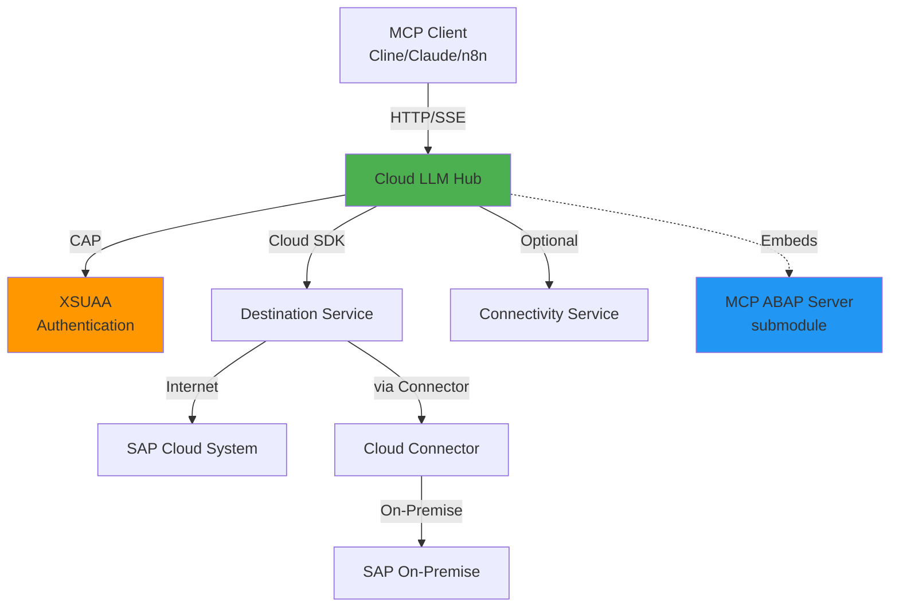
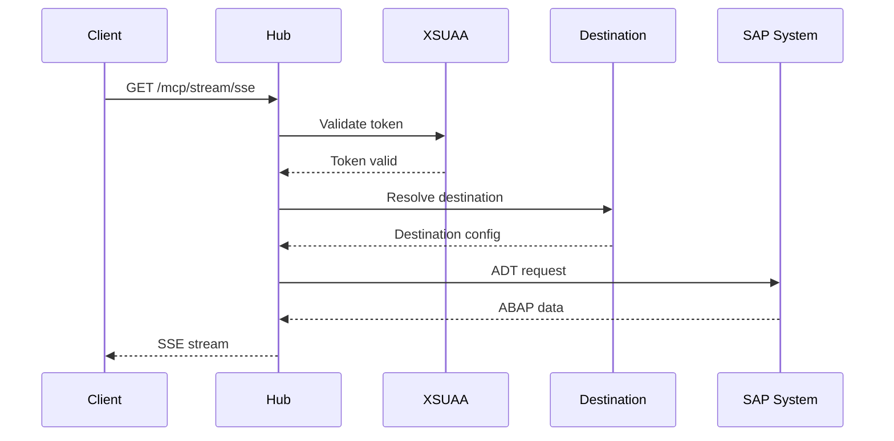

# 📋 Пропозиції по покращенню проєкту Cloud LLM Hub

**Дата аналізу:** 5 листопада 2025  
**Версія проєкту:** 1.0.0  
**Статус:** Проєкт виробничо готовий, документація потребує покращення

---

## 🎯 Загальна оцінка

**Оцінка документації: 75/100**

```
Повнота документації:        ████████░░ 80%
Актуальність:                 ███████░░░ 70%
Структурованість:             █████████░ 90%
Доступність для новачків:     ████████░░ 80%
Технічна глибина:             ████████░░ 80%
Приклади та шаблони:          █████████░ 90%
Візуалізація:                 ████░░░░░░ 40%
Операційна документація:      █████░░░░░ 50%
```

---

## ✅ Сильні сторони проєкту

### 1. Документація
- ✅ **Відмінна структура** для різних аудиторій (споживачі, інтегратори, розробники)
- ✅ **Quick Setup Guide** - можливість почати за 60 секунд
- ✅ **Багато практичних прикладів** - Cline, n8n, CI/CD, GitHub Actions, GitLab CI
- ✅ **Contributor guides** - повний набір для розробників
- ✅ **ADR (Architecture Decision Records)** - задокументовані архітектурні рішення
- ✅ **Шаблони конфігурації** - готові YAML файли для різних сценаріїв

### 2. Архітектура
- ✅ **Чітке розділення відповідальностей** - CAP сервіси, MCP manager, connections
- ✅ **Dependency Injection** - гнучка архітектура для з'єднань з ABAP
- ✅ **Кешування** - оптимізація через кешування MCP серверів (30 хв TTL)
- ✅ **SAP Cloud SDK інтеграція** - використання офіційного SDK для destinations
- ✅ **Підтримка on-premise** - через Cloud Connector

### 3. Код
- ✅ **TypeScript** - повна типізація
- ✅ **Модульна структура** - легко розширювати
- ✅ **Експортовані інтерфейси** - зручне API для інтеграції

---

## 🔴 Критичні проблеми (Високий пріоритет)

### 1. Дублювання README файлів

**Проблема:**
- Існує два README файли: `README.md` та `README.new.md`
- `README.md` - орієнтований на користувачів, більш повний
- `README.new.md` - технічний, коротший, ізольований

**Рішення:**
```bash
# Варіант 1: Видалити README.new.md (рекомендовано)
rm README.new.md

# Варіант 2: Перемістити в документацію для розробників
mv README.new.md docs/contributors/QUICK_REFERENCE.md
# і додати посилання в docs/contributors/README.md
```

**Пріоритет:** 🔴 Критично  
**Час:** 15 хвилин

---

### 2. Відсутній SECURITY.md

**Проблема:**
- Немає політики безпеки
- Незрозуміло, як повідомляти про вразливості
- Не вказані підтримувані версії

**Рішення:** Створити `SECURITY.md` в корні проєкту:

```markdown
# Security Policy

## Supported Versions

| Version | Supported          |
| ------- | ------------------ |
| 1.0.x   | :white_check_mark: |
| < 1.0   | :x:                |

## Reporting a Vulnerability

**Please DO NOT create public GitHub issues for security vulnerabilities.**

Instead, please report security vulnerabilities to:
- Email: security@your-domain.com (або замініть на реальний)
- Expected response time: 48 hours

### What to include:
1. Description of the vulnerability
2. Steps to reproduce
3. Potential impact
4. Suggested fix (if any)

### What happens next:
1. We'll acknowledge receipt within 48 hours
2. We'll investigate and provide an initial assessment within 5 business days
3. We'll work on a fix and coordinate disclosure timing with you
4. We'll credit you in the security advisory (if you wish)

## Security Best Practices

### For Administrators:
- Always use XSUAA authentication in production
- Rotate JWT tokens regularly
- Use Cloud Connector for on-premise systems
- Enable HTTPS only
- Review access logs regularly

### For Developers:
- Never commit credentials to git
- Use `.env` files for local development (excluded from git)
- Use service keys for BTP authentication
- Follow the principle of least privilege
```

**Пріоритет:** 🔴 Критично  
**Час:** 30 хвилин

---

### 3. Застарілий CHANGELOG.md

**Проблема:**
- Останній запис від 29 жовтня 2025
- Відсутні зміни за останні місяці
- Секція `[Unreleased]` не оновлювалась

**Рішення:** Оновити CHANGELOG.md, додати актуальні зміни

**Пріоритет:** 🔴 Високий  
**Час:** 1 година

---

### 4. Відсутній API_REFERENCE.md

**Проблема:**
- Немає повної специфікації API
- Ендпоінти розкидані по різних документах
- Немає прикладів request/response для всіх ендпоінтів

**Рішення:** Створити `docs/API_REFERENCE.md`:

**Структура:**
```markdown
# API Reference

## Authentication
- XSUAA / Basic Auth

## Endpoints

### 1. Health Check
GET /odata/v4/mcp/Health()

### 2. Destination Probe
GET /odata/v4/mcp/ProbeDestination?destination={name}

### 3. SSE Stream
GET /mcp/stream/sse

### 4. Stream-HTTP
POST /mcp/stream/http

## Error Codes
- 401: Authentication failed
- 403: Insufficient permissions
- ...

## Rate Limiting
...
```

**Пріоритет:** 🔴 Високий  
**Час:** 3-4 години

---

### 5. Відсутній TROUBLESHOOTING.md

**Проблема:**
- Типові проблеми розкидані по DEBUGGING.md та іншим документам
- Немає централізованої бази знань
- Немає FAQ

**Рішення:** Створити `docs/TROUBLESHOOTING.md`:

**Структура:**
```markdown
# Troubleshooting Guide

## Quick Diagnostics

### Check Health
curl https://your-app.cfapps.eu10.hana.ondemand.com/odata/v4/mcp/Health\(\)

## Common Issues

### 1. Authentication Errors
**Problem:** 401 Unauthorized
**Causes:**
- Expired JWT token
- Invalid credentials
- Missing XSUAA binding

**Solutions:**
...

### 2. Connection Timeouts
...

### 3. Cloud Connector Issues
...

## FAQ
...

## Getting Help
...
```

**Пріоритет:** 🔴 Високий  
**Час:** 2-3 години

---

## 🟡 Важливі покращення (Середній пріоритет)

### 6. Додати візуалізації (Mermaid діаграми)

**Проблема:**
- Архітектура описана тільки текстом
- Немає діаграм request flows
- Складно швидко зрозуміти систему

**Рішення:** Додати Mermaid діаграми в `docs/contributors/ARCHITECTURE.md`:

```markdown
## 🏗️ System Architecture





**Пріоритет:** 🟡 Високий  
**Час:** 2-3 години

---

### 7. Створити OPERATIONS.md (Runbook)

**Проблема:**
- Немає документації для операторів/DevOps
- Незрозуміло, як підтримувати систему в продакшені
- Немає incident response процедур

**Рішення:** Створити `docs/OPERATIONS.md`:

**Структура:**
```markdown
# Operations Guide (Runbook)

## 1. Monitoring

### Key Metrics
- Response time (p50, p95, p99)
- Error rate
- Active connections
- Cache hit rate

### Health Checks
- `/odata/v4/mcp/Health()` - every 30s
- Expected response: 200 OK

### Alerts
- Response time > 5s
- Error rate > 5%
- No response for 1 minute

## 2. Backup & Recovery

### What to Backup
- Configuration (xs-security.json, mta.yaml)
- Service bindings
- Destination configurations

### Recovery Procedures
...

## 3. Scaling

### Horizontal Scaling
cf scale cloud-llm-hub-srv -i 3

### Vertical Scaling
...

## 4. Incident Response

### Severity Levels
- P0: Service down
- P1: Degraded performance
- P2: Non-critical issues

### P0 Incident Procedure
1. Check health endpoint
2. Review recent logs
3. Check service bindings
4. Restart if needed
...

## 5. Maintenance Windows
...

## 6. Log Analysis

### Log Locations
cf logs cloud-llm-hub-srv --recent

### Common Log Patterns
- Authentication errors: "401 Unauthorized"
- Timeout: "ETIMEDOUT"
...
```

**Пріоритет:** 🟡 Середній  
**Час:** 4-5 годин

---

### 8. Створити MONITORING.md

**Проблема:**
- Немає рекомендацій по моніторингу
- Не описані метрики
- Немає dashboard templates

**Рішення:** Створити `docs/MONITORING.md`

**Пріоритет:** 🟡 Середній  
**Час:** 3-4 години

---

### 9. Створити MIGRATION_GUIDE.md

**Проблема:**
- Немає інструкцій по міграції між версіями
- Не документовані breaking changes
- Незрозуміло, як оновлюватись

**Рішення:** Створити `docs/MIGRATION_GUIDE.md`

**Пріоритет:** 🟡 Середній  
**Час:** 2-3 години

---

### 10. Додати Unit тести

**Проблема:**
- Є тільки інтеграційні та smoke тести
- Немає unit тестів для окремих компонентів
- Низьке code coverage

**Рішення:**
1. Налаштувати Jest або Mocha
2. Додати unit тести для:
   - `srv/mcp-manager.ts`
   - `srv/connections/destinationResolver.ts`
   - `srv/connections/CloudSdkAbapConnection.ts`
3. Налаштувати coverage reporting

**Пріоритет:** 🟡 Середній  
**Час:** 1-2 тижні

---

## 🟢 Бажані покращення (Низький пріоритет)

### 11. Створити PERFORMANCE.md

**Що включити:**
- Benchmarks
- Рекомендації по оптимізації
- Tuning параметрів
- Bottleneck аналіз

**Пріоритет:** 🟢 Низький  
**Час:** 3-4 години

---

### 12. Версіонування документації

**Проблема:**
- Документи не мають версій
- Незрозуміло, яка документація для якої версії

**Рішення:**
- Варіант 1: Додати "Version: 1.0" в заголовки документів
- Варіант 2: Створити `docs/v1.0/` структуру
- Варіант 3: Використати git tags для версій документації

**Пріоритет:** 🟢 Низький  
**Час:** 1-2 дні

---

### 13. Розширити TESTING.md

**Що додати:**
- Unit testing guidelines
- Mocking strategies
- Test coverage цілі
- E2E testing scenarios
- Performance testing
- Security testing

**Пріоритет:** 🟢 Низький  
**Час:** 2-3 години

---

### 14. Інтернаціоналізація документації

**Проблема:**
- Вся документація англійською
- Локальний ринок може потребувати українську версію

**Рішення:**
- Створити `docs/uk/` для українських перекладів
- Почати з ключових документів:
  - QUICK_SETUP.md
  - GETTING_STARTED.md
  - TROUBLESHOOTING.md

**Пріоритет:** 🟢 Низький  
**Час:** 1-2 тижні (залежить від обсягу)

---

## 📅 Рекомендований план дій

### Фаза 1: Очищення та критичні виправлення (1-2 дні)

**Завдання:**
1. ✅ Видалити або перемістити `README.new.md`
2. ✅ Створити `SECURITY.md`
3. ✅ Оновити `CHANGELOG.md`

**Результат:** Усунення критичних прогалин

---

### Фаза 2: Покращення документації (1 тиждень)

**Завдання:**
4. ✅ Створити `docs/API_REFERENCE.md`
5. ✅ Створити `docs/TROUBLESHOOTING.md`
6. ✅ Додати Mermaid діаграми в `ARCHITECTURE.md`

**Результат:** Повна технічна документація

---

### Фаза 3: Операційна документація (1 тиждень)

**Завдання:**
7. ✅ Створити `docs/OPERATIONS.md`
8. ✅ Створити `docs/MONITORING.md`
9. ✅ Створити `docs/MIGRATION_GUIDE.md`

**Результат:** Production-ready документація

---

### Фаза 4: Тести та оптимізація (2-3 тижні)

**Завдання:**
10. ✅ Додати unit тести
11. ✅ Створити `docs/PERFORMANCE.md`
12. ✅ Розширити `TESTING.md`

**Результат:** Підвищення якості коду

---

### Фаза 5: Додаткові покращення (ongoing)

**Завдання:**
13. ✅ Версіонування документації
14. ✅ Інтернаціоналізація
15. ✅ Інші покращення

**Результат:** Підвищення зручності використання

---

## 🎯 Очікувані результати

### Після Фази 1-2 (2 тижні):
- ✅ Усунені критичні прогалини
- ✅ Повна технічна документація
- ✅ Зручніше для нових користувачів
- ✅ **Оцінка документації: 80/100**

### Після Фази 3 (3 тижні):
- ✅ Production-ready статус
- ✅ Документація для операторів
- ✅ Легше підтримувати в продакшені
- ✅ **Оцінка документації: 85/100**

### Після Фази 4 (6 тижнів):
- ✅ Високе code coverage
- ✅ Документовані performance характеристики
- ✅ Кращі практики тестування
- ✅ **Оцінка документації: 90/100**

---

## 💡 Висновок

Проєкт **Cloud LLM Hub** має солідну базу (75/100) і готовий до виробничого використання. Основні покращення потрібні в трьох напрямках:

1. 🔴 **Критичні виправлення** - усунення дублювання, додавання SECURITY.md
2. 🟡 **Документація** - візуалізація, операційні процедури, troubleshooting
3. 🟢 **Якість коду** - unit тести, performance guide

Виконання фаз 1-3 (4 тижні роботи) підніме оцінку до **85/100** та надасть проєкту **enterprise-ready** статус.

---

## 📞 Контакти

Якщо виникають питання або потрібна допомога з імплементацією:
- GitHub Issues: https://github.com/fr0ster/cloud-llm-hub/issues
- Email: [вставити контакт]

**Дата створення:** 5 листопада 2025  
**Автор аналізу:** GitHub Copilot  
**Версія документу:** 1.0
